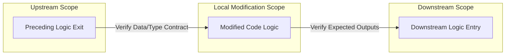

# Holistic Logic Flow Reviewer

## Overview

Use this skill to conduct a generic, wide-angle architectural and logic review following any codebase modification. Rather than evaluating code changes in isolation, this skill enforces a holistic verification sequence to guarantee absolute systemic coherence and prevent boundary breakages across execution paths.

---

## Workflow

### Step 1: Core Logic Validation of Changes

Examine the modified code blocks directly to verify localized correctness before expanding to system integration points.

**Audit Checklist:**
-   **Logical Soundness**: Check for logical bugs, incorrect conditionals, off-by-one boundary errors, and incorrect data transformations.
-   **Null Safety & Typing**: Verify that possible `None` / `null` states are safely intercepted and that variable mutations conform to expected static type representations.
-   **State Integrity**: Ensure that the modifications introduce no unexpected side-effects, resource lockups, or dead state allocations.

### Step 2: Holistic Flow Tracing (End-to-End Audit)

Conduct a continuous trace across boundary transitions to establish an end-to-end view of the execution pipeline.

**Audit Checklist:**
1.  **Upstream Exit Points**: Identify the preceding functions, callers, or pipeline steps that invoke the modified block. Verify that the values, state arguments, and data shapes exiting upstream perfectly match the input expectations of the new code.
2.  **Modification Layer**: Confirm that the new logic processes data cleanly and efficiently.
3.  **Downstream Entry Points**: Trace outputs, state changes, and side-effects forward into the entry points of subsequent logic flows (such as planning loops, database serializations, event queues, or frontend visualizers). Ensure downstream consumers receive exactly the schemas and states they expect without missing keys or unhandled objects.

### Step 3: Multi-Path Verification & Edge Validation

Systems frequently invoke logic across diverse operational contexts. Ensure full path coverage.

**Audit Checklist:**
-   **Multiple Entry Points**: If the modified code can be invoked via multiple paths (e.g., synchronous REST queries, asynchronous background tasks, parallel workflow reducers, or helper wrappers), **every single entry point must be checked** to ensure complete compatibility.
-   **Multiple Exit Points**: Inspect all possible exit branches from the new logic (including standard success returns, early return shortcuts, and error exception bubbles). Verify that downstream exception handlers and fallback branches maintain flawless logical flow.
-   **Test Suite Verification**: Assert continuous stability by running the relevant project test framework to validate multi-branch execution flows.
