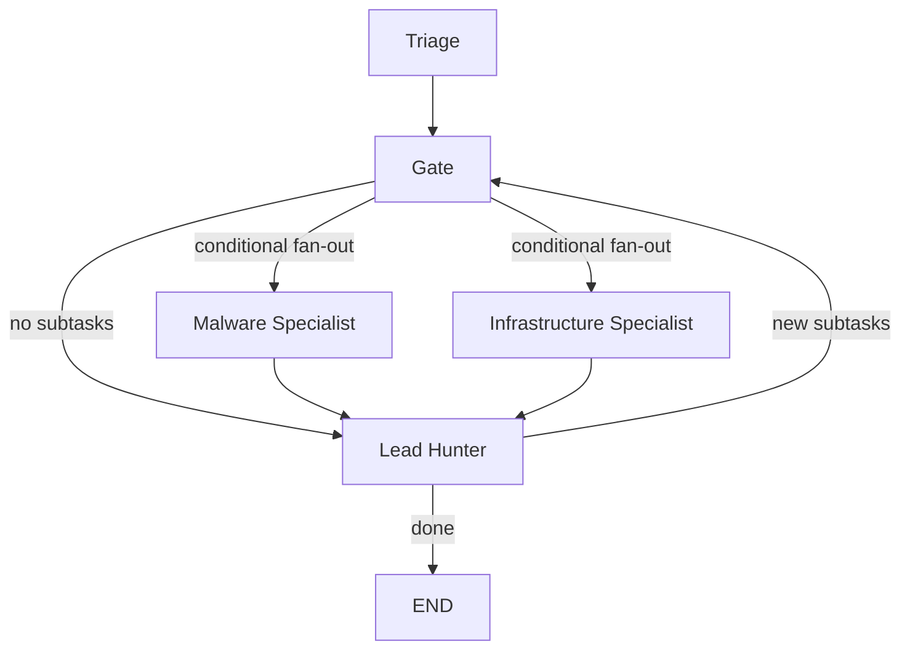

# Project Harimau — Code Review

Deep review of the investigation flow, prompts, and graph/visual representation. Each section highlights **what's working well**, **what needs improvement**, and **concrete recommendations**.

**Status Legend**: ✅ COMPLETED · 🔄 PARTIALLY DONE · ⬜ OPEN

---

## 1. Investigation Flow

### Current Architecture



### What's Working Well
- **Hybrid Triage** (deterministic fetch + LLM analysis) is a strong pattern — guarantees data quality while getting intelligent routing
- **Parallel specialists** via LangGraph fan-out is well-architected
- **3-layer early exit** in Lead Hunter (no uninvestigated nodes → LLM signals complete → convergence detection) prevents wasted iterations
- **InvestigationCache** (NetworkX) as a shared graph state is a good design decision
- **Code-enforced accumulation** (Python-owned merging of `analyzed_targets`, `network_indicators`, etc.) protects against LLM regression — this is excellent defensive engineering

### Issues & Recommendations

#### ✅ 1.1 Triage Does Too Much Planning — COMPLETED

> [!NOTE]
> **Implemented in v0.6.0.** Triage was refactored to perform only threat assessment. Subtask generation was replaced by a deterministic Python routing function `generate_initial_subtasks()` in `triage.py`. The Lead Hunter now owns all subsequent planning across iterations.

**What was done** (commit: `feat(triage): deterministic subtask generation`):
- Removed `subtasks` field from `TRIAGE_ANALYSIS_PROMPT` entirely
- Implemented `generate_initial_subtasks()` in [`triage.py`](file:///e:/Github/project_harimau/backend/agents/triage.py) — deterministic signal-filtered routing
- Signal threshold: `verdict == MALICIOUS/SUSPICIOUS` OR `malicious_vendor_count > 3`
- Triage now outputs: `verdict`, `confidence`, `severity`, `key_findings`, `threat_context`, `priority_entities` only

#### ⬜ 1.2 Specialist Inner Loops Are Opaque — OPEN

> [!IMPORTANT]
> Both [`malware.py`](file:///e:/Github/project_harimau/backend/agents/malware.py) and [`infrastructure.py`](file:///e:/Github/project_harimau/backend/agents/infrastructure.py) run internal `for iteration in range(max_iterations)` loops (up to 10 iterations each). These loops are **invisible to LangGraph checkpointing** — if a specialist crashes at iteration 7, all progress is lost.

**Recommendations**:
- **Short-term**: Reduce `malware_iterations` and `infra_iterations` from 10 to 5-7. Ten tool-calling rounds is excessive; most investigations converge in 3-5 rounds
- **Long-term**: Extract to LangGraph `ToolNode` + conditional edges. This unlocks per-step checkpointing, visibility, and independent timeout handling

#### ⬜ 1.3 IOC Type Detection Is Fragile — OPEN

At [`triage.py:L554-568`](file:///e:/Github/project_harimau/backend/agents/triage.py#L554-L568), IOC identification uses a cascade of `if/elif/else`:

```python
if "http" in ioc or "/" in ioc:         # URL
elif re.match(ipv4_pattern, ioc):        # IP
elif "." in ioc:                          # Domain
else:                                     # File
```

**Problems**:
- `"http"` check catches strings like `httpbin.org` as URL instead of Domain
- `"/" in ioc` catches filesystem paths
- `"." in ioc` matches filenames like `malware.exe` as Domain
- No IPv6 support

**Recommendation**: Use a proper IOC classification function with ordered regex patterns:
1. Full URL pattern (`^https?://...`)
2. IPv4 (`^\d{1,3}\.\d{1,3}\.\d{1,3}\.\d{1,3}$`)
3. IPv6
4. Hash (SHA256 > SHA1 > MD5)
5. Domain (validate TLD against known TLD list or use `tldextract`)

#### ⬜ 1.4 Gate Node Is Essentially a No-Op — OPEN

[`gate_node()`](file:///e:/Github/project_harimau/backend/graph/workflow.py#L74-L84) returns `{}` — it exists purely as a routing anchor for `route_from_gate()`. This is fine architecturally, but consider whether the gate could validate/enrich subtasks before dispatching (e.g., deduplication, priority sorting).

#### ⬜ 1.5 Missing Error Recovery in the Loop — OPEN

If both specialists fail (return error results), Lead Hunter still runs synthesis, generating a report from error messages. Consider adding:
- A pre-synthesis check: if all specialist results have `verdict == "System Error"`, skip synthesis and return a structured error state
- Retry logic at the Gate level for transient failures

---

## 2. Prompts

### What's Working Well
- **Structured JSON output schemas** in all agent prompts — good for deterministic parsing
- **Anti-hallucination guardrails** in specialist prompts ("DO NOT HALLUCINATE IOCs", "Only include indicators explicitly returned by your tools")
- **Example outputs** for both success and failure cases — excellent for grounding LLM behavior
- **Collaboration instructions** (malware ↔ infrastructure cross-referencing) are clearly specified

### Issues & Recommendations

#### ✅ 2.1 Triage Prompt Is Overloaded — COMPLETED (via 1.1)

> [!NOTE]
> Resolved as part of 1.1. Subtask/routing instructions were removed from `TRIAGE_ANALYSIS_PROMPT`. The prompt is now scoped to: **assess threat → identify key findings → contextualize → output structured JSON**.

#### ✅ 2.2 Specialist Prompts Lack Iteration Awareness — COMPLETED

> [!NOTE]
> **Implemented in v0.6.0.** An "Iteration Context" block was added to both malware and infrastructure agent system prompts, instructing the LLM to merge prior and new findings and only investigate new targets.

**What was done**:
- Added to [`malware.py`](file:///e:/Github/project_harimau/backend/agents/malware.py) system prompt:
  ```
  **Iteration Context:**
  You may be called multiple times. Each time, merge prior and new findings.
  Use tools ONLY for new targets.
  ```
- Same addition to [`infrastructure.py`](file:///e:/Github/project_harimau/backend/agents/infrastructure.py)

#### ⬜ 2.3 FINAL_ITERATION_PROMPT Needs Model Awareness — OPEN

[`FINAL_ITERATION_PROMPT`](file:///e:/Github/project_harimau/backend/utils/agent_utils.py#L5-L12) is used with `base_llm` (tools unbound), but the prompt says "stop using tools" — the LLM doesn't have tools at this point. Rephrase to:

```
"You have completed your tool-based investigation. Based on ALL the information 
gathered across your tool calls, provide your comprehensive analysis now..."
```

#### ✅ 2.4 Inconsistent Model Usage — COMPLETED

> [!NOTE]
> **Implemented in v0.6.0.** Standardized all agents on `ChatGoogleGenerativeAI` (official SDK) and migrated to Gemini 3.1 Pro at low temperature. Removed all `ChatVertexAI` usage. Stale model metadata in transparency events was corrected.

**Current model state (standardized)**:

| Agent | Model | SDK |
|-------|-------|-----|
| Triage | `gemini-3.1-flash-preview` | `ChatGoogleGenerativeAI` |
| Malware | `gemini-3.1-pro-preview` | `ChatGoogleGenerativeAI` |
| Infrastructure | `gemini-3.1-pro-preview` | `ChatGoogleGenerativeAI` |
| Lead Hunter Planning | `gemini-3.1-flash-preview` | `ChatGoogleGenerativeAI` |
| Lead Hunter Synthesis | `gemini-3.1-pro-preview` | `ChatGoogleGenerativeAI` |

#### ✅ 2.5 Lead Hunter Synthesis Prompt Could Use Graph Data Better — COMPLETED

> [!NOTE]
> **Implemented in v0.6.0.** `_build_edge_tuples()` was added to [`lead_hunter_synthesis.py`](file:///e:/Github/project_harimau/backend/agents/lead_hunter_synthesis.py) to generate machine-readable `source → target [relationship]` tuples from the live NetworkX graph. These are injected into the synthesis context, grounding Graphviz output in actual investigation data.

---

## 3. Graphs / Visual Representation

### Current Stack
- **Backend**: NetworkX `MultiDiGraph` → serialized via `nx.node_link_data()` → formatted by `graph_formatter.py`
- **Frontend**: ReactFlow + d3-force simulation + custom nodes + d3-graphviz for DOT diagrams in reports

### What's Working Well
- **Dual-path graph formatting** (`format_graph_from_cache` for rich data, `format_investigation_graph` as fallback) is pragmatic
- **Custom node components** with type-specific icons (router for IP, fingerprint for hash, link for URL) are intuitive
- **d3-force physics simulation** for organic layout with collision avoidance and repulsion
- **Malicious indicator badges** (red halo + warning icon) provide instant visual signal
- **Graphviz rendering** of attack flow diagrams in the final report is a nice dual-visualization approach

### Issues & Recommendations

#### ✅ 3.1 Node Labels Are Truncated/Unreadable — COMPLETED

> [!NOTE]
> **Implemented.** A `getSmartLabel()` function was added to `page.tsx` that selects the best display string per entity type. Label max-width increased from `100px` to `160px`, font size from `9px` to `10px`. The redundant 7px tooltip sub-text was removed.

**What was done**:
- **Files**: Extracts filename from `"hash\n(filename.exe)"` format; falls back to `abc12345...def456` abbreviated hash
- **URLs**: Shows `hostname/path` with truncation
- **IPs/Domains**: Shows full value (already short)
- Removed static 7px title text below each node

#### ✅ 3.2 Color Palette Is Too Monotone — COMPLETED

> [!NOTE]
> **Implemented** in [`graph_formatter.py`](file:///e:/Github/project_harimau/backend/utils/graph_formatter.py). IP and Domain are now distinct colors.

**New COLOR_MAP**:

| Type | Old Color | New Color | Notes |
|------|-----------|-----------|-------|
| file | `#9B59B6` (purple) | `#9B59B6` (purple) | Unchanged |
| domain | `#E67E22` (orange) | `#E67E22` (orange) | Unchanged |
| ip_address | `#E67E22` (orange) ⚠️ | `#3498DB` (blue) ✅ | **Fixed** |
| url | `#2ECC71` (green) | `#2ECC71` (green) | Unchanged |
| collection | `#3498DB` (blue) | `#F39C12` (amber) | Freed blue for IP |

#### ✅ 3.3 Graph Gets Overwhelming With No Filtering Controls — COMPLETED

> [!NOTE]
> **Implemented.** A compact filter toolbar was added to the graph tile header. Filter state is managed in React and re-applies instantly (frontend-only — no API calls).

**What was done**:
- **"Relevant" toggle** (default: ON) — filters using `inReport` flag from backend
- **"Malicious" toggle** (default: OFF) — filters using `isMalicious` flag
- **Entity type checkboxes** (🔒 File / 🌐 Domain / 📡 IP / 🔗 URL)
- Filter changes trigger a `useEffect` that rebuilds the d3 simulation with the new node set
- `entityType` field added to backend node payload to support frontend type filtering

**Still open** from original recommendations:
- Threat score slider (item 4)
- Depth filter — N hops from root (item 5)

#### ✅ 3.4 No Node Click Interaction — COMPLETED

> [!NOTE]
> **Implemented.** `onNodeClick` handler added to `<ReactFlow>`. Clicking any node opens a slide-in detail panel.

**What was done**:
- `onNodeClick` stores the raw `BackendNode` from `rawGraphRef` into `selectedNode` state
- Slide-in panel (320px wide, `animate-slide-in-right`) shows:
  - Full entity ID with one-click clipboard copy button
  - Verdict (color-coded: red=malicious, amber=suspicious, cyan=clean)
  - Threat Score (color-coded by threshold: ≥70 red, ≥40 amber)
  - Vendor Detections (e.g., `12/72`)
  - Analysis details (full tooltip text from backend, pre-formatted)
  - Status flags: `Malicious` · `Root IOC` · `In Report`
- Backend payload extended with `threatScore`, `verdict`, `vendorDetections` fields
- Panel dismisses via ✕ button

**Still open** from original recommendations:
- Relationship browser (incoming + outgoing edges in panel)
- GTI link to VirusTotal page

#### ✅ 3.5 Simulation Side-Effects in State Updater — COMPLETED

> [!NOTE]
> **Implemented.** The d3-force simulation is now created entirely outside of `setNodes()`, eliminating the React anti-pattern.

**What was done** in [`page.tsx`](file:///e:/Github/project_harimau/app/src/app/investigate/%5Bid%5D/page.tsx):
- Simulation built with `simNodes` array constructed outside any state updater
- `simulationRef.current = simulation` assigned outside `setNodes`
- Initial positions set via a clean `setNodes(visibleNodes.map(...))` call
- Tick handler calls `setNodes` only for position updates (pure transformation)
- `nodeOrigin={[0.5, 0.5]}` added to `<ReactFlow>` to align d3's center-origin coordinate system with ReactFlow node placement

#### 🔄 3.6 Attack Flow Diagram (Graphviz) Issues — PARTIALLY DONE

> [!NOTE]
> Error boundary implemented. Deterministic DOT generation from NetworkX is partially addressed via edge tuple grounding (2.5) but not fully implemented as a standalone DOT template.

**What was done**:
- **Error boundary** added to `GraphvizRenderer`: catches rendering failures and shows `"Attack flow diagram could not be rendered"` with an error icon instead of a blank box
- **Edge grounding** (2.5): `_build_edge_tuples()` injects real graph edges into the synthesis prompt so the LLM starts from actual data

**Still open**:
- Generating the base DOT graph deterministically from NetworkX and passing it as a template for the LLM to annotate — would eliminate hallucinated nodes/edges entirely

---

## Summary: Priority Ranking

| Priority | Item | Status | Notes |
|----------|------|--------|-------|
| 🔴 P0 | Standardize model SDK (2.4) | ✅ Done | All on `ChatGoogleGenerativeAI` + Gemini 3.1 |
| 🔴 P0 | Fix simulation side-effects (3.5) | ✅ Done | d3 sim extracted from `setNodes` |
| 🟠 P1 | Separate triage planning from analysis (1.1, 2.1) | ✅ Done | Deterministic routing in `triage.py` |
| 🟠 P1 | Add graph filtering controls (3.3) | ✅ Done | Relevant/Malicious/Type toggles |
| 🟠 P1 | Node click → detail panel (3.4) | ✅ Done | Slide-in panel with threat data |
| 🟡 P2 | Improve node labels (3.1) | ✅ Done | `getSmartLabel()` per entity type |
| 🟡 P2 | Differentiate IP vs Domain colors (3.2) | ✅ Done | IP=Blue, Domain=Orange |
| 🟡 P2 | Add iteration context to specialist prompts (2.2) | ✅ Done | Iteration Context block added |
| 🟡 P2 | Fix IOC type detection (1.3) | ⬜ Open | Cascade `if/elif` still fragile |
| 🟢 P3 | Graphviz error boundary (3.6 partial) | ✅ Done | Fallback message on render failure |
| 🟢 P3 | Deterministic Graphviz from NetworkX (3.6 full) | ⬜ Open | LLM still generates DOT from scratch |
| 🟢 P3 | Extract specialist inner loops to LangGraph (1.2) | ⬜ Open | Invisible to checkpointing |
| 🟢 P3 | Error recovery in the loop (1.5) | ⬜ Open | No pre-synthesis error check |
| 🟢 P3 | `FINAL_ITERATION_PROMPT` model awareness (2.3) | ⬜ Open | Minor prompt clarity fix |
| 🟢 P3 | Gate node enrichment (1.4) | ⬜ Open | Gate returns `{}`, no validation |

---

## Remaining Work for Next Session

The following items remain **open** and are recommended for the next iteration:

### High Value
1. **1.3 — IOC Type Detection**: Replace the fragile `if/elif` cascade with proper ordered regex patterns. Risk: misclassified IOCs get routed to the wrong specialist and waste investigation budget.

2. **3.6 full — Deterministic Graphviz**: Generate the base DOT graph from the NetworkX `InvestigationCache` in `_build_graph_summary()`. Pass it as a template to the LLM for annotation. Eliminates hallucinated nodes/edges in the attack flow diagram.

3. **1.2 — Specialist Loop Checkpointing**: Extract the `for iteration in range(max_iterations)` loops in `malware.py` and `infrastructure.py` into LangGraph `ToolNode` nodes with conditional edges. Enables per-step checkpointing and removes silent progress loss on crash.

### Lower Value / Polish
4. **1.5 — Error Recovery**: Add a pre-synthesis guard in `lead_hunter_synthesis.py` — if all specialist results have `verdict == "System Error"`, return a structured error state instead of synthesizing a report from error messages.

5. **3.4 partial — Node Detail Panel**: Add relationship browser (incoming + outgoing edges) and a VirusTotal deep-link to the existing detail panel.

6. **2.3 — FINAL_ITERATION_PROMPT**: Minor wording fix — rephrase "stop using tools" to "you have completed your tool-based investigation".

7. **1.4 — Gate Enrichment**: Consider adding subtask deduplication and priority sorting at the gate before specialist fan-out.
