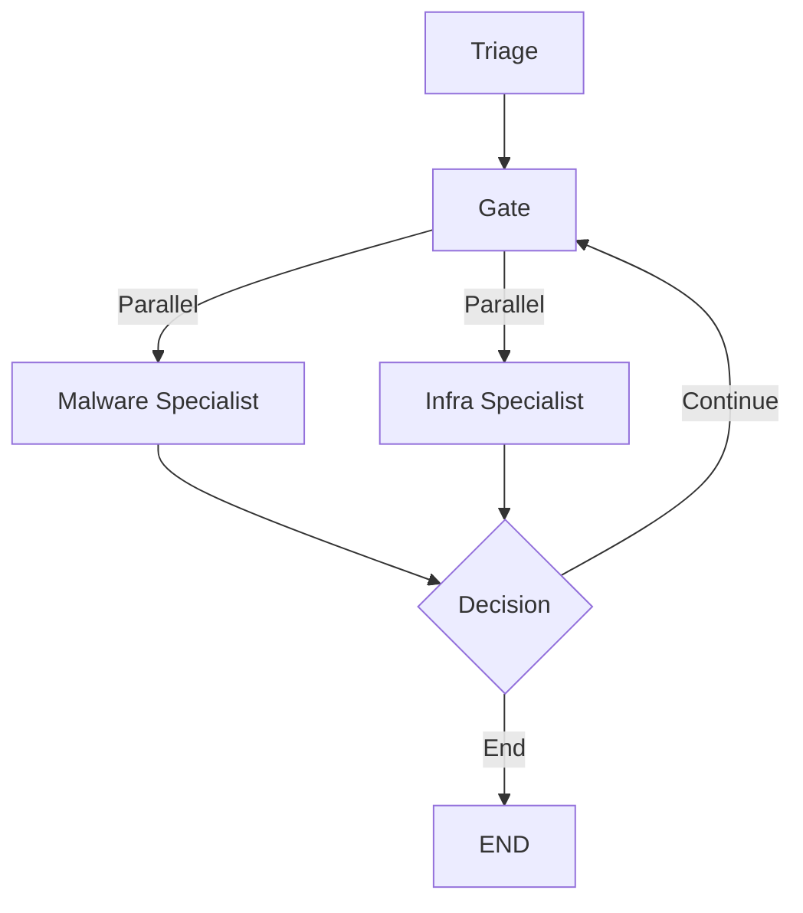

# Agent Implementation Reference

*Supplement to [architecture.md](./architecture.md) - Last updated: 2026-01-30*

This document provides implementation-level details for the Harimau specialist agents.

---

## Agent Structure Pattern

Both Malware and Infrastructure specialists follow this proven pattern:

### Phase 1: Initialization
```python
async def specialist_node(state: AgentState):
    cache = state.get("investigation_graph")
    subtask = next((t for t in state.get("subtasks", []) 
                   if t.get("agent") == "specialist_name"), None)
    
    # Extract target or use regex fallback
    target = subtask.get("entity_id") or extract_from_task_text(subtask["task"])
```

### Phase 2: Tool Definition
```python
async with mcp_manager.get_session("gti") as session:
    @tool
    async def get_resource(identifier: str):
        """Tool description for LLM."""
        try:
            res = await session.call_tool("mcp_name", arguments={"param": identifier})
            return res.content[0].text if res.content else "{}"
        except Exception as e:
            return str(e)
```

### Phase 3: Agent Loop (10 Iterations)
```python
    llm = ChatVertexAI(model="gemini-2.5-flash", temperature=0)
    llm_with_tools = llm.bind_tools([tool1, tool2, ...])
    
    messages = [SystemMessage(content=PROMPT), HumanMessage(content=task)]
    final_content = None
    
    for iteration in range(7):
        if iteration == 6:
            messages.append(HumanMessage(
                content="Final iteration. Provide comprehensive JSON structure."
            ))
        
        response = await llm.ainvoke(messages)
        messages.append(response)
        
        if response.tool_calls:
            for tc in response.tool_calls:
                tool_result = await tools[tc["name"]].ainvoke(tc["args"])
                messages.append(ToolMessage(content=tool_result, tool_call_id=tc["id"]))
        else:
            final_content = response.content
            if final_content: break
```

### Phase 4: Fallback Content Capture
```python
    # If loop exits without clean break
    if not final_content and messages:
        for msg in reversed(messages):
            if isinstance(msg, AIMessage) and msg.content and not msg.tool_calls:
                final_content = msg.content
                break
```

### Phase 5: JSON Parsing (Flexible)
```python
    result = parse_json_flexible(final_content)
```

### Phase 6: Report Generation
```python
    result["markdown_report"] = generate_specialist_markdown_report(result, ioc)
```

### Phase 7: State Updates
```python
    # Store results
    if "specialist_results" not in state:
        state["specialist_results"] = {}
    state["specialist_results"]["specialist_name"] = result
    
    # Update graph
    sync_findings_to_graph(state, result, target)
    
    # Mark subtask complete
    for task in state.get("subtasks", []):
        if task.get("agent") == "specialist_name":
            task["status"] = "completed"
            task["result_summary"] = result.get("summary")
    
    return state
```

---

## JSON Parsing Implementation

### Dual-Format Handler

Handles both `{...}` objects and `[{...}]` arrays:

```python
def parse_json_flexible(content: str) -> dict:
    # Remove markdown wrapping
    clean = content
    if "```json" in clean:
        clean = clean.split("```json")[-1].split("```")[0].strip()
    elif "```" in clean:
        clean = clean.split("```")[1].strip() if clean.count("```") >= 2 else clean
    
    # Detect structure type
    array_start = clean.find("[")
    object_start = clean.find("{")
    
    if array_start != -1 and (object_start == -1 or array_start < object_start):
        # JSON Array: [{...}, {...}]
        end_idx = clean.rfind("]")
        if end_idx != -1:
            clean = clean[array_start:end_idx+1]
            parsed = json.loads(clean)
            if isinstance(parsed, list) and len(parsed) > 0:
                return parsed[0]  # Take first element
            raise ValueError("Empty or invalid array")
        raise ValueError("No closing bracket found")
    
    elif object_start != -1:
        # JSON Object: {...}
        end_idx = clean.rfind("}")
        if end_idx != -1:
            clean = clean[object_start:end_idx+1]
            return json.loads(clean)
        raise ValueError("No closing brace found")
    
    else:
        raise ValueError(f"No JSON structure found. Content: {content[:100]}")
```

---

## MCP Tool Integration

### Argument Mapping Table

**Critical**: All three layers must use consistent parameter names.

| Entity | Python Function | MCP Tool Call |
|--------|----------------|---------------|
| IP Address | `async def get_ip_address_report(ip_address: str)` | `session.call_tool("get_ip_address_report", arguments={"ip_address": ip_address})` |
| Domain | `async def get_domain_report(domain: str)` | `session.call_tool("get_domain_report", arguments={"domain": domain})` |
| URL | `async def get_url_report(url: str)` | `session.call_tool("get_url_report", arguments={"url": url})` |
| File Hash | `async def get_file_report(file_hash: str)` | `session.call_tool("get_file_report", arguments={"resource": file_hash})` |

### Tool Definition Template

```python
@tool
async def get_ip_address_report(ip_address: str):
    """
    Get threat intelligence report for an IP address.
    
    Args:
        ip_address: The IP address to analyze (e.g., "8.8.8.8")
    
    Returns:
        JSON string with threat data or error message
    """
    try:
        res = await session.call_tool(
            "get_ip_address_report",
            arguments={"ip_address": ip_address}  # ✅ Must match MCP expectation
        )
        return res.content[0].text if res.content else "{}"
    except Exception as e:
        logger.warning("tool_error", tool="get_ip_address_report", error=str(e))
        return str(e)
```

---

## Error Handling Strategy

### Three-Layer Approach

1. **Tool Layer** (Graceful Degradation)
   ```python
   except Exception as e:
       return str(e)  # Return error as string, let agent decide
   ```

2. **Parsing Layer** (Detailed Context)
   ```python
   except Exception as e:
       state["specialist_results"]["agent"] = {
           "verdict": "System Error",
           "summary": f"Failed to parse analysis: {str(e)}",
           "markdown_report": f"""
## Analysis Failed

**Error Details:**
```
{str(e)}
```

**Raw LLM Output (first 2000 chars):**
```
{str(final_text)[:2000]}
```
"""
       }
   ```

3. **Node Layer** (Fatal Catchall)
   ```python
   except Exception as e:
       logger.error("fatal_agent_error", agent="specialist", error=str(e))
       import traceback
       state["specialist_results"]["agent"] = {
           "verdict": "System Error",
           "summary": f"Fatal error: {str(e)}",
           "markdown_report": f"""
## System Error

### Error
```
{str(e)}
```

### Traceback
```
{traceback.format_exc()}
```
"""
       }
```

---

## Configuration Constants

```python
# Agent Loop Configuration
MAX_ITERATIONS = 10  # Increased for deep analysis

# LLM Settings
MODEL = "gemini-2.5-flash"
TEMPERATURE = 0  # Deterministic analysis

# Error Display
ERROR_CONTEXT_CHARS = 2000  # Show 2000 chars of raw output on failure
```

---

## Deployment Considerations

### ❌ Avoid These Patterns

1. **Pydantic BaseModel schemas** in tool definitions
   - Causes serialization issues in Cloud Run
   - Use simple type hints instead

2. **Hardcoded `ip` parameter** in MCP calls
   - Must use `ip_address` to match server expectations

3. **Single-format JSON parsing**
   - LLM may return arrays or objects unpredictably

### ✅ Recommended Patterns

1. **Simple function signatures** with `@tool` decorator
2. **Consistent parameter naming** across all layers
3. **Flexible JSON parsing** with format detection
4. **Comprehensive error context** for debugging
5. **Fallback message capture** for interrupted loops

---

## Testing Checklist

Before deployment:

- [ ] Syntax validation: `python3 -m py_compile backend/agents/*.py`
- [ ] MCP argument names match across all tools
- [ ] JSON parsing handles both object and array formats
- [ ] Fallback logic present (and not duplicated)
- [ ] Error messages show 2000 chars context
- [ ] Subtask status updates implemented
- [ ] Graph sync logic includes `source_id`
- [ ] All imports present (ChatVertexAI, tool, etc.)

---

## Related Documents

- [agent_debugging_guide.md](./agent_debugging_guide.md) - Troubleshooting
- [architecture.md](./architecture.md) - System design
- [../CHANGELOG.md](../CHANGELOG.md) - Version history

---

## Lead Hunter Implementation

### Workflow Integration

The Lead Hunter orchestrates the iterative investigation loop (max 2 iterations).



### Decision Logic

```python
def should_continue_investigation(state: AgentState) -> str:
    """
    Lead Hunter decides: Continue or End
    """
    iteration = state.get("iteration", 0)
    max_iterations = 2  # Hard limit
    subtasks = state.get("subtasks", [])
    
    # Hard stop at max iterations
    if iteration >= max_iterations:
        return END
    
    # No new work identified
    if not subtasks:
        return END
    
    # Continue to next iteration
    return "continue"
```

### Core Responsibilities
1.  **Review Work**: Analyzes specialist reports from current iteration.
2.  **Analyze Graph**: Identifies uninvestigated entities in the NetworkX cache.
3.  **Prioritize**: Selects high-value targets (malicious, central nodes).
4.  **Direct**: Generates subtasks for next iteration.
5.  **Synthesize**: Updates the holistic intelligence report.
