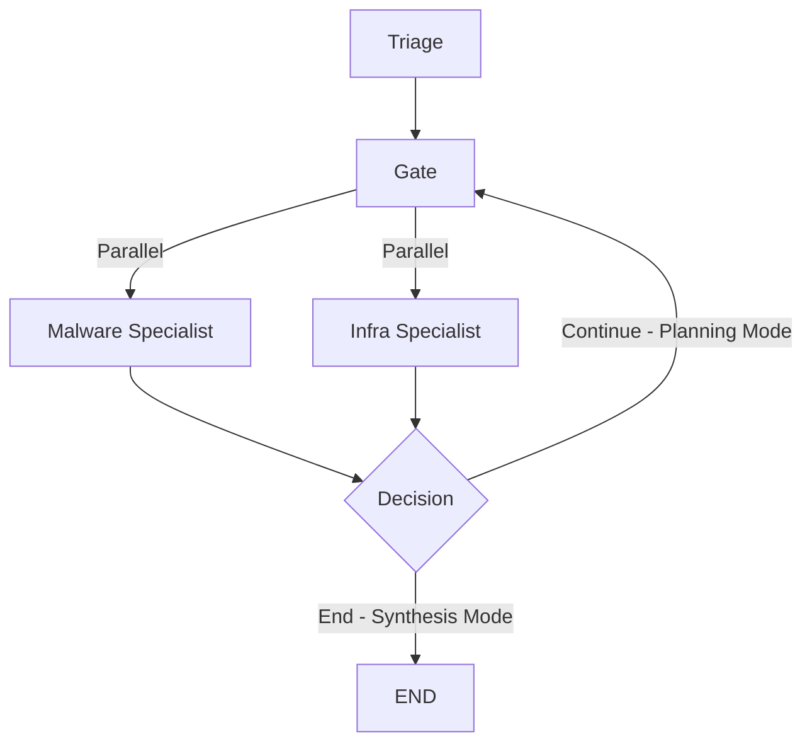

# Agent Implementation Reference

*Supplement to [architecture.md](./architecture.md) - Last updated: 2026-05-11*

This document provides implementation-level details for the Harimau specialist agents.

---

## Agent Structure Pattern

Both Malware and Infrastructure specialists follow this proven pattern:

### Phase 1: Initialization
```python
async def specialist_node(state: AgentState):
    # Target identification is now deterministic:
    # Triage/Planning agents provide a clean 'entity_id' in the subtask.
    target = subtask.get("entity_id")
    if not target:
        # Emergency fallback to regex if subtask schema is corrupted
        target = extract_from_task_text(subtask.get("task", ""))
```

### Phase 2: Tool Definition (Deterministic Graph Update)
```python
async with mcp_manager.get_session("gti") as session:
    @tool
    async def get_resource(identifier: str):
        """Tool description for LLM."""
        try:
            res = await session.call_tool("mcp_name", arguments={"param": identifier})
            if not res.content: return "[]"
            parsed = json.loads(res.content[0].text)
            
            # Deterministically update the knowledge graph
            found = []
            for item in parsed.get("data", []):
                eid = item.get("id")
                etype = item.get("type", "unknown")
                if eid:
                    # Write directly to network schema before LLM gets the data
                    cache.add_entity(eid, etype, {"context": "tool_results"})
                    cache.add_relationship(identifier, eid, "relationship_name")
                    found.append(eid)
            
            return json.dumps(found) # Return lightweight ID array to LLM
        except Exception as e:
            return str(e)
```

### Phase 3: Agent Loop (10 Iterations)
```python
    llm = ChatGoogleGenerativeAI(model="gemini-3-flash-preview", temperature=0)
    llm_with_tools = llm.bind_tools([tool1, tool2, ...])

    # Iteration Context: informs LLM of its cumulative role in a multi-round hunt
    iteration_context = "**Iteration Context:** You may be called multiple times..."
    
    # PEER CONTEXT: Inject findings from the other specialist (if any)
    peer_context = build_peer_context(
        state, state.get("iteration", 0), "agent_name", "peer_name",
        extra_fields=[...], count_key="..."
    )

    messages = [
        SystemMessage(content=PROMPT + "\n\n" + iteration_context),
        HumanMessage(content=f"Task: {task}\n\n{peer_context}")
    ]
    final_content = None
    max_iterations = malware_iterations  # or infra_iterations = 10

    for iteration in range(max_iterations):
        messages = cap_context_window(messages)  # prevent unbounded growth

        if iteration == max_iterations - 1:
            messages.append(HumanMessage(content=FINAL_ITERATION_PROMPT))

        response = await llm_with_tools.ainvoke(messages)
        messages.append(response)

        if response.tool_calls:
            # All tool calls in this turn run concurrently with a 20s per-tool timeout
            results = await run_tools_parallel(tool_dispatch, response.tool_calls, "agent_name", logger)
            for tc, result in zip(response.tool_calls, results):
                messages.append(ToolMessage(content=str(result), tool_call_id=tc["id"]))
        else:
            final_content = response.content
            if final_content:
                break
```

### Phase 4: Fallback Content Capture
```python
    # If loop exits without clean break
    if not final_content and messages:
        for msg in reversed(messages):
            if isinstance(msg, AIMessage) and msg.content and not msg.tool_calls:
                final_content = msg.content
                break
```

### Phase 5: JSON Parsing (Flexible)
```python
    from backend.utils.agent_utils import parse_llm_json

    raw_text, result = parse_llm_json(final_content)
```

### Phase 6: Report Generation
```python
    result["markdown_report"] = generate_specialist_markdown_report(result, ioc)
```

### Phase 7: State Updates
```python
    # Store results
    if "specialist_results" not in state:
        state["specialist_results"] = {}
    state["specialist_results"]["specialist_name"] = result
    
    # Update graph
    sync_findings_to_graph(state, result, target)
    
    # Mark subtask complete
    for task in state.get("subtasks", []):
        if task.get("agent") == "specialist_name":
            task["status"] = "completed"
            task["result_summary"] = result.get("summary")
    
    return state
```

---

## JSON Parsing Implementation

### `parse_llm_json` (`backend/utils/agent_utils.py`)

Handles Gemini/Vertex content that may arrive as a plain string or a list of content blocks. Strips markdown fences, detects array vs object format, and returns `(raw_text, parsed_dict)`. For arrays it returns the first element.

```python
from backend.utils.agent_utils import parse_llm_json

raw_text, result = parse_llm_json(response.content)
# result is always a dict; raw_text is the original string for error context
```

Key behaviours:
- Accepts `str` or `list[dict]` (Vertex content block format)
- Strips ` ```json ` and bare ` ``` ` fences
- For `[{...}]` arrays, extracts first element
- Raises `ValueError` with a 100-char content preview if no JSON is found

---

## Shared Agent Utilities (`backend/utils/agent_utils.py`)

All four functions below are imported by both specialist agents. Do not duplicate them locally.

| Function | Purpose |
|---|---|
| `FINAL_ITERATION_PROMPT` | Standard string appended on the last iteration to force JSON output |
| `parse_llm_json(content)` | Normalise Vertex content, strip fences, return `(raw_text, dict)` |
| `run_tools_parallel(tool_dispatch, tool_calls, agent_name, logger, timeout=20.0)` | `asyncio.gather` with per-tool timeout; `agent_name` scopes log keys |
| `cap_context_window(messages, system_count=2, tail_size=10)` | Keep first N + last N messages; trim tail to start on AIMessage |
| `push_to_rich_intel(relationships_data, rel_name, entity_type, value, source_id, attributes)` | Deduplicating append — skips if same `id` + `source_id` already present |

### `cap_context_window` — why it trims to AIMessage

The LangGraph / Vertex API rejects a `ToolMessage` that has no preceding `AIMessage` in the same context slice. When slicing the tail, the function advances past any leading `ToolMessage`s so the window always opens on an `AIMessage`.

---

## MCP Tool Integration

### Argument Mapping Table

**Critical**: All three layers must use consistent parameter names.

| Entity | Python Function | MCP Tool Call |
|--------|----------------|---------------|
| IP Address | `async def get_ip_address_report(ip_address: str)` | `session.call_tool("get_ip_address_report", arguments={"ip_address": ip_address})` |
| Domain | `async def get_domain_report(domain: str)` | `session.call_tool("get_domain_report", arguments={"domain": domain})` |
| URL | `async def get_url_report(url: str)` | `session.call_tool("get_url_report", arguments={"url": url})` |
| File Hash | `async def get_file_report(file_hash: str)` | `session.call_tool("get_file_report", arguments={"resource": file_hash})` |

### Tool Definition Template

```python
@tool
async def get_ip_address_report(ip_address: str):
    """
    Get threat intelligence report for an IP address.
    """
    try:
        res = await session.call_tool(
            "get_ip_address_report",
            arguments={"ip_address": ip_address}  # ✅ Must match MCP expectation
        )
        if not res.content: return "{}"
        
        # Example: if this tool fetches relationships, update the NetworkX cache here natively
        # cache.add_entity(...)
        # cache.add_relationship(...)
        
        return res.content[0].text 
    except Exception as e:
        logger.warning("tool_error", tool="get_ip_address_report", error=str(e))
        return str(e)
```

---

## Error Handling Strategy

### Three-Layer Approach

1. **Tool Layer** (Graceful Degradation)
   ```python
   except Exception as e:
       return str(e)  # Return error as string, let agent decide
   ```

2. **Parsing Layer** (Detailed Context)
   ```python
   except Exception as e:
       state["specialist_results"]["agent"] = {
           "verdict": "System Error",
           "summary": f"Failed to parse analysis: {str(e)}",
           "markdown_report": f"""
## Analysis Failed

**Error Details:**
```
{str(e)}
```

**Raw LLM Output (first 2000 chars):**
```
{str(final_text)[:2000]}
```
"""
       }
   ```

3. **Node Layer** (Fatal Catchall)
   ```python
   except Exception as e:
       logger.error("fatal_agent_error", agent="specialist", error=str(e))
       import traceback
       state["specialist_results"]["agent"] = {
           "verdict": "System Error",
           "summary": f"Fatal error: {str(e)}",
           "markdown_report": f"""
## System Error

### Error
```
{str(e)}
```

### Traceback
```
{traceback.format_exc()}
```
"""
       }
```

---

## Configuration Constants

```python
# Malware Agent Configuration (Feb 2026)
malware_iterations = 10  # LLM analysis loop iterations
max_analysis_targets = 5  # File hash limit (prevents timeouts)

# Infrastructure Agent Configuration (Feb 2026)
infra_iterations = 10  # LLM analysis loop iterations
unique_targets_limit = 10  # Maximum entities to investigate per iteration

# LLM Settings
MODEL = "gemini-3-flash-preview"
TEMPERATURE = 0  # Deterministic analysis

# Error Display
ERROR_CONTEXT_CHARS = 2000  # Show 2000 chars of raw output on failure
```

---

## Deployment Considerations

### ❌ Avoid These Patterns

1. **Pydantic BaseModel schemas** in tool definitions
   - Causes serialization issues in Cloud Run
   - Use simple type hints instead

2. **Hardcoded `ip` parameter** in MCP calls
   - Must use `ip_address` to match server expectations

3. **Single-format JSON parsing**
   - LLM may return arrays or objects unpredictably

### ✅ Recommended Patterns

1. **Simple function signatures** with `@tool` decorator
2. **Consistent parameter naming** across all layers
3. **Flexible JSON parsing** with format detection
4. **Comprehensive error context** for debugging
5. **Fallback message capture** for interrupted loops

---

## Testing Checklist

Before deployment:

- [ ] Syntax validation: `python3 -m py_compile backend/agents/*.py`
- [ ] MCP argument names match across all tools
- [ ] JSON parsing handles both object and array formats
- [ ] Fallback logic present (and not duplicated)
- [ ] Error messages show 2000 chars context
- [ ] Subtask status updates implemented
- [ ] Graph sync logic includes `source_id`
- [ ] All imports present (ChatVertexAI, tool, etc.)

---

## Malware Specialist Tools

The Malware agent has access to 5 GTI tools via MCP:

1. **get_file_behavior** - Fetches sandbox behavior summary
   ```python
   @tool
   async def get_file_behavior(file_hash: str):
       res = await session.call_tool("get_file_behavior_summary", arguments={"hash": file_hash})
   ```

2. **get_dropped_files** - Files dropped during execution
   ```python
   @tool
   async def get_dropped_files(file_hash: str):
       res = await session.call_tool("get_entities_related_to_a_file", arguments={
           "hash": file_hash,
           "relationship_name": "dropped_files",
           "descriptors_only": True
       })
   ```

3. **get_attribution** - Malware families, threat actors, **and vulnerabilities**
   ```python
   @tool
   async def get_attribution(file_hash: str):
       # Fetches: malware_families, related_threat_actors, vulnerabilities
       # Returns JSON with all three relationship types
   ```

4. **get_file_report** - Full static analysis report (Added Feb 2026)
   ```python
   @tool
   async def get_file_report(file_hash: str):
       res = await session.call_tool("get_file_report", arguments={"hash": file_hash})
   ```

5. **get_network_activity** - Contacted domains, IPs, and URLs
   ```python
   @tool
   async def get_network_activity(file_hash: str):
       # Fetches: contacted_domains, contacted_ips, contacted_urls
       # Updates graph cache natively
   ```

**Tool Binding:**
```python
llm.bind_tools([get_file_behavior, get_dropped_files, get_attribution, get_file_report, get_network_activity])
```

---

## Infrastructure Specialist Tools

The Infrastructure agent has access to 7 GTI/WebRisk tools via MCP:

1. **get_domain_report** - Full threat intelligence report for a domain
   ```python
   @tool
   async def get_domain_report(domain: str):
       res = await session.call_tool("get_domain_report", arguments={"domain": domain})
   ```

2. **get_entities_related_to_a_domain** - Fetch related entities for a domain (resolutions, subdomains, communicating files, etc.)
   ```python
   @tool
   async def get_entities_related_to_a_domain(domain: str, relationship: str):
       res = await session.call_tool("get_entities_related_to_a_domain", arguments={
           "domain": domain, "relationship_name": relationship
       })
   ```

3. **get_ip_address_report** - Full threat intelligence report for an IP address
   ```python
   @tool
   async def get_ip_address_report(ip_address: str):
       res = await session.call_tool("get_ip_address_report", arguments={"ip_address": ip_address})
   ```

4. **get_entities_related_to_an_ip_address** - Fetch related entities for an IP (communicating files, resolutions, etc.)
   ```python
   @tool
   async def get_entities_related_to_an_ip_address(ip_address: str, relationship: str):
       res = await session.call_tool("get_entities_related_to_an_ip_address", arguments={
           "ip_address": ip_address, "relationship_name": relationship
       })
   ```

5. **get_url_report** - Full threat intelligence report for a URL
   ```python
   @tool
   async def get_url_report(url: str):
       res = await session.call_tool("get_url_report", arguments={"url": url})
   ```

6. **get_entities_related_to_an_url** - Fetch related entities for a URL (redirects, referrers, etc.)
   ```python
   @tool
   async def get_entities_related_to_an_url(url: str, relationship: str):
       res = await session.call_tool("get_entities_related_to_an_url", arguments={
           "url": url, "relationship_name": relationship
       })
   ```

7. **get_webrisk_report** - Google Web Risk reputation check for a URL
   ```python
   @tool
   async def get_webrisk_report(url: str):
       res = await session.call_tool("get_webrisk_report", arguments={"url": url})
   ```

**Tool Binding:**
```python
llm.bind_tools([
    get_domain_report, get_entities_related_to_a_domain,
    get_ip_address_report, get_entities_related_to_an_ip_address,
    get_url_report, get_entities_related_to_an_url,
    get_webrisk_report
])
```

---

## Specialist Output Schema Conventions

### `threat_score`
Both Malware and Infrastructure agents include `threat_score` in their output. It is read **directly** from `gti_assessment.threat_score.value` in the GTI tool response — no combining, weighting, or derivation. It reflects the GTI verdict on the primary IOC being investigated.

### `summary` — narrative prose
The `summary` field in each specialist's JSON output is a **5-paragraph narrative** covering: overall assessment, technical findings, threat actor context, infrastructure or malware behaviour, and recommended actions. This gives the synthesis agent (`lead_hunter_synthesis.py`) rich raw material for the final report.

### Cross-agent collaboration via `related_indicators`
- **Infrastructure → Malware**: File hashes discovered in `communicating_files` / `downloaded_files` during infrastructure analysis **must** be placed in `related_indicators` with a `File:` prefix. The Lead Hunter planning agent will assign these to the Malware specialist in the next iteration.
- **Malware → Infrastructure**: Network indicators (IPs, domains) found during malware analysis must be placed in `network_indicators` / `related_indicators` so the Infrastructure agent can pivot on them.

### Example output fields (both agents)
```json
{
  "verdict": "MALICIOUS",
  "threat_score": 90,
  "summary": "Five-paragraph narrative ...",
  "network_indicators": [...],
  "related_indicators": ["File:abc123...", "IP:1.2.3.4"],
  ...
}
```

---

## Related Documents

- [agent_debugging_guide.md](./agent_debugging_guide.md) - Troubleshooting
- [architecture.md](./architecture.md) - System design
- [../CHANGELOG.md](../CHANGELOG.md) - Version history

---

## Lead Hunter Implementation

### File Structure

The Lead Hunter is split across three files for separation of concerns:

| File | Role |
|------|------|
| `backend/agents/lead_hunter.py` | LangGraph node entry point — mode switch (plan vs synthesize) |
| `backend/agents/lead_hunter_planning.py` | Planning phase — generates subtasks for the next specialist round |
| `backend/agents/lead_hunter_synthesis.py` | Synthesis phase — writes the final Markdown threat intelligence report |

### Workflow Integration

The Lead Hunter orchestrates the iterative investigation loop (max 3 iterations).


```mermaid
graph TD
    Triage --> Gate
    Gate -->|Parallel| Malware[Malware Specialist]
    Gate -->|Parallel| Infra[Infra Specialist]
    Malware --> LeadHunter
    Infra --> LeadHunter
    LeadHunter{Decision}
    LeadHunter -->|Continue - Planning Mode| Gate
    LeadHunter -->|End - Synthesis Mode| END
```

### Mode Switch Logic (`lead_hunter.py`)

```python
MAX_ITERATIONS = 3

if current_iteration < MAX_ITERATIONS:
    # PLANNING MODE: generate subtasks for next specialist round
    plan = await run_planning_phase(state, llm, cache)
    ...
else:
    # SYNTHESIS MODE: write final report
    final_report = await generate_final_report_llm(state, llm)
    state["subtasks"] = []  # clear to stop the loop
```

Runs when `iteration < max_iterations`. Responsibilities:
1. Gathers triage context + specialist summaries.
2. Queries NetworkX graph for all uninvestigated `file/ip/domain/url` nodes (up to 50).
3. Prompts the LLM to generate new `subtasks` JSON for the next round.
4. Returns `{"subtasks": [...]}` or `{"subtasks": []}` if no leads remain (triggers early synthesis).

> **Note**: For the *initial* round (Iteration 0), subtasks are generated deterministically by `triage.py` to ensure immediate high-signal specialist fan-out. Lead Hunter takes over planning for all subsequent rounds.

### Synthesis Phase (`lead_hunter_synthesis.py`)

Runs at the final iteration (or if planning returns no tasks). Produces a comprehensive Markdown report:
- Executive Summary
- Attack Narrative (kill chain)
- Investigation Timeline
- Threat Profile, Malware Profile, Infrastructure Mapping
- Graphviz attack flow diagram
- Intelligence Gaps & Pivots
- Attribution and Context
- Hunt Hypotheses
- IOC Appendix (table format)

### Core Responsibilities
1.  **Review Work**: Analyzes specialist reports from current iteration.
2.  **Analyze Graph**: Identifies uninvestigated entities in the NetworkX cache.
3.  **Prioritize**: Selects high-value targets (malicious, central nodes).
4.  **Direct**: Generates subtasks for next iteration (planning mode).
5.  **Synthesize**: Writes holistic threat intelligence report (synthesis mode).
