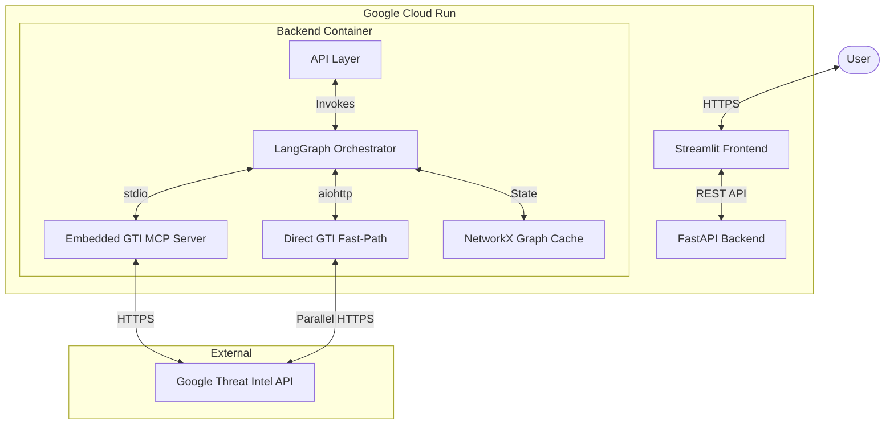

# System Architecture: Project Harimau V2

## 1. High-Level Design

Harimau V2 is a **Cloud-Native, Modular Monolith** for automated threat hunting. It decouples the User Interface from Investigation Logic to support long-running, asynchronous operations with token-optimized LLM analysis.



## 2. Component Breakdown

### 2.1 Frontend (`/app`)
* **Technology**: Streamlit (Python).
* **Role**: Pure presentation layer.
* **Authentication**: Google IAP / IAM (via Cloud Run).
* **Logic**:
  - Submits jobs to Backend (`POST /api/investigate`).
  - Polls for status updates.
  - Visualizes graph with rich tooltips (threat scores, filenames, categories).

### 2.2 Backend (`/backend`)
* **Technology**: FastAPI + LangGraph.
* **Role**: Investigation orchestration and state management.
* **Modules**:
  - `main.py`: API Endpoints with enhanced graph visualization.
  - `graph/workflow.py`: LangGraph State Machine.
  - `graph/state.py`: AgentState definition (includes NetworkX graph)## 3. Data Layer: Investigation Cache

### 3.1 NetworkX Graph (Phase 5 - Current)
* **Storage**: In-memory `MultiDiGraph` stored in LangGraph state.
* **Lifecycle**: Created per investigation, persists for entire job.
* **Contents**: Full entity attributes from GTI API.
* **Purpose**:
  - Triage stores complete entities (all relationships, full attributes).
  - LLM queries minimal fields for analysis (token-efficient).
  - Specialists retrieve full data from cache (no re-fetching).

**Example Usage**:
```python
# Triage stores full entity
graph.add_node(entity_id, **full_attributes)

# LLM gets minimal context
llm_context = {k: graph.nodes[entity_id][k] 
               for k in ["verdict", "threat_score"]}

# Specialist gets everything
full_entity = dict(graph.nodes[entity_id])
```

### 3.2 Future: FalkorDB (Phase 6 - Planned)
* **Purpose**: Persistent storage across investigations.
* **Benefits**: Multi-container support, rich Cypher queries, historical analysis.

---

  - `agents/`: Agent implementations (Triage, Malware, Infrastructure).
  - `tools/`: Direct GTI API wrappers with async support.
* **Logging**: Structured JSON logging (`utils/logger.py`).

### 2.3 Embedded MCP Server (`/backend/mcp`)
* **Technology**: Python (`mcp` library).
* **Role**: Threat intelligence connectivity.
* **Deployment**: Subprocess of Backend.
* **Transport**: `stdio` (zero latency) + Direct API (parallel fetch).
* **Registry**: Dynamic loading via `mcp_registry.json`.

### 2.4 Investigation Cache (NetworkX)
* **Technology**: NetworkX `MultiDiGraph`.
* **Storage**: In LangGraph `AgentState` (per-job, in-memory).
* **Schema**:
  - **Nodes**: Entity ID + full GTI attributes.
  - **Edges**: Relationship types (e.g., `contacted_domains`).
* **Query Patterns**:
  - **For LLM**: Minimal field extraction (9 essential fields).
  - **For Specialists**: Full attribute retrieval.
  - **For Graph UI**: Display fields (URLs, filenames, scores).

### 2.5 Token Optimization Strategy

**Problem**: File IOC investigations consumed 200K-2M tokens (exceeding limits).

**Solution**: Dual-layer data model:

1. **Storage Layer** (Rich):
   ```python
   entity = {
       "id": "sha256...",
       "type": "file",
       "url": "https://full-url.com",  # Display field
       "meaningful_name": "malware.exe",  # Display field
       "names": ["variant1.exe", "variant2.exe"],  # Display field
       "size": 2560000,  # Display field
       "verdict": "MALICIOUS",  # LLM + Display
       "threat_score": 85,  # LLM + Display
       "malicious_count": 42,  # LLM + Display
       # ... full GTI attributes
   }
   ```

2. **LLM Context Layer** (Minimal):
   ```python
   llm_context = {
       "id": entity["id"],
       "type": entity["type"],
       "display_name": entity.get("meaningful_name", entity["id"][:16]),
       "verdict": entity.get("verdict"),
       "threat_score": entity.get("threat_score"),
       "malicious_count": entity.get("malicious_count")
   }
   ```

**Results**:
- File IOC relationships: 20 → 11 critical types (-45%)
- Tokens per entity: 1000 → 50 (-95%)
- Total tokens: 200K-2M → <30K (-90%+)
- Analysis depth: Maintained ✅

### 2.6 Graph Visualization Enhancement

**Display Requirements** (User-Facing):
1. Full URLs (not truncated)
2. File names (not just hashes)
3. Rich tooltips with:
   - Threat score
   - "X vendors detected as malicious"
   - File metadata (name, type, size)
   - URL categories

**Implementation**:
```python
# backend/main.py - Graph endpoint
tooltip_text = f"""
Threat Score: {entity['threat_score']}
{entity['malicious_count']} vendors detected as malicious
Filename: {entity['meaningful_name']}
Type: {entity['file_type']}
Size: {entity['size'] / 1024 / 1024:.2f} MB
Verdict: {entity['verdict']}
""".strip()
```

### 2.7 Observability & Transparency
* **Structured Logging**: JSON logs → Google Cloud Logging.
* **Agent Transparency**:
  - Tool call tracing (status, entity counts, samples).
  - LLM reasoning capture (raw responses).
* **Performance**: Sub-3s latency via parallel "Super-Bundle" enrichment.

---

## 3. API Specification

### 3.1 Investigation Endpoints

#### POST /api/investigate
**Submit new investigation.**

**Request**:
```json
{
  "ioc": "44d88612fea8a8f36de82e1278abb02f"
}
```

**Response** (202 Accepted):
```json
{
  "job_id": "abc-123",
  "status": "running",
  "ioc": "44d88612fea8a8f36de82e1278abb02f",
  "ioc_type": "File"
}
```

#### GET /api/investigations/{job_id}
**Get investigation status and results.**

**Response** (200 OK):
```json
{
  "job_id": "abc-123",
  "status": "completed",
  "ioc": "44d88612fea8a8f36de82e1278abb02f",
  "ioc_type": "File",
  "risk_level": "HIGH",
  "gti_score": 85,
  "final_report": "...",
  "metadata": {
    "tool_call_trace": [...],
    "rich_intel": {...}
  }
}
```

#### GET /api/investigations/{job_id}/graph
**Get graph data with rich tooltips.**

**Response** (200 OK):
```json
{
  "nodes": [
    {
      "id": "contacted_domains_evil.com",
      "label": "evil.com",
      "color": "#E67E22",
      "size": 20,
      "title": "Threat Score: 85\n42 vendors detected as malicious\nVerdict: MALICIOUS"
    }
  ],
  "edges": [...]
}
```

#### GET /api/debug/investigation/{job_id}
**Debug endpoint for investigation state inspection.**

#### GET /api/diagnostic/pipeline/{ioc}
**Test each pipeline step independently.**

---

## 4. Key Design Patterns

### 4.1 Alpha-Inspired Data Flow
1. **Fetch Everything**: Triage fetches full entities + all relationships.
2. **Store Everything**: NetworkX graph caches complete attributes.
3. **Query Minimal**: LLM receives filtered 9-field summaries.
4. **Enrich On-Demand**: Specialists pull full data from cache.

**Benefits**:
- No re-fetching (faster, fewer API calls)
- LLM stays under token limits
- Specialists have full context
- Graph UI shows rich tooltips

### 4.2 Triage vs Specialists

**Triage Agent** (Breadth-First):
- Fetches 11 critical relationship types
- Stores minimal entity data for each
- Provides complete graph structure
- Identifies high-value entities for deep-dive
- **Token Budget**: <30K

**Specialist Agents** (Depth-First):
- Query full enrichment from NetworkX cache
- Pull sandbox reports, PCAP data, attribution chains
- Investigate pivots identified by triage
- **Token Budget**: No limits (focused analysis on 5-10 entities)

### 4.3 Asynchronous Reliability
Investigations can take >5 minutes. HTTP times out in 60s.
* **Solution**: Frontend submits job, gets `job_id`, polls for updates.
* **Backend**: Runs LangGraph workflow synchronously (Cloud Run timeout: 60m).

### 4.4 Tiered Logging
* **Info Level**: Milestones ("Triage Complete").
* **Debug Level**: Full trace (tool I/O, agent reasoning).
* **Format**: JSON for Cloud Logging.

---

## 5. Security
* **Authentication**: Google Cloud IAM (Invoker Role).
* **Secrets**: `GTI_API_KEY` stored in Secret Manager, injected as env var.
* **Network**: All traffic over HTTPS.

---

## 6. Recent Improvements

### Token Optimization (Jan 2026)
- Reduced file IOC token usage by 90%+
- Implemented dual-layer data model
- Maintained analysis depth

### Bug Fixes (Jan 2026)
- ✅ Fixed `UnboundLocalError` (variable shadowing in triage)
- ✅ Fixed empty graph tooltips
- ✅ Added full URL display

### Visualization (Jan 2026)
- Rich mouseover tooltips
- Full filenames in graph
- Human-readable vendor detections

---

## 7. Roadmap

### Phase 5 (Current)
- [x] NetworkX investigation cache
- [ ] Enhanced specialist agents
- [ ] Historical investigation queries

### Phase 6 (Planned)
- [ ] Migrate to FalkorDB for persistence
- [ ] Multi-container support
- [ ] Real-time SSE updates
- [ ] Advanced graph queries (Cypher)
