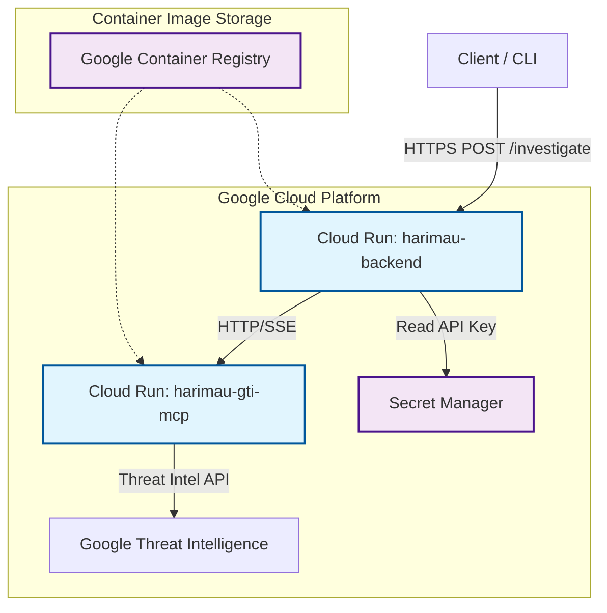

# System Architecture

## Phase 1: Cloud Run Microservices

The following diagram illustrates the deployment architecture of the Project Harimau Triage Agent on Google Cloud Platform.

## Component Interaction

1.  **Client**: Initiates investigation via `POST /investigate` with an IOC (e.g., `google.com`).
2.  **Harimau Backend**:
    *   Authenticates via IAM (if enabled) or public endpoint for Phase 1.
    *   Initializes the **LangGraph** workflow.
    *   **Triage Agent** routes requests to the **MCP Registry**.
3.  **MCP Registry**:
    *   Retrieves the `GTI_MCP_URL` from environment variables.
    *   Establishes an **SSE (Server-Sent Events)** connection to the GTI MCP Service.
    *   Sends JSON-RPC requests to querying tools (`get_domain_report`, etc.).
4.  **Harimau GTI MCP**:
    *   Receives MCP requests.
    *   Authenticates with **Google Threat Intelligence** using the key stored in Secret Manager (injected as env var).
    *   Returns threat data to the Backend.
5.  **Synthesis Agent**:
    *   Aggregates findings.
    *   Generates the final Markdown report.
