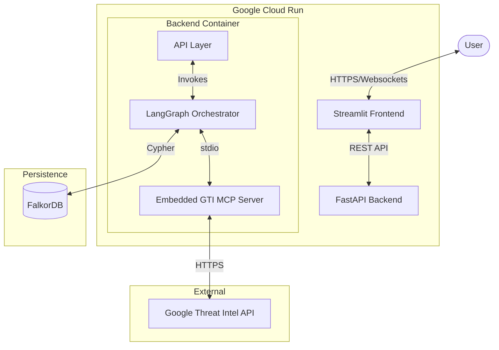

# System Architecture: Project Harimau V2

## 1. High-Level Design

Harimau V2 is a **Cloud-Native, Modular Monolith** designed for automated threat hunting. It decouples the User Interface from the Investigation Logic to support long-running, asynchronous operations.



## 2. Component Breakdown

### 2.1 Frontend (`/app`)
*   **Technology**: Streamlit (Python).
*   **Role**: purely presentation.
*   **Authentication**: Google IAP / IAM (via Cloud Run).
*   **Logic**:
    *   Submits jobs to Backend (`POST /api/investigate`).
    *   Polls/Streams status updates.
    *   Visualizes the Graph (using `streamlit-agraph`).

### 2.2 Backend (`/backend`)
*   **Technology**: FastAPI + LangGraph.
*   **Role**: The "Brain". Handles orchestration and state.
*   **Modules**:
    *   `router.py`: API Endpoints.
    *   `graph.py`: LangGraph State Machine definition.
    *   `agents/`: Directory containing agent logic (Triage, Malware, Infra).
    *   `tools/`: Directory containing Tool definitions (MCP Clients).
*   **Logging**: Structured JSON logging (`utils/logger.py`) for Cloud Logging ingestion.

### 2.3 Embedded MCP Server (`/backend/mcp`)
*   **Technology**: Python (`mcp` library).
*   **Role**: Connectivity to Threat Intel.
*   **Deployment**: Runs as a **Subprocess** of the Backend.
*   **Transport**: `stdio` (Standard Input/Output) for zero latency.
*   **Registry**: Dynamic loading via `mcp_registry.json`.
*   **Troubleshooting & Integration Notes**:
    *   **Imports**: When embedding external MCP servers (like `gti`), ensure import paths are relative (e.g., `from .tools import *` instead of `from gti_mcp import *`) to function within the `backend` package structure.
    *   **Environment**: The internal subprocess must use the correct Python interpreter. We map `"command": "python"` to `sys.executable` in `client.py` to ensure it uses the running venv/container environment (important for `python` vs `python3` discrepancies).

### 2.4 Graph Engine
*   **Technology**: FalkorDB (Redis Graph).
*   **Role**: Stores investigation state (Nodes/Edges).
*   **Schema**:
    *   **Core**: `id`, `type`, `verdict`, `color`.
    *   **Dynamic**: Agents add properties as JSON.
    *   **Edges**: Relationship names map to TI API keys (e.g. `:DOWNLOADED`).

## 3. API Specification

The Backend exposes a REST API for the Frontend to consume.

### 3.1 Investigation Endpoints

#### POST /api/investigate
**Submit a new investigation job.**

**Request:**
```json
{
  "ioc": "1.1.1.1",
  "ioc_type": "ip",  // Optional: auto-detect if not provided
  "max_depth": 2      // Optional: default from config
}
```

**Response (202 Accepted):**
```json
{
  "job_id": "inv-abc123",
  "status": "queued",
  "created_at": "2026-01-08T01:47:00Z"
}
```

#### GET /api/investigations/{job_id}
**Get investigation status and results.**

**Response (200 OK):**
```json
{
  "job_id": "inv-abc123",
  "status": "completed",  // queued|running|completed|failed
  "ioc": "1.1.1.1",
  "created_at": "2026-01-08T01:47:00Z",
  "completed_at": "2026-01-08T01:50:00Z",
  "verdict": "malicious",
  "graph_url": "/api/investigations/inv-abc123/graph",
  "report_url": "/api/investigations/inv-abc123/report"
}
```

#### GET /api/investigations/{job_id}/graph
**Get graph data for visualization.**

**Response (200 OK):**
```json
{
  "nodes": [
    {"id": "1.1.1.1", "type": "ip", "verdict": "malicious", "color": "#ff0000"}
  ],
  "edges": [
    {"from": "1.1.1.1", "to": "malware.exe", "type": "DOWNLOADED", "label": "Downloaded"}
  ]
}
```

#### GET /api/investigations/{job_id}/report
**Get final investigation report (markdown).**

**Response (200 OK):**
```markdown
# Investigation Report: 1.1.1.1

## Executive Summary
The IP address 1.1.1.1 is assessed as **MALICIOUS** with high confidence. 
This infrastructure was observed distributing ransomware payloads.

## Attack Chain
Analysis reveals the following sequence:
1. Initial file `malware.exe` (SHA256: abc123...) contacted 1.1.1.1
2. The file attempted to execute obfuscated code that established C2 communication
3. A 2nd stage ransomware payload was downloaded from domain `evil.com` (resolved to 1.1.1.1)
4. The payload exhibits behaviors consistent with Conti ransomware (TTP: T1486)

## Evidence
- **File**: malware.exe - MALICIOUS (AV detections: 45/70)
- **IP**: 1.1.1.1 - MALICIOUS (Known C2 infrastructure)
- **Domain**: evil.com - MALICIOUS (Recently registered, hosting malware)

## Technical Details
- Campaign: "Conti v3 Distribution"
- TTPs: T1486 (Data Encrypted for Impact), T1071 (Application Layer Protocol)

## Recommended Actions
1. Block 1.1.1.1 at perimeter firewall
2. Quarantine all instances of malware.exe
3. Search for evil.com in proxy logs
```

#### GET /api/investigations/{job_id}/artifacts/{filename}
**Download saved artifacts (graph.png, report.md).**

**Response (200 OK):** Binary file content

### 3.2 Librarian Endpoints

#### GET /api/schema/proposals
**Get pending schema change proposals.**

**Response (200 OK):**
```json
{
  "proposals": [
    {
      "id": "prop-123",
      "type": "edge_merge",
      "description": "Merge :DOWNLOADS and :DOWNLOADED",
      "affected_count": 15
    }
  ]
}
```

#### POST /api/schema/proposals/{proposal_id}/approve
**Approve a schema change proposal.**

**Response (200 OK):**
```json
{"status": "applied", "message": "Merged 15 edges"}
```

### 3.3 Health & Utility

#### GET /health
**Health check endpoint.**

**Response (200 OK):**
```json
{"status": "healthy", "services": {"db": "ok", "mcp": "ok"}}
```

### 3.4 Real-time Updates (Optional)

**Phase 1 (Polling):**
Streamlit polls `GET /api/investigations/{job_id}` every 10 seconds.

**Phase 2 (SSE - Future):**
#### GET /api/investigations/{job_id}/stream
**Stream real-time investigation updates.**

**Response (200 OK, text/event-stream):**
```
event: node_added
data: {"id": "1.1.1.1", "type": "ip"}

event: agent_started
data: {"agent": "malware_specialist"}

event: verdict_reached
data: {"verdict": "malicious", "confidence": 0.95}
```

## 4. Key Design Patterns

### 3.1 Asynchronous Reliability
Investigations can take >5 minutes. HTTP times out in 60s.
*   **Solution**: The Frontend submits a job and gets a `job_id`. The Backend runs the LangGraph workflow in a background thread (or Cloud Task). The Frontend polls for updates.

### 3.2 Tiered Logging (Observability)
*   **Info Level**: Milestones ("Malware Found").
*   **Debug Level**: Full Trace (Tool Inputs/Outputs, Agent Reasoning).
*   **Format**: JSON.

### 3.3 Self-Refining Schema (The Librarian)
*   An asynchronous agent runs *after* the report.
*   It analyzes the graph for schema inconsistencies (e.g. duplicate edge types).
*   It proposes changes that require Human Approval in the UI.

## 4. Security
*   **Authentication**: Managed by Google Cloud IAM (Invoker Role).
*   **Secrets**: API Keys (GTI_API_KEY) stored in Secret Manager and injected as Env Vars.
