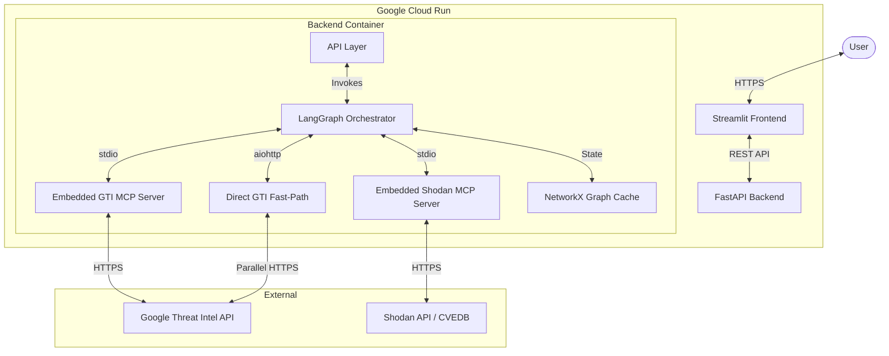

# System Architecture: Project Harimau V2

## 1. High-Level Design

Harimau V2 is a **Cloud-Native, Modular Monolith** for automated threat hunting. It decouples the User Interface from Investigation Logic to support long-running, asynchronous operations with token-optimized LLM analysis.


```mermaid
graph TD
    User([User]) <-->|HTTPS| Frontend[Streamlit Frontend]
    
    subgraph "Google Cloud Run"
        Frontend <-->|REST API| Backend[FastAPI Backend]
        
        subgraph "Backend Container"
            BackendAPI[API Layer] <-->|Invokes| LG[LangGraph Orchestrator]
            LG <-->|stdio| GTIMC[Embedded GTI MCP Server]
            LG <-->|stdio| ShodanMCP[Embedded Shodan MCP Server]
            LG <-->|aiohttp| DirectAPI[Direct GTI Fast-Path]
            LG <-->|State| Cache[NetworkX Graph Cache]
        end
    end

    subgraph "External"
        GTIMC <-->|HTTPS| GoogleTI[Google Threat Intel API]
        DirectAPI <-->|Parallel HTTPS| GoogleTI
        ShodanMCP <-->|HTTPS| ShodanAPI[Shodan API / CVEDB]
    end
```

## 2. Component Breakdown

### 2.1 Frontend (`/app`)
* **Technology**: Streamlit (Python).
* **Role**: Pure presentation layer.
* **Architecture**: Component-based modularity.
  - `main.py`: Application entry point and orchestrator.
  - `components/sidebar.py`: Settings, health-checks, graph controls.
  - `components/investigation_tracker.py`: Job polling and SSE progress streaming.
  - `components/results_tabs.py`: Renders Triage, Graph, Specialists, and Timeline tabs.
* **Authentication**: Google IAP / IAM (via Cloud Run).
* **Logic**:
  - Submits jobs to Backend (`POST /api/investigate`).
  - Polls for status updates via tracker component.
  - Visualizes graph with rich tooltips (threat scores, filenames, categories).

### 2.2 Backend (`/backend`)
* **Technology**: FastAPI + LangGraph.
* **Role**: Investigation orchestration and state management.
* **Modules**:
  - `main.py`: API Endpoints with enhanced graph visualization.
  - `graph/workflow.py`: LangGraph State Machine (Iterative Loop).
  - `graph/state.py`: AgentState definition (includes NetworkX graph).
  - `agents/`: Agent implementations (Triage, Malware, Infrastructure).
  - `tools/`: Direct GTI API wrappers with async support.
* **Logging**: Structured JSON logging (`utils/logger.py`).

#### Data Layer: Store First, Summarize Second

NetworkX Graph & Persistence (Phase 6 - Current):
* **Storage**: In-memory `MultiDiGraph` stored in LangGraph state.
* **Persistence**: LangGraph state snapshots are persisted to **Cloud SQL (PostgreSQL)** using `AsyncPostgresSaver`.
* **Lifecycle**: Created per investigation, persists for entire job; survives container restarts.
* **Contents**: Full entity attributes from GTI API.

To maintain token efficiency, Agents strictly follow this order of operations:
1. **Fetch**: Agent calls GTI API tool (e.g., `get_file_report`).
2. **Store (Data Layer)**: Agent *immediately* writes the full, heavy JSON response into NetworkX. This acts as the "Hard Drive".
3. **Summarize (Control Layer)**: Agent extracts a *minimal* summary (ID, Verdict, Score) to pass back to the LangGraph state (`messages`). This acts as the "RAM".

**Why?**
* **NetworkX (Hard Drive)**: Holds 100% of the data (50+ attributes per entity). Zero token cost.
* **LangGraph (RAM)**: Holds <5% of data. Keeps LLM context small (<30K tokens).

**Example Usage**:
```python
# 1. FETCH
raw_data = gti_api.get(entity)

# 2. CACHE (NetworkX) - Store the heavy data here
cache.add_entity(entity, raw_data)

# 3. SUMMARIZE (LangGraph) - Tell the LLM what we found
summary = f"Found entity {entity.id} with verdict {entity.verdict}"

# 4. RETURN - Updates the workflow state
return {"messages": [summary]}
```

**Data Layer: Cloud SQL (PostgreSQL)** (Phase 6 - Current):
* **Purpose**: Persistent storage for investigation results and metadata.
* **Implementation**: `asyncpg` for relational data, JSONB for rich metadata.
* **Checkpointer**: `AsyncPostgresSaver` (via `psycopg`) for LangGraph state persistence.
* **Benefits**: Recovers investigations after container scale-down or crash; avoids memory-only data loss.

Future: FalkorDB (Phase 7 - Planned):
* **Purpose**: Cross-investigation graph queries (IOC/campaign correlation).
* **Benefits**: Multi-container support, rich Cypher queries, historical analysis.

### 2.3 Embedded MCP Servers (`/backend/mcp`)
* **Technology**: Python (`mcp` library, FastMCP).
* **Role**: Threat intelligence connectivity.
* **Deployment**: Subprocess of Backend (one process per server).
* **Transport**: `stdio` (zero latency) + Direct API (parallel fetch).
* **Registry**: Dynamic loading via `mcp_registry.json`.
* **Servers**:
  - **GTI MCP** (`backend/mcp/gti/`): Google Threat Intelligence — file, domain, IP, URL analysis, hunting rulesets, threat profiles.
  - **Shodan MCP** (`backend/mcp/shodan/`): Internet exposure data — IP host lookup (ports, services, banners, SSL/SSH/FTP/DNS fingerprints), DNS resolution, reverse DNS, CVE/CPE lookup via CVEDB.

### 2.4 Investigation Cache (NetworkX)
* **Technology**: NetworkX `MultiDiGraph`.
* **Storage**: In LangGraph `AgentState` (per-job, in-memory).
* **Schema**:
  - **Nodes**: Entity ID + **full_gti_attributes** (e.g., scores, verdict, country, full JSON).
  - **Edges**: Relationship type + metadata (e.g., `first_seen`, `scan_date`).
* **Query Patterns**:
  - **For LLM**: Minimal field extraction (9 essential fields).
  - **For Specialists**: Full attribute retrieval.
  - **For Graph UI**: Display fields (URLs, filenames, scores).

### 2.5 Token Optimization Strategy

**Problem**: File IOC investigations consumed 200K-2M tokens (exceeding limits).

**Solution**: Dual-layer data model:

1. **Storage Layer** (Rich):
   ```python
   entity = {
       "id": "sha256...",
       "type": "file",
       "url": "https://full-url.com",  # Display field
       "meaningful_name": "malware.exe",  # Display field
       "names": ["variant1.exe", "variant2.exe"],  # Display field
       "size": 2560000,  # Display field
       "verdict": "MALICIOUS",  # LLM + Display
       "threat_score": 85,  # LLM + Display
       "malicious_count": 42,  # LLM + Display
       # ... full GTI attributes
   }
   ```

2. **LLM Context Layer** (Minimal):
   ```python
   llm_context = {
       "id": entity["id"],
       "type": entity["type"],
       "display_name": entity.get("meaningful_name", entity["id"][:16]),
       "verdict": entity.get("verdict"),
       "threat_score": entity.get("threat_score"),
       "malicious_count": entity.get("malicious_count")
   }
   ```

**Results**:
- File IOC relationships: 20 → 11 critical types (-45%)
- Tokens per entity: 1000 → 50 (-95%)
- Total tokens: 200K-2M → <30K (-90%+)
- Analysis depth: Maintained ✅

### 2.6 Graph Visualization Enhancement

**Display Requirements** (User-Facing):
1. Full URLs (not truncated)
2. File names (not just hashes)
3. Rich tooltips with:
   - Threat score
   - "X vendors detected as malicious"
   - File metadata (name, type, size)
   - URL categories

**Implementation**:
```python
# backend/main.py - Graph endpoint
tooltip_text = f"""
Threat Score: {entity['threat_score']}
{entity['malicious_count']} vendors detected as malicious
Filename: {entity['meaningful_name']}
Type: {entity['file_type']}
Size: {entity['size'] / 1024 / 1024:.2f} MB
Verdict: {entity['verdict']}
""".strip()
```

### 2.7 Observability & Transparency
* **Structured Logging**: JSON logs → Google Cloud Logging.
* **Agent Transparency**:
  - Tool call tracing (status, entity counts, samples).
  - LLM reasoning capture (raw responses).
* **Performance**: Sub-3s latency via parallel "Super-Bundle" enrichment.

---

## 3. API Specification

### 3.1 Investigation Endpoints

#### POST /api/investigate
**Submit new investigation (Async Pattern).**

**Request**:
```json
{
  "ioc": "44d88612fea8a8f36de82e1278abb02f",
  "max_iterations": 3
}
```

`max_iterations` is optional — defaults to the `HUNT_ITERATIONS` env var (default: 3). Controls investigation depth: 1 = fast triage, 5 = deep investigation.

**Response** (200 OK - Returns immediately):
```json
{
  "job_id": "abc-123",
  "status": "running",
  "message": "Investigation started. Poll /api/investigations/{job_id} for results."
}
```

**Note**: Investigation runs in background. Poll the GET endpoint below for completion status.

#### GET /api/investigations/{job_id}
**Get investigation status and results.**

**Response** (200 OK):
```json
{
  "job_id": "abc-123",
  "status": "completed",
  "ioc": "44d88612fea8a8f36de82e1278abb02f",
  "ioc_type": "File",
  "risk_level": "HIGH",
  "gti_score": 85,
  "final_report": "...",
  "metadata": {
    "tool_call_trace": [...],
    "rich_intel": {...}
  }
}
```

#### GET /api/investigations/{job_id}/graph
**Get graph data with rich tooltips.**

**Response** (200 OK):
```json
{
  "nodes": [
    {
      "id": "contacted_domains_evil.com",
      "label": "evil.com",
      "color": "#E67E22",
      "size": 20,
      "title": "Threat Score: 85\n42 vendors detected as malicious\nVerdict: MALICIOUS"
    }
  ],
  "edges": [...]
}
```

#### GET /api/debug/investigation/{job_id}
**Debug endpoint for investigation state inspection.**

#### GET /api/diagnostic/pipeline/{ioc}
**Test each pipeline step independently.**

---

## 4. Key Design Patterns

### 4.1 Alpha-Inspired Data Flow
1. **Fetch Everything**: Triage fetches full entities + all relationships.
2. **Store Everything**: NetworkX graph caches complete attributes.
3. **Query Minimal**: LLM receives filtered 9-field summaries.
4. **Enrich On-Demand**: Specialists pull full data from cache.

**Benefits**:
- No re-fetching (faster, fewer API calls)
- LLM stays under token limits
- Specialists have full context
- Graph UI shows rich tooltips

### 4.2 Triage vs Specialists

**Triage Agent** (Breadth-First):
- Fetches 11 critical relationship types
- Stores minimal entity data for each
- Provides complete graph structure
- Identifies high-value entities for deep-dive
- **Token Budget**: <30K

**Specialist Agents** (Depth-First):
- Query full enrichment from NetworkX cache.
- Pull sandbox reports, PCAP data, attribution chains.
- Investigate pivots identified by triage.
- **Reporting Strategy**: Specialist Agents generate structured Python reports instead of embedding Markdown in JSON. This prevents parsing errors and ensures 100% stability.
- **Data Sync**: Findings are "Double Committed" to the NetworkX cache (Data Layer) and the LangGraph state (Control Layer) for immediate frontend rendering.
- **Token Budget**: No limits (focused analysis on 5-10 entities).

### 4.3 Specialist Handoff & Visualization
1. **Dynamic Routing**: Triage identifies specialists (e.g., `malware_specialist`) based on IOC properties.
2. **Specialist Results Tab**: A dedicated Streamlit tab renders individual markdown reports for each specialist.
3. **Graph Integration**: Specialist findings (Dropped Files, C2 IPs) appear as new nodes in the graph with unique 🚩 specialist tooltips.
4. **Centering Logic**: The graph is explicitly forced to re-center when specialized findings are added.

### 4.4 Async Background Processing (Feb 2026)

**Problem**: Investigations can take 8+ minutes. HTTP connections time out in 60-300 seconds depending on Cloud Run configuration.

**Solution**: Async job pattern with polling:
* **Frontend**: Submits investigation via `POST /api/investigate`, receives `job_id` immediately, polls `GET /api/investigations/{job_id}` every 10 seconds.
* **Backend**: Returns job immediately, runs LangGraph workflow in background task (`asyncio.create_task`). Cloud Run container timeout: 60 minutes.
* **Progress Bar**: Frontend calculates progress based on elapsed time (~8.5 min average) capped at 95% until actual completion.

**Benefits**:
- No connection timeouts for long investigations
- Real-time status updates via polling
- User-friendly progress visualization

### 4.4 Tiered Logging
* **Info Level**: Milestones ("Triage Complete").
* **Debug Level**: Full trace (tool I/O, agent reasoning).
* **Format**: JSON for Cloud Logging.

---

## 5. Security
* **Authentication**: Google Cloud IAM (Invoker Role). Full Cloud IAP planned for Phase 6.3.
* **Secrets**: `GTI_API_KEY`, `WEBRISK_API_KEY`, `SHODAN_API_KEY` stored in Secret Manager, injected as env vars at Cloud Run startup.
* **Network**: All traffic over HTTPS.

---

## 6. Recent Improvements

### Token Optimization (Jan 2026)
- Reduced file IOC token usage by 90%+
- Implemented dual-layer data model
- Maintained analysis depth

### Bug Fixes (Jan 2026)
- ✅ Fixed `UnboundLocalError` (variable shadowing in triage)
- ✅ Fixed empty graph tooltips
- ✅ Added full URL display

### Visualization (Jan 2026)
- Rich mouseover tooltips
- Full filenames in graph
- Human-readable vendor detections

### Code Quality Overhaul (Feb 2026)
- **Robustness**: Consolidated infrastructure agent state updates to prevent race conditions.
- **Data Integrity**: Implemented deep-merge deduplication in NetworkX cache.
- **Reliability**: Replaced bare exception handlers with specific error types and structured logging.
- **Efficiency**: Confirmed parallel execution of specialist agents.

### Major Changes (Feb 2026)

#### Async Background Processing
- **Problem**: Investigations taking 8+ minutes exceeded Cloud Run connection timeout (60-300s)
- **Solution**: POST /api/investigate returns immediately with job_id, investigation runs via `asyncio.create_task`
- **Frontend**: Polls every 10 seconds with realistic progress bar (95% cap until completion)
- **Impact**: Zero connection timeouts, improved UX

#### Parallel Specialist Execution Fixes
- **Graph Merge**: Added custom reducer to preserve data from parallel malware/infra agents
- **Iteration Logic**: Fixed Lead Hunter to allow synthesis at final iteration (changed `>= max_iterations` to `> max_iterations`)
- **Data Preservation**: Subtasks stored in `metadata["rich_intel"]["triage_analysis"]["subtasks"]` to survive Lead Hunter state clearing
- **Impact**: Frontend timeline and agent tasks now display correctly

#### Malware Agent Enhancements
- **New Tools**: 
  - `get_file_report` - Full static analysis report
  - `get_attribution` now includes vulnerabilities (CVEs, exploits)
- **Target Limiting**: `max_analysis_targets = 5` (separate from `malware_iterations = 10`)
- **Impact**: Better intelligence quality without overwhelming API/tokens

### Cloud SQL Persistence & LangGraph Checkpointing (Mar 2026)
- **Problem**: Cloud Run scales to zero, causing loss of all in-memory investigation results and mid-flight state.
- **Solution**: Replaced in-memory `JOBS` dict with **Cloud SQL (PostgreSQL)** using `asyncpg`.
- **Checkpointing**: Integrated LangGraph `AsyncPostgresSaver` to persist state snapshots, allowing jobs to resume across restarts.
- **Data Integrity**: Optimized `save_job` to exclude binary objects (NetworkX graph) and improved error handling to prevent "split-brain" states.
- **Impact**: Investigations are now durable and survive infrastructure interruptions.

### Configurable Investigation Depth / `max_iterations` (Mar 2026)
- **Problem**: `hunt_iterations` (workflow.py) and `MAX_ITERATIONS` (lead_hunter.py) were two separate hardcoded constants controlling the same loop limit — prone to silent drift.
- **Solution**: Unified into a single `max_iterations` field in `AgentState`, set once from `POST /api/investigate` and carried unchanged through the entire LangGraph loop.
- **Operator default**: `HUNT_ITERATIONS` env var on the Cloud Run service (no redeployment for tuning).
- **User control**: Sidebar slider (1–5) passed as `max_iterations` in the POST payload.
- **Impact**: Single source of truth for depth. Cost vs. thoroughness is now a per-investigation analyst decision.

---

## 7. Roadmap

### Phase 5 (Current)
- [x] NetworkX investigation cache
- [x] Enhanced specialist agents
- [ ] Historical investigation queries

### Phase 6 (Current)
- [x] Cloud SQL (PostgreSQL) — investigation persistence + LangGraph checkpointing (`AsyncPostgresSaver`)
- [x] Real-time SSE updates
- [x] Configurable `max_iterations` — per-request investigation depth via `AgentState` + frontend slider
- [x] Shodan MCP integration — internet exposure enrichment for Infrastructure Agent (Phase 6.2)
- [ ] Authentication hardening — Cloud IAP + Load Balancer + WAF (Phase 6.3)
- [ ] A2A protocol support — expose Agent Card + inbound task endpoint; optional outbound handoff to detection_agent (enable/disable via `DETECTION_AGENT_ENABLED` env var)

### Phase 7 (Future)
- [ ] FalkorDB — cross-investigation graph queries (IOC/campaign correlation across investigations)
- [ ] Multi-container support
- [ ] Advanced graph queries (Cypher)

### Long-Term Exploration
- [ ] Migrate from Cloud SQL + FalkorDB to **Cloud Spanner + SpannerGraph** — single database for both relational and graph workloads. Pending confirmation of LangGraph checkpointer compatibility with Spanner's PostgreSQL dialect.
