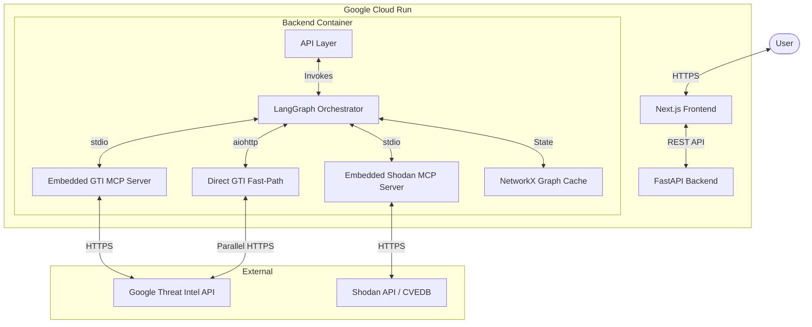
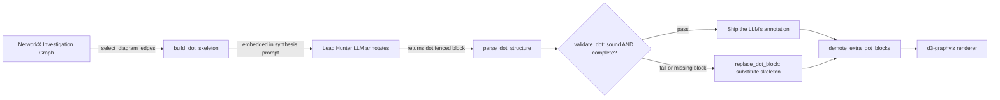

# System Architecture: Project Harimau

## 1. High-Level Design

Harimau is a **Cloud-Native, Modular Monolith** for automated threat hunting. It decouples the User Interface from Investigation Logic to support long-running, asynchronous operations with token-optimized LLM analysis.


```mermaid
graph TD
    User([User]) <-->|HTTPS| Frontend[Next.js Frontend]
    
    subgraph "Google Cloud Run"
        Frontend <-->|REST API| Backend[FastAPI Backend]
        
        subgraph "Backend Container"
            BackendAPI[API Layer] <-->|Invokes| LG[LangGraph Orchestrator]
            LG <-->|stdio| GTIMC[Embedded GTI MCP Server]
            LG <-->|stdio| ShodanMCP[Embedded Shodan MCP Server]
            LG <-->|aiohttp| DirectAPI[Direct GTI Fast-Path]
            LG <-->|State| Cache[NetworkX Graph Cache]
        end
    end

    subgraph "External"
        GTIMC <-->|HTTPS| GoogleTI[Google Threat Intel API]
        DirectAPI <-->|Parallel HTTPS| GoogleTI
        ShodanMCP <-->|HTTPS| ShodanAPI[Shodan API / CVEDB]
    end
```

## 2. Component Breakdown

### 2.1 Frontend (`/app`)
* **Technology**: Next.js (React, TypeScript, Tailwind CSS v4).
* **Role**: Pure presentation layer.
* **Architecture**: App Router with server/client components.
  - `src/app/page.tsx`: Main landing page with centered search box and investigation controls.
  - `src/app/investigate/[id]/page.tsx`: Dynamic route for rendering a **Tiled Tactical Dashboard** (graph, timeline, specialist dossiers, and transparency log).
  - `src/app/globals.css`: Global styles including Tailwind directives.
* **Authentication**: Google IAP / IAM (via Cloud Run).
* **Logic**:
  - Submits jobs to Backend (`POST /api/investigate`).
  - Fetches data from Backend via catch-all API route proxy (`src/app/api/[...path]/route.ts`) — reads `BACKEND_URL` at request time from Cloud Run env var.
  - Visualizes graph with **ReactFlow** and **d3-force** simulation.

### 2.2 Backend (`/backend`)
* **Technology**: FastAPI + LangGraph.
* **Role**: Investigation orchestration and state management.
* **Modules**:
  - `main.py`: API Endpoints with enhanced graph visualization.
  - `graph/workflow.py`: LangGraph State Machine (Iterative Loop).
  - `graph/state.py`: AgentState definition (includes NetworkX graph).
  - `agents/`: Agent implementations (Triage, Malware, Infrastructure, Lead Hunter).
  - `tools/`: Direct GTI API wrappers with async support.
  - `utils/agent_utils.py`: Shared agent helpers, including `tool_timeout()` — wraps every specialist tool with a wall-clock budget and catch-all so a slow or failing tool degrades to a JSON error string instead of aborting the specialist's `ToolNode` sub-graph.
  - `utils/dot_builder.py`: Builds and validates the deterministic attack-flow diagram (see §2.9).
  - `utils/sse_manager.py`: SSE broadcast + progress tracking (see §2.7).
* **Logging**: Structured JSON logging (`utils/logger.py`).

#### Data Layer: Store First, Summarize Second

NetworkX Graph & Persistence (Phase 6 - Current):
* **Storage**: In-memory `MultiDiGraph` stored in LangGraph state.
* **Persistence**: LangGraph state snapshots are persisted to **Cloud SQL (PostgreSQL)** using `AsyncPostgresSaver`.
* **Lifecycle**: Created per investigation, persists for entire job; survives container restarts.
* **Contents**: Full entity attributes from GTI API.

To maintain token efficiency, Agents strictly follow this order of operations:
1. **Fetch**: Agent calls GTI API tool (e.g., `get_file_report`).
2. **Store (Data Layer)**: Agent *immediately* writes the full, heavy JSON response into NetworkX. This acts as the "Hard Drive".
3. **Summarize (Control Layer)**: Agent extracts a *minimal* summary (ID, Verdict, Score) to pass back to the LangGraph state (`messages`). This acts as the "RAM".

**Why?**
* **NetworkX (Hard Drive)**: Holds 100% of the data (50+ attributes per entity). Zero token cost.
* **LangGraph (RAM)**: Holds <5% of data. Keeps LLM context small (<30K tokens).

**Example Usage**:
```python
# 1. FETCH
raw_data = gti_api.get(entity)

# 2. CACHE (NetworkX) - Store the heavy data here
cache.add_entity(entity, raw_data)

# 3. SUMMARIZE (LangGraph) - Tell the LLM what we found
summary = f"Found entity {entity.id} with verdict {entity.verdict}"

# 4. RETURN - Updates the workflow state
return {"messages": [summary]}
```

**Data Layer: Cloud SQL (PostgreSQL)** (Phase 6 - Current):
* **Purpose**: Persistent storage for investigation results and metadata.
* **Implementation**: `asyncpg` for relational data, JSONB for rich metadata.
* **Checkpointer**: `AsyncPostgresSaver` (via `psycopg`) for LangGraph state persistence.
* **Benefits**: Recovers investigations after container scale-down or crash; avoids memory-only data loss.

Future: FalkorDB (Phase 7 - Planned):
* **Purpose**: Cross-investigation graph queries (IOC/campaign correlation).
* **Benefits**: Multi-container support, rich Cypher queries, historical analysis.

### 2.3 Embedded MCP Servers (`/backend/mcp`)
* **Technology**: Python (`mcp` library, FastMCP).
* **Role**: Threat intelligence connectivity.
* **Deployment**: Subprocess of Backend (one process per server).
* **Transport**: `stdio` (zero latency) + Direct API (parallel fetch).
* **Registry**: Dynamic loading via `mcp_registry.json`.
* **Servers**:
  - **GTI MCP** (`backend/mcp/gti/`): Google Threat Intelligence — file, domain, IP, URL analysis, hunting rulesets, threat profiles.
  - **Shodan MCP** (`backend/mcp/shodan/`): Internet exposure data — IP host lookup (ports, services, banners, SSL/SSH/FTP/DNS fingerprints), DNS resolution, reverse DNS, CVE/CPE lookup via CVEDB.

### 2.4 Investigation Cache (NetworkX)
* **Technology**: NetworkX `MultiDiGraph`.
* **Storage**: In LangGraph `AgentState` (per-job, in-memory).
* **Schema**:
  - **Nodes**: Entity ID + **full_gti_attributes** (e.g., scores, verdict, country, full JSON).
  - **Edges**: Relationship type + metadata (e.g., `first_seen`, `scan_date`).
* **Query Patterns**:
  - **For LLM**: Minimal field extraction (9 essential fields).
  - **For Specialists**: Full attribute retrieval.
  - **For Lead Hunter Synthesis**: Graph-derived summaries (high-signal nodes, relationships, IOC pivots) combined with triage and specialist summaries.
  - **For Graph UI**: Display fields (URLs, filenames, scores).

### 2.5 Token Optimization Strategy

**Problem**: File IOC investigations consumed 200K-2M tokens (exceeding limits).

**Solution**: Dual-layer data model:

1. **Storage Layer** (Rich):
   ```python
   entity = {
       "id": "sha256...",
       "type": "file",
       "url": "https://full-url.com",  # Display field
       "meaningful_name": "malware.exe",  # Display field
       "names": ["variant1.exe", "variant2.exe"],  # Display field
       "size": 2560000,  # Display field
       "verdict": "MALICIOUS",  # LLM + Display
       "threat_score": 85,  # LLM + Display
       "malicious_count": 42,  # LLM + Display
       # ... full GTI attributes
   }
   ```

2. **LLM Context Layer** (Minimal):
   ```python
   llm_context = {
       "id": entity["id"],
       "type": entity["type"],
       "display_name": entity.get("meaningful_name", entity["id"][:16]),
       "verdict": entity.get("verdict"),
       "threat_score": entity.get("threat_score"),
       "malicious_count": entity.get("malicious_count")
   }
   ```

**Results**:
- File IOC relationships: 20 → 11 critical types (-45%)
- Tokens per entity: 1000 → 50 (-95%)
- Total tokens: 200K-2M → <30K (-90%+)
- Analysis depth: Maintained ✅

### 2.6 Graph Visualization Enhancement

**Display Requirements** (User-Facing):
1. **Interactive Layout**: Uses `d3-force` simulation for organic, non-overlapping node placement.
2. **Contextual Icons**: Nodes display unique icons by type (Router for IP, Link for URL, Fingerprint for Hash).
3. **Malicious Halos**: Malicious nodes are highlighted with red borders and warning badges.
4. **Rich Metadata**: Tooltips and labels provide:
   - Threat score and verdict.
   - Vendor detection ratios.
   - File metadata (filename, type, size).
   - Relationship labels on edges.

**Implementation**:
The frontend maps the `investigation_graph` JSONB from the backend into ReactFlow nodes and edges. It utilizes a `CustomNode` component to render the tactical aesthetic, including specialized icons for root IOCs and specialist findings.

### 2.7 Observability & Transparency
* **Structured Logging**: JSON logs → Google Cloud Logging.
* **Agent Transparency**:
  - Tool call tracing (status, entity counts, samples).
  - LLM reasoning capture (raw responses).
* **Performance**: Sub-3s latency via parallel "Super-Bundle" enrichment.
* **SSE Delivery Guarantees** (`utils/sse_manager.py`): `emit_event` never raises to its caller — a broadcast failure is logged, not propagated, so a browser tab closing mid-hunt cannot abort the investigation. Before broadcasting, it snapshots the subscriber list, which fixes a silent-drop bug where a client disconnecting mid-iteration shortened the list under the loop and caused later subscribers to be skipped. Progress values are clamped monotone and bounded to ≤100% centrally, per job (`_last_progress`, cleared by `clear_history`) — this covers both the dynamic curve computed by `get_progress_estimate()` (`graph/sse_wrappers.py`) and the hardcoded percentages emitted from `main.py`.

### 2.8 CI/CD Deployment Flow

To support selective and automated deployments, the application uses **Google Cloud Build** with path-based triggers.

* **Repository Structure**: Monorepo containing both frontend (`/app`) and backend (`/backend`) source code.
* **Infrastructure as Code**: Managed via **Terraform**, separated into:
  - `terraform/infra/`: Stateful resources (Cloud SQL, Artifact Registry, Secret Manager).
  - `terraform/app/`: Application services (Cloud Run). Must be applied before first CI/CD run to set the Cloud SQL annotation.
* **Automated Triggers**:
    - **Backend Trigger**: Listens for changes in `backend/**`. Runs `cloudbuild-backend.yaml` — builds the FastAPI container, explicitly pushes to Artifact Registry, and deploys with `--add-cloudsql-instances` to preserve Cloud SQL Auth Proxy access.
    - **Frontend Trigger**: Listens for changes in `app/**`. Runs `cloudbuild-frontend.yaml` — builds the Next.js container, explicitly pushes to Artifact Registry, fetches the backend Cloud Run URL, then deploys with `--set-env-vars BACKEND_URL=...` as a runtime env var.

**Why BACKEND_URL is a runtime env var, not a build arg**: The frontend uses a catch-all App Router API route (`src/app/api/[...path]/route.ts`) that reads `process.env.BACKEND_URL` at request time — not during `next build`. This means the correct backend URL is always used without needing to rebuild the image when the backend URL changes. The old `next.config.ts` rewrites approach baked the URL at build time, which caused the proxy to permanently point to `http://localhost:8080`.

This ensures that updating an agent (backend) does not trigger a needless rebuild of the frontend, keeping deployments fast and isolated.

### 2.9 Deterministic Attack-Flow Diagram Pipeline

The Lead Hunter's attack-flow diagram is no longer authored freehand by the LLM. `backend/utils/dot_builder.py` builds a complete, deterministic Graphviz `digraph` skeleton directly from the same edge selection used for the prose edge fact table (see §4.2 "Graph Grounding"), keyed on real, normalised (lowercase) entity ids rather than display labels — so two distinct entities can never collapse into a single DOT node.


```mermaid
graph LR
    Graph[NetworkX Investigation Graph] -->|_select_diagram_edges| Skeleton[build_dot_skeleton]
    Skeleton -->|embedded in synthesis prompt| LLM[Lead Hunter LLM annotates]
    LLM -->|returns dot fenced block| Parse[parse_dot_structure]
    Parse --> Validate{validate_dot: sound AND complete?}
    Validate -->|pass| Ship[Ship the LLM's annotation]
    Validate -->|fail or missing block| Fallback[replace_dot_block: substitute skeleton]
    Ship --> Demote[demote_extra_dot_blocks]
    Fallback --> Demote
    Demote --> Frontend[d3-graphviz renderer]
```

1. **Build** (`build_dot_skeleton`): one node per entity referenced by the selected edges (plus the root IOC, even if it has no edges of its own), shaped and coloured by entity type and verdict; one edge per selected relationship. Deterministic — node declarations are sorted by id, so identical input always produces byte-identical output.
2. **Annotate**: the skeleton is embedded in the synthesis prompt; the LLM is instructed to annotate it (styling, `subgraph cluster_*` phases, edge-label wording) rather than invent a diagram from scratch.
3. **Parse** (`parse_dot_structure`): the returned ` ```dot ` block is parsed with a permissive-but-sound statement scanner — comments, HTML-like attribute values, generic `key=value` attributes, subgraph/graph headers, quoted and bare identifiers, and `node:port:compass` syntax are all handled — to recover the exact node/edge set the LLM referenced.
4. **Validate** (`validate_dot`): checked for both soundness (nothing invented outside the skeleton's node/edge set) and completeness (no skeleton edge silently dropped). Comparisons are case-insensitive.
5. **Fallback** (`replace_dot_block`): on any validation failure, or if the LLM omitted a ` ```dot ` block entirely, the skeleton itself is substituted in — so the diagram is never blank or inconsistent with the graph.
6. **Demote extras** (`demote_extra_dot_blocks`): any ` ```dot ` fence after the first is retagged ` ```text ` before the report is returned. The frontend keys off the language tag, not fence position, and would otherwise hand a second, unvalidated diagram straight to the renderer.

This closes a silent failure mode: the frontend's `d3-graphviz` `renderDot()` is worker-based, so its surrounding `try/catch` never fires — malformed DOT used to render a blank panel with no visible error.

---


## 3. API Specification

### 3.1 Investigation Endpoints

#### POST /api/investigate
**Submit new investigation (Async Pattern).**

**Request**:
```json
{
  "ioc": "44d88612fea8a8f36de82e1278abb02f",
  "max_iterations": 3
}
```

`max_iterations` is optional — defaults to the `HUNT_ITERATIONS` env var (default: 3). Controls investigation depth: 1 = fast triage, 5 = deep investigation.

**Response** (200 OK - Returns immediately):
```json
{
  "job_id": "abc-123",
  "status": "running",
  "message": "Investigation started. Poll /api/investigations/{job_id} for results."
}
```

**Note**: Investigation runs in background. Poll the GET endpoint below for completion status.

#### GET /api/investigations/{job_id}
**Get investigation status and results.**

**Response** (200 OK):
```json
{
  "job_id": "abc-123",
  "status": "completed",
  "ioc": "44d88612fea8a8f36de82e1278abb02f",
  "ioc_type": "File",
  "risk_level": "HIGH",
  "gti_score": 85,
  "final_report": "...",
  "metadata": {
    "tool_call_trace": [...],
    "rich_intel": {...}
  }
}
```

#### GET /api/investigations/{job_id}/graph
**Get graph data with rich tooltips.**

**Response** (200 OK):
```json
{
  "nodes": [
    {
      "id": "contacted_domains_evil.com",
      "label": "evil.com",
      "color": "#E67E22",
      "size": 20,
      "title": "Threat Score: 85\n42 vendors detected as malicious\nVerdict: MALICIOUS"
    }
  ],
  "edges": [...]
}
```

#### GET /api/debug/investigation/{job_id}
**Debug endpoint for investigation state inspection.**

#### GET /api/diagnostic/pipeline/{ioc}
**Test each pipeline step independently.**

---

## 4. Key Design Patterns

### 4.1 Alpha-Inspired Data Flow
1. **Fetch Everything**: Triage fetches full entities + all relationships.
2. **Store Everything**: NetworkX graph caches complete attributes.
3. **Query Minimal**: LLM receives filtered 9-field summaries.
4. **Enrich On-Demand**: Specialists pull full data from cache.
5. **Synthesize with All Context**: Lead Hunter uses the persisted NetworkX investigation graph (via an id-keyed edge fact table) together with triage findings and specialist summaries to produce the final report.

**Benefits**:
- No re-fetching (faster, fewer API calls)
- LLM stays under token limits
- Specialists have full context
- Lead Hunter synthesizes from graph structure (grounded by real edge data) and analyst summaries, not just flat IOC lists
- Graph UI shows rich tooltips

### 4.2 Triage vs Specialists

**Triage Agent** (Breadth-First):
- Fetches 11 critical relationship types from GTI.
- **Signal Filtering**: Only entities with a `Malicious` or `Suspicious` verdict, or `malicious_vendor_count > 3`, are passed to the LLM context.
- **Attribution Bypass**: Contextual entities (campaigns, actors, families) always bypass filtering.
- Provides threat assessment and narrative reporting.
- **Deterministic Routing**: Subtasks are now generated by a Python function based on analysis, decoupling triage from task planning.
- **Token Budget**: <20K (Gemini 3 Flash)

**Specialist Agents** (Depth-First):
- Query full enrichment from NetworkX cache.
- Pull sandbox reports, PCAP data, attribution chains.
- Investigate pivots identified by triage.
- **Iteration-Aware**: Prompts now include context about previous findings to ensure cumulative analysis across multiple hunt rounds.
- **Reporting Strategy**: Specialist Agents generate structured Python reports instead of embedding Markdown in JSON. This prevents parsing errors and ensures 100% stability.
- **Data Sync**: Findings are "Double Committed" to the NetworkX cache (Data Layer) and the LangGraph state (Control Layer) for immediate frontend rendering.
- **Token Budget**: No limits (focused analysis on 5-10 entities).
- **Tool Containment**: every specialist tool call (both agents, 15 tools total) is wrapped with a 20s wall-clock timeout and catch-all (`tool_timeout()` in `utils/agent_utils.py`, applied under `@tool`). On timeout or exception it returns `json.dumps({"error": ...})` instead of raising, so LangGraph's `ToolNode` never aborts the sub-graph over one slow or failing tool — the specialist still completes with partial data rather than collapsing into a `System Error` verdict.

**Lead Hunter** (Synthesis & Planning):
- **Planning Mode**: Consumes triage findings and specialist reports to identify intelligence gaps and prioritize next-iteration leads.
- **Synthesis Mode**: Consumes the triage executive summary, specialist summaries, and a compact graph summary.
- **Graph Grounding**: An id-keyed edge fact table (`_build_edge_tuples` in `lead_hunter_synthesis.py`) gives the LLM one line per selected edge with both endpoints' type, verdict and threat score, the relationship, the target's malicious-vendor count, and a `high_signal` flag — replacing the old label-keyed edge list. The attack-flow diagram is grounded independently and more strictly: the LLM annotates a deterministic Graphviz skeleton built from the same edge selection and validated against it (see §2.9), rather than freehand-authoring a diagram from the edge tuples.
- **High-Signal Node Rule**: Node must have `gti_score > 60`, and must satisfy at least 2 of: `malicious_count > 5`, appears in multiple important relationship types, or bridges malware and infrastructure entity types.
- Produces the final Markdown intelligence report using all context layers.

### 4.3 Specialist Handoff & Visualization
1. **Dynamic Routing**: Triage identifies specialists (e.g., `malware_specialist`) based on IOC properties.
2. **Specialist Dossiers Tile**: A dedicated tile in the dashboard renders individual markdown reports for each specialist.
3. **Graph Integration**: Specialist findings (Dropped Files, C2 IPs) appear as new nodes in the graph with unique icons and context.
4. **Transparency**: The "Agent Transparency" tile provides a live feed of tool calls and internal reasoning logs.

### 4.4 Async Background Processing (Feb 2026)

**Problem**: Investigations can take 8+ minutes. HTTP connections time out in 60-300 seconds depending on Cloud Run configuration.

**Solution**: Async job pattern with polling:
* **Frontend**: Submits investigation via `POST /api/investigate`, receives `job_id` immediately, polls `GET /api/investigations/{job_id}` every 10 seconds.
* **Backend**: Returns job immediately, runs LangGraph workflow in background task (`asyncio.create_task`). Cloud Run container timeout: 60 minutes.
* **Progress Bar**: Frontend calculates progress based on elapsed time (~8.5 min average) capped at 95% until actual completion.

**Benefits**:
- No connection timeouts for long investigations
- Real-time status updates via polling
- User-friendly progress visualization

### 4.4 Tiered Logging
* **Info Level**: Milestones ("Triage Complete").
* **Debug Level**: Full trace (tool I/O, agent reasoning).
* **Format**: JSON for Cloud Logging.

---

## 5. Security
* **Authentication**: Google Cloud IAM (Invoker Role). Full Cloud IAP planned for Phase 6.3.
* **Secrets**: `GTI_API_KEY`, `WEBRISK_API_KEY`, `SHODAN_API_KEY` stored in Secret Manager, injected as env vars at Cloud Run startup.
* **Network**: All traffic over HTTPS.

---

## 6. Recent Improvements

### Token Optimization (Jan 2026)
- Reduced file IOC token usage by 90%+
- Implemented dual-layer data model
- Maintained analysis depth

### Bug Fixes (Jan 2026)
- ✅ Fixed `UnboundLocalError` (variable shadowing in triage)
- ✅ Fixed empty graph tooltips
- ✅ Added full URL display

### Visualization (Jan 2026)
- Rich mouseover tooltips
- Full filenames in graph
- Human-readable vendor detections

### Code Quality Overhaul (Feb 2026)
- **Robustness**: Consolidated infrastructure agent state updates to prevent race conditions.
- **Data Integrity**: Implemented deep-merge deduplication in NetworkX cache.
- **Reliability**: Replaced bare exception handlers with specific error types and structured logging.
- **Efficiency**: Confirmed parallel execution of specialist agents.

### Major Changes (Feb/May 2026)

#### Async Background Processing & Robustness
- **Problem 1**: Investigations taking 8+ minutes exceeded Cloud Run connection timeout.
- **Solution**: POST /api/investigate returns immediately with job_id, investigation runs via `asyncio.create_task`.
- **Problem 2**: Specialist agents crashing due to `ExceptionGroup` when a single VirusTotal relationship returned a 404.
- **Solution**: Implemented defensive error handling in `consume_vt_iterator` to ensure `TaskGroup` stability.
- **Impact**: Zero connection timeouts, 100% agent reliability even with partial API failures.

#### State Machine Optimization
- **Cleanup**: Pruned dead fields from `AgentState` to minimize persistence overhead.
- **Convergence**: Switched to a `union_lists` reducer for `tasked_entities` to prevent exponential duplication during parallel specialist merges.

#### Parallel Specialist Execution Fixes
- **Graph Merge**: Added custom reducer to preserve data from parallel malware/infra agents
- **Iteration Logic**: Fixed Lead Hunter to allow synthesis at final iteration (changed `>= max_iterations` to `> max_iterations`)
- **Data Preservation**: Subtasks stored in `metadata["rich_intel"]["triage_analysis"]["subtasks"]` to survive Lead Hunter state clearing
- **Impact**: Frontend timeline and agent tasks now display correctly

#### Malware Agent Enhancements
- **New Tools**: 
  - `get_file_report` - Full static analysis report
  - `get_attribution` now includes vulnerabilities (CVEs, exploits)
- **Target Limiting**: `max_analysis_targets = 5` (separate from `malware_iterations = 10`)
- **Impact**: Better intelligence quality without overwhelming API/tokens

### CI/CD & Cloud SQL Connectivity Fixes (Apr 2026)
- **Problem 1 — Frontend proxying to `localhost:8080`**: `next.config.ts` rewrites evaluate `process.env.BACKEND_URL` at `next build` time, not at container startup. Since the env var was not set during Docker build, the fallback `http://localhost:8080` was permanently compiled into the routing table — Cloud Run's runtime env var had no effect.
  - **Fix**: Replaced `next.config.ts` rewrites entirely with a Next.js catch-all App Router API route (`app/src/app/api/[...path]/route.ts`). It reads `process.env.BACKEND_URL` on every request (runtime), so the correct backend URL is always used. `BACKEND_URL` is set as a Cloud Run runtime env var by `cloudbuild-frontend.yaml` at deploy time.
- **Problem 2 — Cloud SQL socket not available in Cloud Run**: The backend Cloud Run service template was missing the `run.googleapis.com/cloudsql-instances` annotation. Without it, the Cloud SQL Auth Proxy unix socket is never injected into the container, so the `host=/cloudsql/...` connection string in `DATABASE_URL` fails.
  - **Fix**: Added the annotation to the backend service `metadata.annotations` in `terraform/app/main.tf`. Added `--add-cloudsql-instances` to `cloudbuild-backend.yaml` so every CI deploy preserves it.
- **Deploy order**: Always run `terraform/app/` apply before the first CI/CD deployment so the Cloud SQL annotation is set.

### Cloud SQL Persistence & LangGraph Checkpointing (Mar 2026)
- **Problem**: Cloud Run scales to zero, causing loss of all in-memory investigation results and mid-flight state.
- **Solution**: Replaced in-memory `JOBS` dict with **Cloud SQL (PostgreSQL)** using `asyncpg`.
- **Checkpointing**: Integrated LangGraph `AsyncPostgresSaver` to persist state snapshots, allowing jobs to resume across restarts.
- **Data Integrity**: Optimized `save_job` to exclude binary objects (NetworkX graph) and improved error handling to prevent "split-brain" states.
- **Impact**: Investigations are now durable and survive infrastructure interruptions.

### Configurable Investigation Depth / `max_iterations` (Mar 2026)
- **Problem**: `hunt_iterations` (workflow.py) and `MAX_ITERATIONS` (lead_hunter.py) were two separate hardcoded constants controlling the same loop limit — prone to silent drift.
- **Solution**: Unified into a single `max_iterations` field in `AgentState`, set once from `POST /api/investigate` and carried unchanged through the entire LangGraph loop.
- **Operator default**: `HUNT_ITERATIONS` env var on the Cloud Run service (no redeployment for tuning).
- **User control**: Sidebar slider (1–5) passed as `max_iterations` in the POST payload.
- **Impact**: Single source of truth for depth. Cost vs. thoroughness is now a per-investigation analyst decision.

### Attack-Flow Diagram Grounding, Tool Containment & SSE Robustness (Jul 2026)
- **Problem 1 — Diagram hallucination and silent blank panels**: the Lead Hunter's attack-flow diagram was authored entirely freehand by the LLM, grounded only by a label-keyed edge list nothing validated. Two distinct entities could collapse into one DOT node, and because the frontend's `d3-graphviz` `renderDot()` is worker-based, malformed DOT rendered a blank panel with no visible error.
  - **Fix**: new `backend/utils/dot_builder.py` builds a deterministic DOT skeleton from the graph's real entity ids; the LLM annotates it; the annotation is parsed and validated for both soundness and completeness against the skeleton's own node/edge set, with a deterministic fallback to the skeleton on any failure. See §2.9.
- **Problem 2 — A single failing specialist tool could abort the whole hunt**: the native `ToolNode` sub-graph migration (2026-06-04) dropped the per-tool timeout and catch-all that a prior helper used to enforce; `ToolNode`'s default error handling re-raises anything that isn't its own `ToolInvocationError`.
  - **Fix**: `tool_timeout()` in `utils/agent_utils.py`, applied under `@tool` on all 15 specialist tool closures — bounds each call to 20s and converts any exception to a `json.dumps({"error": ...})` result instead of letting it propagate.
- **Problem 3 — SSE broadcast failures and a broken progress curve**: `emit_event` could raise into callers (including the node-`_started` emit, which sat outside the node's own `try`, so a broadcast failure could stop a node from running at all), a disconnecting client could silently drop later subscribers mid-broadcast, and the progress estimate divided its 15–90% band by `max_iterations` when there are actually `max_iterations + 1` specialist passes — specialists at the final iteration could compute over 100%, clamped only client-side.
  - **Fix**: `emit_event` never raises; the subscriber list is snapshotted before broadcast; progress is clamped monotone and ≤100% centrally, per job, in `sse_manager`. See §2.7.
- **Also**: consolidated the two overlapping, drifting edge-context blocks the synthesis LLM used to see into a single id-keyed edge fact table (`_build_edge_tuples`); pinned `backend/requirements.txt` (previously fully unpinned) after `mcp`'s latest release removed the `mcp.server.fastmcp` module both embedded MCP servers import.
- **Impact**: Full backend suite (115 tests, including four new suites for this work — `test_dot_builder.py`, `test_synthesis_edges.py`, `test_sse_robustness.py`, `test_specialist_subgraph.py`) passing.

---

## 7. Roadmap

### Phase 5 (Current)
- [x] NetworkX investigation cache
- [x] Enhanced specialist agents
- [ ] Historical investigation queries

### Phase 6 (Current)
- [x] Cloud SQL (PostgreSQL) — investigation persistence + LangGraph checkpointing (`AsyncPostgresSaver`)
- [x] Real-time SSE updates
- [x] Configurable `max_iterations` — per-request investigation depth via `AgentState` + frontend slider
- [x] Shodan MCP integration — internet exposure enrichment for Infrastructure Agent (Phase 6.2)
- [ ] Authentication hardening — Cloud IAP + Load Balancer + WAF (Phase 6.3)
- [ ] A2A protocol support — expose Agent Card + inbound task endpoint; optional outbound handoff to detection_agent (enable/disable via `DETECTION_AGENT_ENABLED` env var)

### Phase 7 (Future)
- [ ] FalkorDB — cross-investigation graph queries (IOC/campaign correlation across investigations)
- [ ] Multi-container support
- [ ] Advanced graph queries (Cypher)

### Long-Term Exploration
- [ ] Migrate from Cloud SQL + FalkorDB to **Cloud Spanner + SpannerGraph** — single database for both relational and graph workloads. Pending confirmation of LangGraph checkpointer compatibility with Spanner's PostgreSQL dialect.
