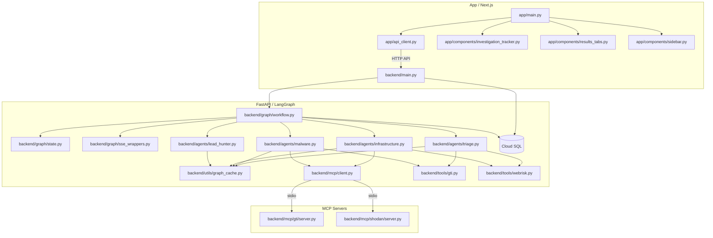

# Codebase Dependency Graph

This document outlines the classes, functions, and dependencies for each Python file in the `project_harimau` codebase.

## Semantic Knowledge Graph

This section provides a detailed semantic graph of the codebase relationships, focusing on roles and data flow.

### Mermaid Diagram

### Detailed Node Descriptions

*   **`app/main.py`**: Streamlit/Next.js entry point for the UI. Renders components and uses `api_client` to talk to backend.
*   **`app/api_client.py`**: Wrapper for API calls to the backend.
*   **`backend/main.py`**: FastAPI entry point. Handles HTTP requests, database operations (Cloud SQL), and initiates the LangGraph workflow.
*   **`backend/graph/workflow.py`**: Defines the LangGraph state machine, adding nodes for each agent and edges for transitions.
*   **`backend/graph/state.py`**: Defines the `AgentState` dictionary used to pass data between nodes in the graph.
*   **`backend/agents/triage.py`**: Triage Agent. Performs breadth-first search of IOCs, populates the graph cache, and assigns subtasks to specialists.
*   **`backend/agents/malware.py`**: Malware Specialist Agent. Performs deep dive into file artifacts, attribution, and behavior.
*   **`backend/agents/infrastructure.py`**: Infrastructure Specialist Agent. Pivots on domains/IPs to map adversary infrastructure.
*   **`backend/agents/lead_hunter.py`**: Lead Hunter Agent. Synthesizes findings from all agents and graph cache to produce final report.
*   **`backend/utils/graph_cache.py`**: Implements the `InvestigationCache` using NetworkX `MultiDiGraph`. Crucial for token optimization (Dual-Layer Data Model).
*   **`backend/mcp/client.py`**: Manages sessions with embedded MCP servers (GTI and Shodan).

### Key Relationships (Edges)

*   **Frontend -> Backend**: `api_client.py` makes REST API calls to `backend/main.py` (e.g., `/api/investigate`, `/api/investigations/{id}`).
*   **Orchestration**: `workflow.py` orchestrates the execution flow between `triage`, `malware`, `infra`, and `lead_hunter` based on the state.
*   **Data Sharing**: All agents read from and write to `graph_cache.py` to share detailed intel without blowing up the LLM token context in `AgentState`.
*   **Tool Access**: Agents use `mcp_client.py` to invoke tools exposed by the embedded MCP servers.

## `app/api_client.py`
**Imports:**
- `os`
- `requests`
- `time`
- `typing`

**Classes:**
- `HarimauAPIClient`
  - `__init__()`
  - `health_check()`
  - `submit_investigation()`
  - `get_investigation()`
  - `get_investigations()`
  - `get_graph_data()`
  - `get_report()`
  - `stream_investigation_events()`

## `app/components/__init__.py`
## `app/components/investigation_tracker.py`
**Imports:**
- `api_client`
- `streamlit`
- `time`

**Top-level Functions:**
- `render_investigation_tracker()`

## `app/components/results_tabs.py`
**Imports:**
- `api_client`
- `datetime`
- `re`
- `streamlit`

**Top-level Functions:**
- `_render_graph_tab()`
- `_render_report_tab()`
- `_render_specialist_tab()`
- `_render_timeline_tab()`
- `_render_transparency_tab()`
- `_render_triage_tab()`
- `render_tabs()`

## `app/components/sidebar.py`
**Imports:**
- `api_client`
- `streamlit`

**Top-level Functions:**
- `render_sidebar()`

## `app/main.py`
**Imports:**
- `api_client`
- `components.investigation_tracker`
- `components.results_tabs`
- `components.sidebar`
- `requests`
- `streamlit`

## `backend/__init__.py`
## `backend/agents/__init__.py`
## `backend/agents/infrastructure.py`
**Imports:**
- `backend.graph.state`
- `backend.mcp.client`
- `backend.tools.webrisk`
- `backend.utils.graph_cache`
- `backend.utils.logger`
- `backend.utils.transparency`
- `contextlib`
- `json`
- `langchain_core.messages`
- `langchain_core.tools`
- `langchain_google_vertexai`
- `os`

**Top-level Functions:**
- `generate_infrastructure_markdown_report()`
- `infrastructure_node()`

## `backend/agents/lead_hunter.py`
**Imports:**
- `backend.agents.lead_hunter_planning`
- `backend.agents.lead_hunter_synthesis`
- `backend.config`
- `backend.graph.state`
- `backend.utils.graph_cache`
- `backend.utils.logger`
- `langchain_google_vertexai`
- `os`

**Top-level Functions:**
- `lead_hunter_node()`

## `backend/agents/lead_hunter_planning.py`
**Imports:**
- `backend.graph.state`
- `backend.utils.graph_cache`
- `backend.utils.logger`
- `json`
- `langchain_core.messages`

**Top-level Functions:**
- `run_planning_phase()`

## `backend/agents/lead_hunter_synthesis.py`
**Imports:**
- `backend.graph.state`
- `backend.utils.logger`
- `json`
- `langchain_core.messages`

**Top-level Functions:**
- `generate_final_report_llm()`

## `backend/agents/malware.py`
**Imports:**
- `backend.graph.state`
- `backend.mcp.client`
- `backend.tools.gti`
- `backend.utils.graph_cache`
- `backend.utils.logger`
- `backend.utils.transparency`
- `json`
- `langchain_core.messages`
- `langchain_core.tools`
- `langchain_google_vertexai`
- `os`

**Top-level Functions:**
- `generate_malware_markdown_report()`
- `malware_node()`

## `backend/agents/triage.py`
**Imports:**
- `asyncio`
- `backend.graph.state`
- `backend.tools.gti`
- `backend.tools.webrisk`
- `backend.utils.graph_cache`
- `backend.utils.logger`
- `backend.utils.transparency`
- `json`
- `langchain_core.messages`
- `langchain_google_vertexai`
- `os`
- `re`

**Top-level Functions:**
- `comprehensive_triage_analysis()`
- `extract_triage_data()`
- `generate_markdown_report_locally()`
- `prepare_detailed_context_for_llm()`
- `triage_node()`

## `backend/config.py`
**Imports:**
- `os`

## `backend/graph/__init__.py`
## `backend/graph/sse_wrappers.py`
**Imports:**
- `asyncio`
- `backend.graph.state`
- `backend.utils.logger`
- `backend.utils.sse_manager`
- `functools`
- `typing`

**Top-level Functions:**
- `get_progress_estimate()`
- `with_sse_events()`

## `backend/graph/state.py`
**Imports:**
- `langchain_core.messages`
- `operator`
- `typing`

**Classes:**
- `AgentState`

**Top-level Functions:**
- `concat_reports()`
- `last_value()`
- `merge_dicts()`
- `merge_graphs()`

## `backend/graph/workflow.py`
**Imports:**
- `backend.agents.infrastructure`
- `backend.agents.lead_hunter`
- `backend.agents.malware`
- `backend.agents.triage`
- `backend.config`
- `backend.graph.sse_wrappers`
- `backend.graph.state`
- `backend.utils.logger`
- `langgraph.graph`

**Top-level Functions:**
- `create_graph()`
- `gate_node()`
- `route_from_gate()`
- `route_from_lead_hunter()`

## `backend/main.py`
**Imports:**
- `asyncio`
- `asyncpg`
- `backend.config`
- `backend.graph.workflow`
- `backend.utils.logger`
- `contextlib`
- `datetime`
- `fastapi`
- `json`
- `os`
- `pydantic`
- `uuid`

**Classes:**
- `InvestigationRequest`

**Top-level Functions:**
- `_run_investigation_background()`
- `bulk_cancel_jobs()`
- `cancel_investigation()`
- `debug_investigation()`
- `delete_jobs()`
- `diagnostic_pipeline()`
- `get_all_investigations()`
- `get_investigation()`
- `get_investigation_graph()`
- `get_investigation_history()`
- `get_job()`
- `get_test_iocs()`
- `health_check()`
- `lifespan()`
- `list_jobs()`
- `root()`
- `run_investigation()`
- `save_job()`
- `stream_investigation()`
- `test_sse_compatibility()`
- `test_tool_directly()`

## `backend/mcp/client.py`
**Imports:**
- `asyncio`
- `backend.utils.logger`
- `contextlib`
- `json`
- `mcp`
- `mcp.client.stdio`
- `os`
- `typing`

**Classes:**
- `MCPClientManager`
  - `__init__()`
  - `_load_registry()`
  - `get_session()`

## `backend/mcp/shodan/__init__.py`

## `backend/mcp/shodan/server.py`
**Imports:**
- `mcp.server.fastmcp`
- `os`
- `shodan`
- `tools`

**Top-level Functions:**
- `get_shodan_client()`
- `main()`

## `backend/mcp/shodan/tools/__init__.py`
**Imports:**
- `cve`
- `dns`
- `host`

## `backend/mcp/shodan/tools/host.py`
**Imports:**
- `json`
- `mcp.server.fastmcp`
- `server`
- `shodan`

**Top-level Functions:**
- `_extract_service()`
- `ip_lookup()`
- `shodan_search()`

## `backend/mcp/shodan/tools/dns.py`
**Imports:**
- `json`
- `mcp.server.fastmcp`
- `server`
- `shodan`

**Top-level Functions:**
- `dns_lookup()`
- `reverse_dns_lookup()`

## `backend/mcp/shodan/tools/cve.py`
**Imports:**
- `json`
- `mcp.server.fastmcp`
- `requests`
- `server`

**Top-level Functions:**
- `cpe_lookup()`
- `cve_lookup()`
- `cves_by_product()`

## `backend/mcp/gti/__init__.py`
## `backend/mcp/gti/server.py`
**Imports:**
- `collections.abc`
- `contextlib`
- `dataclasses`
- `logging`
- `mcp.server.fastmcp`
- `os`
- `tools`
- `vt`

**Top-level Functions:**
- `_vt_client_factory()`
- `main()`
- `vt_client()`

## `backend/mcp/gti/tools/__init__.py`
**Imports:**
- `collections`
- `files`
- `intelligence`
- `netloc`
- `threat_profiles`
- `urls`

## `backend/mcp/gti/tools/collections.py`
**Imports:**
- `logging`
- `mcp.server.fastmcp`
- `server`
- `typing`

**Top-level Functions:**
- `_get_sigma_rule_details()`
- `_get_yara_rule_details()`
- `_search_threats_by_collection_type()`
- `create_collection()`
- `get_collection_feature_matches()`
- `get_collection_mitre_tree()`
- `get_collection_report()`
- `get_collection_rules()`
- `get_collection_timeline_events()`
- `get_collections_commonalities()`
- `get_entities_related_to_a_collection()`
- `search_campaigns()`
- `search_malware_families()`
- `search_software_toolkits()`
- `search_threat_actors()`
- `search_threat_reports()`
- `search_threats()`
- `search_vulnerabilities()`
- `update_collection_attributes()`
- `update_iocs_in_collection()`

## `backend/mcp/gti/tools/files.py`
**Imports:**
- `asyncio`
- `json`
- `logging`
- `mcp.server.fastmcp`
- `server`
- `typing`
- `urllib.parse`

**Top-level Functions:**
- `analyse_file()`
- `get_entities_related_to_a_file()`
- `get_file_behavior_report()`
- `get_file_behavior_summary()`
- `get_file_report()`
- `search_digital_threat_monitoring()`

## `backend/mcp/gti/tools/intelligence.py`
**Imports:**
- `mcp.server.fastmcp`
- `server`
- `typing`

**Top-level Functions:**
- `get_entities_related_to_a_hunting_ruleset()`
- `get_hunting_ruleset()`
- `search_iocs()`

## `backend/mcp/gti/tools/netloc.py`
**Imports:**
- `mcp.server.fastmcp`
- `server`
- `typing`

**Top-level Functions:**
- `get_domain_report()`
- `get_entities_related_to_a_domain()`
- `get_entities_related_to_an_ip_address()`
- `get_ip_address_report()`

## `backend/mcp/gti/tools/threat_profiles.py`
**Imports:**
- `mcp.server.fastmcp`
- `server`
- `typing`

**Top-level Functions:**
- `get_threat_profile()`
- `get_threat_profile_associations_timeline()`
- `get_threat_profile_recommendations()`
- `list_threat_profiles()`

## `backend/mcp/gti/tools/urls.py`
**Imports:**
- `base64`
- `mcp.server.fastmcp`
- `server`
- `typing`

**Top-level Functions:**
- `get_entities_related_to_an_url()`
- `get_url_report()`
- `url_to_base64()`

## `backend/mcp/gti/utils.py`
**Imports:**
- `asyncio`
- `logging`
- `typing`
- `vt`

**Top-level Functions:**
- `consume_vt_iterator()`
- `fetch_object()`
- `fetch_object_relationships()`
- `parse_collection_commonalities()`
- `sanitize_response()`

## `backend/tools/__init__.py`
## `backend/tools/gti.py`
**Imports:**
- `aiohttp`
- `asyncio`
- `backend.utils.logger`
- `certifi`
- `os`
- `ssl`

**Top-level Functions:**
- `_enrich_with_relationships()`
- `_fetch_relationship_objects()`
- `_make_request()`
- `_scrub_heavy_fields()`
- `get_domain_report()`
- `get_file_report()`
- `get_ip_report()`
- `get_url_report()`

## `backend/tools/webrisk.py`
**Imports:**
- `aiohttp`
- `asyncio`
- `backend.utils.logger`
- `google.cloud`
- `os`

**Top-level Functions:**
- `evaluate_uri()`
- `get_webrisk_api_key()`

## `backend/utils/__init__.py`
## `backend/utils/config.py`
**Imports:**
- `os`
- `typing`
- `yaml`

**Top-level Functions:**
- `load_agents_config()`

## `backend/utils/graph_cache.py`
**Imports:**
- `json`
- `networkx`
- `typing`

**Classes:**
- `InvestigationCache`
  - `__init__()`
  - `get_state()`
  - `add_entity()`
  - `add_relationship()`
  - `get_entity_minimal()`
  - `get_entity_full()`
  - `get_neighbors()`
  - `get_neighbors_with_data()`
  - `get_all_entities_by_type()`
  - `has_entity()`
  - `get_stats()`
  - `mark_as_investigated()`
  - `get_uninvestigated_nodes()`
  - `export_for_visualization()`

## `backend/utils/graph_formatter.py`
**Imports:**
- `backend.utils.logger`
- `json`

**Top-level Functions:**
- `format_investigation_graph()`

## `backend/utils/logger.py`
**Imports:**
- `logging`
- `os`
- `structlog`
- `sys`

**Top-level Functions:**
- `configure_logger()`
- `get_logger()`

## `backend/utils/sse_manager.py`
**Imports:**
- `asyncio`
- `backend.utils.logger`
- `datetime`
- `json`
- `typing`

**Classes:**
- `SSEEventManager`
  - `__init__()`
  - `create_queue()`
  - `emit_event()`
  - `get_events()`
  - `subscribe()`
  - `clear_history()`

## `backend/utils/transparency.py`
**Imports:**
- `typing`

**Top-level Functions:**
- `emit_reasoning()`
- `emit_tool_call()`
- `emit_tool_result()`
