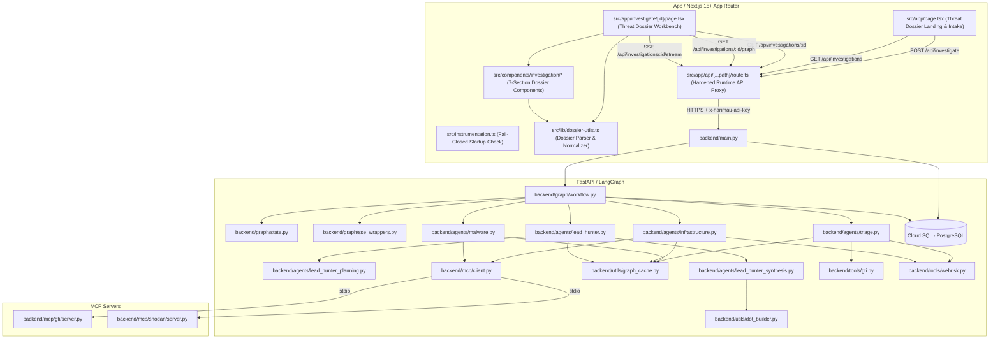

# Codebase Dependency Graph

This document outlines the architecture, components, and module dependencies for the `project_harimau` codebase.

## Semantic Knowledge Graph

This section provides a detailed semantic graph of the codebase relationships, focusing on roles and data flow.

### Mermaid Diagram


```mermaid
graph TD
    subgraph Frontend [App / Next.js 15+ App Router]
        inst["src/instrumentation.ts (Fail-Closed Startup Check)"]
        page["src/app/page.tsx (Threat Dossier Landing & Intake)"]
        investigate["src/app/investigate/[id]/page.tsx (Threat Dossier Workbench)"]
        dossier_comp["src/components/investigation/* (7-Section Dossier Components)"]
        dossier_utils["src/lib/dossier-utils.ts (Dossier Parser & Normalizer)"]
        proxy["src/app/api/[...path]/route.ts (Hardened Runtime API Proxy)"]
        
        investigate --> dossier_comp
        investigate --> dossier_utils
        dossier_comp --> dossier_utils
        page -->|POST /api/investigate| proxy
        page -->|GET /api/investigations| proxy
        investigate -->|GET /api/investigations/:id| proxy
        investigate -->|GET /api/investigations/:id/graph| proxy
        investigate -->|SSE /api/investigations/:id/stream| proxy
        
        proxy -->|HTTPS + x-harimau-api-key| b_main["backend/main.py"]
    end

    subgraph Backend [FastAPI / LangGraph]
        b_main --> workflow["backend/graph/workflow.py"]
        
        workflow --> state["backend/graph/state.py"]
        workflow --> sse_wrap["backend/graph/sse_wrappers.py"]
        
        workflow --> triage["backend/agents/triage.py"]
        workflow --> malware["backend/agents/malware.py"]
        workflow --> infra["backend/agents/infrastructure.py"]
        workflow --> lead_hunter["backend/agents/lead_hunter.py"]
        
        lead_hunter --> lh_plan["backend/agents/lead_hunter_planning.py"]
        lead_hunter --> lh_synth["backend/agents/lead_hunter_synthesis.py"]
        lh_synth --> dot_builder["backend/utils/dot_builder.py"]
        
        triage --> graph_cache["backend/utils/graph_cache.py"]
        malware --> graph_cache
        infra --> graph_cache
        lead_hunter --> graph_cache
        
        infra --> mcp_client["backend/mcp/client.py"]
        malware --> mcp_client
        
        triage --> gti_tool["backend/tools/gti.py"]
        triage --> webrisk_tool["backend/tools/webrisk.py"]
        infra --> webrisk_tool
        
        b_main --> db[(Cloud SQL - PostgreSQL)]
        workflow --> db
    end

    subgraph MCP Servers
        mcp_client -->|stdio| gti_server["backend/mcp/gti/server.py"]
        mcp_client -->|stdio| shodan_server["backend/mcp/shodan/server.py"]
    end
```

### Detailed Node Descriptions

*   **`src/instrumentation.ts`**: Next.js startup hook (`register()`). Verifies `process.env.HARIMAU_API_KEY` is configured at container startup; logs a fatal error and terminates the instance (`process.exit(1)`) if missing.
*   **`src/app/page.tsx`**: Next.js client component. Threat Dossier landing page with predatory tiger emblem (`/tiger_logo.png`), IOC intake console, 5-level Forensic Intensity selector (`1–5` `max_iterations`), `HUNT` command button, and Recent Threat Dossiers list fetched from `/api/investigations`.
*   **`src/app/investigate/[id]/page.tsx`**: Next.js dynamic route rendering the **Harimau Threat Dossier Workbench** and **Spatial Topology Canvas**:
    - **7-Section Threat Dossier (`src/components/investigation/*`)**: `DossierMasthead`, `SpecialistReportsGrid`, `DossierCompanionRail`, `AttackFlowSection` (`d3-graphviz`), `TacticalSwimLanes` (MITRE ATT&CK matrix), `DecoyInsightBanner`, and `AppendixIocTable`.
    - **Spatial Topology Canvas**: Interactive graph via `@xyflow/react` and `d3-force` simulation with node styling by entity type and interactive entity drawer.
    - **Live Agent Stream**: EventSource listener streaming real-time reasoning traces and tool execution logs from `/api/investigations/{id}/stream`.
*   **`src/lib/dossier-utils.ts`**: Deterministic parser and normalizer that extracts Executive Summary prose, MITRE ATT&CK swim lanes, decoy/infrastructure pivot banners, DOT diagram blocks, and deduplicated Appendix IOC entries with strict `http:`/`https:` external URL guards.
*   **`src/app/api/[...path]/route.ts`**: Hardened App Router catch-all proxy route. Enforces fail-closed `HARIMAU_API_KEY` presence (`process.exit(1)` if missing), injects `x-harimau-api-key` server-to-server, applies a strict client request header allowlist, blocks `/api/admin/*`, `/api/debug/*`, `/api/diagnostic/*`, and `/api/test/*` (`403 Forbidden`), enforces `https://` for non-localhost `BACKEND_URL` targets, and rate-limits `POST /api/investigate` (`10 requests / 5 minutes / IP`).
*   **`backend/main.py`**: FastAPI entry point. Enforces fail-closed `HARIMAU_API_KEY` verification at startup (`lifespan` calls `os._exit(1)` if missing) and per-request via `verify_harimau_api_key` middleware (`secrets.compare_digest` on all routes except `/health` and `/`), disables `/docs`, `/redoc`, and `/openapi.json`, and handles Cloud SQL persistence (`asyncpg`), checkpointer setup (`AsyncPostgresSaver`), background task dispatch (`_run_investigation_background`), and SSE streaming endpoints.
*   **`backend/graph/workflow.py`**: Defines the LangGraph investigation workflow: `triage` -> `gate` -> `malware_specialist` & `infrastructure_specialist` (parallel fan-out) -> `lead_hunter` -> (loop or `END`).
*   **`backend/graph/state.py`**: Defines `AgentState` with deep reducers: `merge_metadata` (recursive rich-intel merging), `merge_graphs` (NetworkX MultiDiGraph merging — both sides' node ids are normalised with their `entity_type`, since canonical form can depend on it), `union_lists` (case-insensitive dedup), and `last_value`. Its target lifecycle distinguishes `scheduled_entities` (accepted specialist dispatches), `target_outcomes` (latest per-target evidence/failure record), and `processed_entities` (only targets proven by specialist output); `tasked_entities` remains a legacy scheduling alias for persisted checkpoints.
*   **`backend/agents/triage.py`**: Triage Agent. Performs initial breadth-first relationship queries via direct GTI API fast-path, evaluates risk levels, filters high-signal entities, and deterministically generates subtasks.
*   **`backend/agents/malware.py`**: Malware Specialist Agent. Runs as a LangGraph `ToolNode` sub-graph with 5 specialist tools (`get_file_behavior`, `get_dropped_files`, `get_network_activity`, `get_attribution`, `get_file_report`), structured Pydantic output, and cumulative iteration memory.
*   **`backend/agents/infrastructure.py`**: Infrastructure Specialist Agent. Runs as a LangGraph `ToolNode` sub-graph with 10 tools across GTI (domains, IPs, URLs), WebRisk, and Shodan (IP/DNS lookups), with structured output.
*   **`backend/agents/lead_hunter.py`**: Lead Hunter Orchestrator. Coordinates planning rounds (`run_planning_phase`) and final intelligence synthesis (`generate_final_report_llm`), enforcing early convergence exit rules.
*   **`backend/agents/lead_hunter_synthesis.py`**: Synthesizes the final intelligence report, builds the grounded edge fact table, and coordinates attack-flow diagram annotation with `dot_builder.py`.
*   **`backend/utils/dot_builder.py`**: Generates deterministic Graphviz DOT skeletons directly from NetworkX cache, parses returned DOT fences, and strictly validates node/edge consistency.
*   **`backend/utils/entity_identity.py`**: Defines typed canonical IOC identities. It lowercases file/IP/domain identities, but only the scheme and host of URLs; it also maps GTI base64url URL ids to their canonical raw URL.
*   **`app/src/lib/investigation-stream.ts`**: Applies persisted snapshots and terminal SSE events monotonically, preventing stale REST/live updates from resurrecting a terminal hunt.
*   **`backend/utils/graph_cache.py`**: Wraps NetworkX `MultiDiGraph` with canonical entity identity resolution (`_normalise_id`), including GTI URL-id aliases, deep node/edge attribute merging, and minimal field extraction.
*   **`backend/mcp/client.py`**: Manages stdio sessions for embedded GTI and Shodan FastMCP servers.

### Key Relationships (Edges)

*   **Frontend -> Backend**: Next.js client fetches from `/api/*`, which `src/app/api/[...path]/route.ts` proxies over HTTPS with `x-harimau-api-key` to `backend/main.py`.
*   **SSE Streaming**: `/api/investigations/{id}/stream` registers the subscriber before sending an authoritative persisted `investigation_snapshot`, then streams live events. It periodically reconciles durable job state for cross-instance terminal completion; completed, failed, and cancelled states are terminal.
*   **Orchestration**: `workflow.py` orchestrates state transitions between `triage`, `gate`, specialists, and `lead_hunter`.
*   **Data Sharing**: Specialists commit raw findings directly to `graph_cache.py` and `metadata["rich_intel"]`, preserving full data for downstream synthesis while passing compact summaries to LLMs.
*   **Tool Execution**: Specialist agents invoke MCP tools bounded by `@tool_timeout(20.0)` in `backend/utils/agent_utils.py`.

## Frontend (`/app`)

### `app/src/instrumentation.ts`
**Role:** Next.js startup validation hook (`register()`). Terminates the server process (`process.exit(1)`) if `HARIMAU_API_KEY` is missing.

### `app/src/app/page.tsx`
**Role:** Threat Dossier landing page and IOC search interface.
**Dependencies:**
- `next/navigation` (`useRouter`)
- `next/image`
- `lucide-react`
- React hooks (`useState`, `useEffect`, `useCallback`, `useRef`)
**Endpoints Consumed:**
- `GET /api/investigations` (fetch past search history)
- `POST /api/investigate` (submit new investigation with `ioc` and `max_iterations`)

### `app/src/app/investigate/[id]/page.tsx`
**Role:** Harimau Threat Dossier Workbench & Spatial Topology Canvas.
**Dependencies:**
- `app/src/components/investigation/*` (`DossierMasthead`, `SpecialistReportsGrid`, `DossierCompanionRail`, `AttackFlowSection`, `TacticalSwimLanes`, `DecoyInsightBanner`, `AppendixIocTable`)
- `app/src/lib/dossier-utils` (`buildAppendixIocs`, `extractDotFromReport`, `extractExecutiveSummary`, `extractMitreSwimLanes`, `extractDecoyInsight`, `normalizeEntityId`, `sanitizeExternalHttpUrl`)
- `@xyflow/react` (`ReactFlow`, `Controls`, `MiniMap`, `Background`)
- `d3-graphviz` & `d3` (attack-flow Graphviz diagram rendering)
- `react-markdown` & `remark-gfm` (report and dossier rendering)
- `dagre` (graph layout helper)
**Endpoints Consumed:**
- `GET /api/investigations/:id` (poll/fetch status and results)
- `GET /api/investigations/:id/graph` (fetch nodes and edges for ReactFlow and Appendix IOC fusion)
- `GET /api/investigations/:id/stream` (SSE real-time event listener)

### `app/src/app/api/[...path]/route.ts`
**Role:** Hardened Next.js App Router catch-all proxy with fail-closed `HARIMAU_API_KEY` enforcement, header allowlisting, admin path blocking, HTTPS transport verification, and rate limiting on `POST /api/investigate`.
**Dependencies:**
- `next/server` (`NextRequest`, `NextResponse`)
- Runtime env vars `BACKEND_URL` and `HARIMAU_API_KEY`
**HTTP Methods Handled:** `GET`, `POST`, `DELETE`

## `backend/__init__.py`
## `backend/agents/__init__.py`
## `backend/agents/infrastructure.py`
**Imports:**
- `asyncio`
- `contextlib.AsyncExitStack`
- `pydantic` (`BaseModel`, `Field`)
- `langchain_core.messages` (`SystemMessage`, `HumanMessage`, `BaseMessage`)
- `langchain_core.tools` (`tool`)
- `langchain_google_genai` (`ChatGoogleGenerativeAI`)
- `langgraph.graph` (`StateGraph`, `START`, `END`)
- `langgraph.prebuilt` (`ToolNode`)
- `backend.graph.state` (`AgentState`)
- `backend.mcp.client` (`mcp_manager`)
- `backend.tools.webrisk`
- `backend.utils.agent_utils` (`tool_timeout`, `build_peer_context`, `push_to_rich_intel`, `reduce_messages`, `parse_indicator_string`)
- `backend.utils.checkpointer_registry`
- `backend.utils.graph_cache` (`InvestigationCache`, `extract_gti_summary`)
- `backend.utils.logger`
- `backend.utils.transparency` (`emit_tool_call`, `emit_reasoning`)

**Classes & Schemas:**
- `InfrastructureSpecialistOutput` (Pydantic model for structured output)
- `AnalyzedTargetInfra`

**Top-level Functions:**
- `infrastructure_node()`: Main entry point for the Infrastructure Agent (compiles and runs `StateGraph(InfrastructureSubgraphState)` with `ToolNode` and `@tool_timeout(20.0)` wrappers)
- `generate_infrastructure_markdown_report()`: Generates standalone specialist dossier markdown

## `backend/agents/lead_hunter.py`
**Role:** Active orchestrator for Project Harimau (`run_planning_phase` + `generate_final_report_llm`).
**Imports:**
- `langchain_google_genai` (`ChatGoogleGenerativeAI`)
- `backend.agents.lead_hunter_planning` (`run_planning_phase`)
- `backend.agents.lead_hunter_synthesis` (`generate_final_report_llm`)
- `backend.config` (`DEFAULT_HUNT_ITERATIONS`)
- `backend.graph.state` (`AgentState`)
- `backend.utils.graph_cache` (`InvestigationCache`)
- `backend.utils.logger`
- `backend.utils.report_validator` (`validate_and_annotate`)
- `backend.utils.signal_filter` (`promote_by_graph_context`)
- `backend.utils.transparency` (`emit_reasoning`)
- `backend.utils.verdict_engine` (`apply_composite_verdicts`)

**Top-level Functions:**
- `lead_hunter_node()`: Decides between Planning Mode (`run_planning_phase`) and Synthesis Mode (`generate_final_report_llm`) based on iteration limits and 3-layer convergence exit conditions.

## `backend/agents/lead_hunter_planning.py`
**Imports:**
- `backend.graph.state`
- `backend.utils.graph_cache`
- `backend.utils.logger`
- `backend.utils.transparency`
- `langchain_core.messages`
- `langchain_google_genai`
- `pydantic`

**Top-level Functions:**
- `run_planning_phase()`: Queries NetworkX cache for uninvestigated entities, evaluates pivot opportunities, and generates next-round subtasks.

## `backend/agents/lead_hunter_synthesis.py`
**Imports:**
- `backend.graph.state`
- `backend.utils.dot_builder` (`build_dot_skeleton`, `parse_dot_structure`, `validate_dot`, `replace_dot_block`, `demote_extra_dot_blocks`)
- `backend.utils.graph_cache`
- `backend.utils.logger`
- `backend.utils.transparency`
- `langchain_core.messages`
- `langchain_google_genai`

**Top-level Functions:**
- `generate_final_report_llm()`: Synthesizes findings across triage, specialist dossiers, and the persisted graph into a comprehensive intelligence report with a validated Graphviz attack-flow diagram.
- `_score_edges()`: Computes multi-attribute relevance scores for graph edges.
- `_select_diagram_edges()`: Shared edge selection enforcing the 40-edge cap with high-signal prioritization.

## `backend/agents/malware.py`
**Imports:**
- `asyncio`
- `pydantic` (`BaseModel`, `Field`)
- `langchain_core.messages` (`SystemMessage`, `HumanMessage`, `BaseMessage`)
- `langchain_core.tools` (`tool`)
- `langchain_google_genai` (`ChatGoogleGenerativeAI`)
- `langgraph.graph` (`StateGraph`, `START`, `END`)
- `langgraph.prebuilt` (`ToolNode`)
- `backend.graph.state` (`AgentState`)
- `backend.mcp.client` (`mcp_manager`)
- `backend.utils.agent_utils` (`tool_timeout`, `build_peer_context`, `push_to_rich_intel`, `reduce_messages`, `parse_indicator_string`)
- `backend.utils.checkpointer_registry`
- `backend.utils.graph_cache` (`InvestigationCache`, `extract_gti_summary`)
- `backend.utils.logger`
- `backend.utils.transparency` (`emit_tool_call`, `emit_reasoning`)

**Classes & Schemas:**
- `MalwareSpecialistOutput` (Pydantic model for structured output)
- `AnalyzedTarget`
- `IntelligenceNotes`

**Top-level Functions:**
- `malware_node()`: Main entry point for the Malware Agent (runs `StateGraph(MalwareSubgraphState)` with `ToolNode` and 5 specialized analysis tools)
- `generate_malware_markdown_report()`: Generates standalone specialist dossier markdown

## `backend/agents/triage.py`
**Imports:**
- `asyncio`
- `pydantic` (`BaseModel`, `Field`)
- `langchain_core.messages` (`SystemMessage`, `HumanMessage`)
- `langchain_google_genai` (`ChatGoogleGenerativeAI`)
- `backend.graph.state` (`AgentState`)
- `backend.tools.gti`
- `backend.tools.webrisk`
- `backend.utils.graph_cache` (`InvestigationCache`, `normalize_verdict`)
- `backend.utils.logger`
- `backend.utils.signal_filter` (`get_signal_reason`)
- `backend.utils.transparency` (`emit_tool_call`, `emit_reasoning`)

**Classes & Schemas:**
- `TriageAnalysisOutput`
- `ThreatContext`
- `PriorityEntity`

**Top-level Functions:**
- `triage_node()`: Orchestrates breadth-first initial enrichment, signal filtering, verdict determination, and deterministic subtask generation.
- `comprehensive_triage_analysis()`
- `extract_triage_data()`
- `generate_markdown_report_locally()`
- `prepare_detailed_context_for_llm()`

## `backend/config.py`
**Imports:**
- `os`

## `backend/graph/__init__.py`
## `backend/graph/sse_wrappers.py`
**Imports:**
- `asyncio`
- `backend.graph.state`
- `backend.utils.logger`
- `backend.utils.sse_manager`
- `functools`
- `typing`

**Top-level Functions:**
- `get_progress_estimate()`
- `with_sse_events()`

## `backend/graph/state.py`
**Imports:**
- `langchain_core.messages`
- `operator`
- `typing`

**Classes:**
- `AgentState`

**Top-level Functions:**
- `concat_reports()`
- `last_value()`
- `merge_dicts()`
- `merge_graphs()`

## `backend/graph/workflow.py`
**Imports:**
- `backend.agents.infrastructure`
- `backend.agents.lead_hunter`
- `backend.agents.malware`
- `backend.agents.triage`
- `backend.config`
- `backend.graph.sse_wrappers`
- `backend.graph.state`
- `backend.utils.logger`
- `langgraph.graph`

**Top-level Functions:**
- `create_graph()`
- `gate_node()`
- `route_from_gate()`
- `route_from_lead_hunter()`

## `backend/main.py`
**Imports:**
- `asyncio`
- `asyncpg`
- `backend.config`
- `backend.graph.workflow`
- `backend.utils.logger`
- `contextlib`
- `datetime`
- `fastapi`
- `json`
- `os`
- `pydantic`
- `uuid`

**Classes:**
- `InvestigationRequest`

**Top-level Functions:**
- `_run_investigation_background()`
- `bulk_cancel_jobs()`
- `cancel_investigation()`
- `debug_investigation()`
- `delete_jobs()`
- `diagnostic_pipeline()`
- `get_all_investigations()`
- `get_investigation()`
- `get_investigation_graph()`
- `get_investigation_history()`
- `get_job()`
- `get_test_iocs()`
- `health_check()`
- `lifespan()`
- `list_jobs()`
- `root()`
- `run_investigation()`
- `save_job()`
- `stream_investigation()`
- `test_sse_compatibility()`
- `test_tool_directly()`

## `backend/mcp/client.py`
**Imports:**
- `asyncio`
- `backend.utils.logger`
- `contextlib`
- `json`
- `mcp`
- `mcp.client.stdio`
- `os`
- `typing`

**Classes:**
- `MCPClientManager`
  - `__init__()`
  - `_load_registry()`
  - `get_session()`

## `backend/mcp/shodan/__init__.py`

## `backend/mcp/shodan/server.py`
**Imports:**
- `mcp.server.fastmcp`
- `os`
- `shodan`
- `tools`

**Top-level Functions:**
- `get_shodan_client()`
- `main()`

## `backend/mcp/shodan/tools/__init__.py`
**Imports:**
- `cve`
- `dns`
- `host`

## `backend/mcp/shodan/tools/host.py`
**Imports:**
- `json`
- `mcp.server.fastmcp`
- `server`
- `shodan`

**Top-level Functions:**
- `_extract_service()`
- `ip_lookup()`
- `shodan_search()`

## `backend/mcp/shodan/tools/dns.py`
**Imports:**
- `json`
- `mcp.server.fastmcp`
- `server`
- `shodan`

**Top-level Functions:**
- `dns_lookup()`
- `reverse_dns_lookup()`

## `backend/mcp/shodan/tools/cve.py`
**Imports:**
- `json`
- `mcp.server.fastmcp`
- `requests`
- `server`

**Top-level Functions:**
- `cpe_lookup()`
- `cve_lookup()`
- `cves_by_product()`

## `backend/mcp/gti/__init__.py`
## `backend/mcp/gti/server.py`
**Imports:**
- `collections.abc`
- `contextlib`
- `dataclasses`
- `logging`
- `mcp.server.fastmcp`
- `os`
- `tools`
- `vt`

**Top-level Functions:**
- `_vt_client_factory()`
- `main()`
- `vt_client()`

## `backend/mcp/gti/tools/__init__.py`
**Imports:**
- `collections`
- `files`
- `intelligence`
- `netloc`
- `threat_profiles`
- `urls`

## `backend/mcp/gti/tools/collections.py`
**Imports:**
- `logging`
- `mcp.server.fastmcp`
- `server`
- `typing`

**Top-level Functions:**
- `_get_sigma_rule_details()`
- `_get_yara_rule_details()`
- `_search_threats_by_collection_type()`
- `create_collection()`
- `get_collection_feature_matches()`
- `get_collection_mitre_tree()`
- `get_collection_report()`
- `get_collection_rules()`
- `get_collection_timeline_events()`
- `get_collections_commonalities()`
- `get_entities_related_to_a_collection()`
- `search_campaigns()`
- `search_malware_families()`
- `search_software_toolkits()`
- `search_threat_actors()`
- `search_threat_reports()`
- `search_threats()`
- `search_vulnerabilities()`
- `update_collection_attributes()`
- `update_iocs_in_collection()`

## `backend/mcp/gti/tools/files.py`
**Imports:**
- `asyncio`
- `json`
- `logging`
- `mcp.server.fastmcp`
- `server`
- `typing`
- `urllib.parse`

**Top-level Functions:**
- `analyse_file()`
- `get_entities_related_to_a_file()`
- `get_file_behavior_report()`
- `get_file_behavior_summary()`
- `get_file_report()`
- `search_digital_threat_monitoring()`

## `backend/mcp/gti/tools/intelligence.py`
**Imports:**
- `mcp.server.fastmcp`
- `server`
- `typing`

**Top-level Functions:**
- `get_entities_related_to_a_hunting_ruleset()`
- `get_hunting_ruleset()`
- `search_iocs()`

## `backend/mcp/gti/tools/netloc.py`
**Imports:**
- `mcp.server.fastmcp`
- `server`
- `typing`

**Top-level Functions:**
- `get_domain_report()`
- `get_entities_related_to_a_domain()`
- `get_entities_related_to_an_ip_address()`
- `get_ip_address_report()`

## `backend/mcp/gti/tools/threat_profiles.py`
**Imports:**
- `mcp.server.fastmcp`
- `server`
- `typing`

**Top-level Functions:**
- `get_threat_profile()`
- `get_threat_profile_associations_timeline()`
- `get_threat_profile_recommendations()`
- `list_threat_profiles()`

## `backend/mcp/gti/tools/urls.py`
**Imports:**
- `base64`
- `mcp.server.fastmcp`
- `server`
- `typing`

**Top-level Functions:**
- `get_entities_related_to_an_url()`
- `get_url_report()`
- `url_to_base64()`

## `backend/mcp/gti/utils.py`
**Imports:**
- `asyncio`
- `logging`
- `typing`
- `vt`

**Top-level Functions:**
- `consume_vt_iterator()`
- `fetch_object()`
- `fetch_object_relationships()`
- `parse_collection_commonalities()`
- `sanitize_response()`

## `backend/tools/__init__.py`
## `backend/tools/gti.py`
**Imports:**
- `aiohttp`
- `asyncio`
- `backend.utils.logger`
- `certifi`
- `os`
- `ssl`

**Top-level Functions:**
- `_enrich_with_relationships()`
- `_fetch_relationship_objects()`
- `_make_request()`
- `_scrub_heavy_fields()`
- `get_domain_report()`
- `get_file_report()`
- `get_ip_report()`
- `get_url_report()`

## `backend/tools/webrisk.py`
**Imports:**
- `aiohttp`
- `asyncio`
- `backend.utils.logger`
- `google.cloud`
- `os`

**Top-level Functions:**
- `evaluate_uri()`
- `get_webrisk_api_key()`

## `backend/utils/__init__.py`

## `backend/utils/agent_utils.py`
**Imports:**
- `asyncio`
- `functools`
- `json`
- `re`
- `langchain_core.messages` (`BaseMessage`)
- `typing` (`List`)

**Top-level Functions & Constants:**
- `tool_timeout(seconds=20.0, logger=None)`: Wall-clock timeout decorator with catch-all returning uniform `json.dumps({"error": ...})` envelope. Applied under `@tool` on all 15 specialist tool closures.
- `build_peer_context()`: Builds formatted string of the other specialist's findings from prior iterations for cross-domain context injection.
- `parse_indicator_string()`: Parses `'Type: value'` indicator strings with regex into `(entity_type, value)`.
- `reduce_messages()`: LangGraph message list reducer with ID-based deduplication and overwrite history support.
- `push_to_rich_intel()`: Deduplicating append to relationship entity lists based on `(id, source_id)`.
- `FINAL_ITERATION_PROMPT`: Standard prompt forcing structured conclusion on the final specialist iteration.

## `backend/utils/checkpointer_registry.py`
**Global State:**
- `checkpointer`: Holds the initialized `AsyncPostgresSaver` instance or `None`.

## `backend/utils/config.py`
**Imports:**
- `os`
- `typing`
- `yaml`

**Top-level Functions:**
- `load_agents_config()`: Helper to load agent hyperparameters.

## `backend/utils/dot_builder.py`
**Imports:**
- `re`
- `typing` (`Dict`, `List`, `Set`, `Tuple`, `Optional`)
- `backend.utils.logger`

**Top-level Functions:**
- `build_dot_skeleton()`: Deterministically builds a complete Graphviz `digraph` skeleton directly from the NetworkX cache, styled and clustered by entity type and verdict.
- `parse_dot_structure()`: Permissive, quote-aware scanner extracting all referenced node IDs and directed edges from a DOT string.
- `validate_dot()`: Validates that an LLM-annotated DOT block is structurally sound (no hallucinated nodes/edges) and complete (retains all required skeleton edges).
- `extract_dot_block()`: Extracts the first ` ```dot ` fenced block from markdown text.
- `replace_dot_block()`: Replaces the first ` ```dot ` block in markdown text with a validated or fallback block.
- `demote_extra_dot_blocks()`: Retags any secondary ` ```dot ` blocks to ` ```text ` to prevent unvalidated diagrams from reaching the frontend renderer.

## `backend/utils/graph_cache.py`
**Imports:**
- `json`
- `networkx` as `nx`
- `typing`

**Classes:**
- `InvestigationCache`
  - `__init__(graph_data=None)`
  - `get_state()`: Serializes graph via `nx.node_link_data()`.
  - `add_entity(entity_id, entity_type, **attributes)`: Normalized ID insertion.
  - `add_relationship(source_id, target_id, relationship, **attributes)`: Pre-insertion deduplicating edge insertion.
  - `get_entity_minimal(entity_id)`: Extracts 9 compact fields for token-optimized LLM context.
  - `get_entity_full(entity_id)`: Retrieves complete raw attributes.
  - `get_neighbors(entity_id)`
  - `get_neighbors_with_data(entity_id)`
  - `get_all_entities_by_type(entity_type)`
  - `has_entity(entity_id)`
  - `get_stats()`
  - `mark_as_investigated(entity_id, agent_name)`
  - `get_uninvestigated_nodes()`
  - `export_for_visualization()`

**Top-level Functions:**
- `_normalise_id(raw_id)`: Canonical lowercase, trimmed string normalization.
- `normalize_verdict(val)`: Coerces arbitrary GTI verdict values into uppercase standards (`MALICIOUS`, `SUSPICIOUS`, `BENIGN`, `UNKNOWN`).
- `extract_gti_summary(entity)`: Helper extracting vendor detections and threat scores.

## `backend/utils/graph_formatter.py`
**Imports:**
- `backend.utils.logger`
- `backend.utils.graph_cache` (`InvestigationCache`, `normalize_verdict`)
- `json`
- `os`

**Top-level Functions:**
- `format_graph_from_cache(job_id, job)`: Builds frontend graph data directly from the persisted NetworkX `investigation_graph` JSONB, providing rich tooltips, typed colors, `isMalicious`, `entityType`, and `isRoot` flags.
- `format_investigation_graph(job_id, job)`: Legacy reconstruction fallback using `rich_intel`.

## `backend/utils/logger.py`
**Imports:**
- `logging`
- `os`
- `structlog`
- `sys`

**Top-level Functions:**
- `configure_logger()`: Configures structured JSON logging for Cloud Logging compatibility.
- `get_logger(name)`: Returns a structured logger instance with contextual binding.

## `backend/utils/report_validator.py`
**Imports:**
- `re`
- `typing` (`Dict`, `List`, `Any`)
- `backend.utils.logger`

**Top-level Functions:**
- `validate_and_annotate(report_md, cache, specialist_results, root_ioc, job_id=None)`: Verifies every IOC cited in the report against the NetworkX investigation graph and specialist tool outputs, annotating any unverified/hallucinated citations rather than stripping them. Never raises. Returns `(annotated_report, validation)`, where `validation` is the `{"unverified", "verified", "extracted"}` dict from `validate_report_iocs` (plus an `"error"` key if the validator itself failed) so callers can report the actual audit outcome.

## `backend/utils/signal_filter.py`
**Imports:**
- `typing` (`Dict`, `Any`, `List`, `Optional`)

**Top-level Functions:**
- `get_signal_reason(entity_data, entity_type)`: Heuristics evaluating whether an entity is high-signal based on vendor counts, verdicts, and suspicious attributes.
- `promote_by_graph_context(cache, uninvestigated_nodes)`: Identifies nodes that bridge malware and infrastructure domains for prioritization.

## `backend/utils/sse_manager.py`
**Imports:**
- `asyncio`
- `datetime`
- `json`
- `typing` (`Dict`, `List`, `Any`, `Optional`)
- `backend.utils.logger`

**Classes:**
- `SSEEventManager`
  - `__init__()`
  - `create_queue(job_id)`: Registers a subscriber queue.
  - `emit_event(job_id, event_type, data)`: Non-raising broadcast with subscriber snapshotting and monotone progress clamping (0–100%).
  - `open_subscription(job_id)` / `close_subscription(job_id, queue)`: Register a client before snapshot generation and close it idempotently.
  - `get_events(job_id)`: Historical event retrieval.
  - `subscribe(job_id)`: Async generator yielding formatted SSE events.
  - `clear_history(job_id)`: Frees event queues and clears progress tracking state.

## `backend/utils/transparency.py`
**Imports:**
- `backend.utils.sse_manager`
- `backend.utils.logger`
- `typing`

**Top-level Functions:**
- `emit_reasoning(job_id, agent_name, thought)`: Emits LLM reasoning thoughts to SSE stream.
- `emit_tool_call(job_id, agent_name, tool_name, tool_input)`: Emits tool invocation trace to SSE stream.
- `emit_tool_result(job_id, agent_name, tool_name, result_summary)`: Emits tool result summary to SSE stream.

## `backend/utils/verdict_engine.py`
**Imports:**
- `typing` (`Dict`, `Any`, `List`)
- `backend.utils.logger`

**Top-level Functions:**
- `apply_composite_verdicts(cache, triage_verdict)`: Calculates comprehensive risk scores and weighted composite verdicts across all graph nodes.
