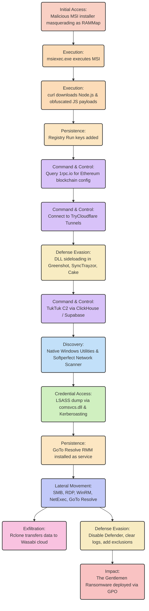

# Threat Hunt Yardstick: EtherRAT, TukTuk, and The Gentlemen Ransomware

## Reference
Based on The DFIR Report: [Flash Alert: EtherRat and TukTuk C2 End in The Gentleman Ransomware](https://thedfirreport.com/2026/05/11/flash-alert-etherrat-and-tuktuk-c2-end-in-the-gentleman-ransomware/)

## Objective
This document serves as a yardstick for testing the Project Harimau AI threat hunting platform. The goal is to provide the initial access indicator (an MSI hash) and evaluate whether Harimau's triage and specialist agents can autonomously hunt, pivot, and uncover the full attack chain, resulting in a narrative report comparable to human-driven DFIR analysis.

---

## 1. Attack Flow Diagram

---

## 2. Attack Chain Details (TTPs)

### 2.1 Initial Access & Execution
*   **Vector**: User executed a malicious MSI installer masquerading as Sysinternals RAMMap from the Desktop/Downloads folder.
*   **Execution**: `msiexec.exe` spawned a batch script (`MVnVmUYj.cmd`), which represented the initial stage of EtherRAT.
*   **Staging**: The malware used `curl` to download a portable Node.js runtime from `nodejs.org`, launching heavily obfuscated JavaScript payloads.

### 2.2 Persistence
*   **Registry**: Added a Registry Run key pointing to a configuration file to launch the Node.js EtherRAT payload upon login.
*   **RMM Tools**: Compromised service account credentials were used to laterally install the **GoTo Resolve** RMM tool as a user-mode service for persistent backdoor access.

### 2.3 Command and Control (C2)
*   **EtherHiding (Blockchain)**: The malware initially contacted `1rpc.io` to read configuration data hosted on the Ethereum blockchain.
*   **Tunnels**: Configuration updates directed malware to active **TryCloudflare** tunnels (`*.trycloudflare.com`). Decoy domains were pushed alongside legitimate ones to frustrate analysis.
*   **SaaS Abuse (TukTuk)**: The actor deployed the TukTuk malware framework, which was observed communicating with SaaS platforms for primary C2, specifically **ClickHouse** and **Supabase**.

### 2.4 Defense Evasion
*   **DLL Sideloading**: Downloaded additional TukTuk payloads from S3 buckets and executed them via DLL sideloading using legitimate, signed binaries (e.g., `Greenshot.exe`, `SyncTrayzor.exe`, `docfx.exe`, `Cake.exe`).
*   **Pre-Encryption Cleaning**: Before executing ransomware, the actor disabled Microsoft Defender, applied AV exclusions, shut down VMs, cleared Windows event logs, and deleted Volume Shadow Copies.

### 2.5 Discovery & Credential Access
*   **Automated Discovery**: Ran native tools via hidden PowerShell and `cmd.exe` to gather host context (e.g., `Get-CimInstance` for AV status, `wmic`, `reg query`).
*   **Manual Recon**: Used commands like `nltest`, `net group "Domain Admins"`, and `whoami`.
*   **Network Scanning**: Deployed the Softperfect Network Scanner (`netscan.exe`) to map internal subnets.
*   **Credential Harvesting**: Executed Kerberoasting attacks and performed LSASS/NTDS dumping. LSASS was dumped using the native `comsvcs.dll` technique (`rundll32.exe C:\windows\System32\comsvcs.dll, MiniDump...`).

### 2.6 Lateral Movement & Exfiltration
*   **Lateral Pivot**: Expanded access through RDP, SMB, and WinRM using harvested admin credentials. Used **NetExec (nxc)** extensively for lateral discovery and execution.
*   **Data Exfiltration**: Configured and ran **Rclone** (`rclone.exe`) with multiple threads and chunks to aggressively push sensitive data out to the **Wasabi** cloud storage platform before deploying ransomware.

### 2.7 Impact
*   **The Gentlemen Ransomware**: The actor created a malicious Group Policy Object (GPO). The GPO created scheduled tasks that executed the staged ransomware binaries housed in the `SYSVOL/NETLOGON` shares across the environment.
*   **Propagation**: Ransomware encrypted the domain, dropped ransom notes, and changed desktop wallpapers.

## 3. Chronological Attack Chain & Observables

This section provides the exact chronological sequence of the attack, mapped to observables, which Harimau should be able to reconstruct:

1.  **Initial Access**: Execution of malicious MSI installer.
    *   *Observable*: `RAMMap.msi` (Hash: `73ce2438d4ed475e03727b7b000d2794`)
2.  **Execution (Stage 1)**: MSI spawns batch script for EtherRAT.
    *   *Observable*: `MVnVmUYj.cmd` (Hash: `b2d51212744f404714fd909e87254d98`)
3.  **Execution (Stage 2)**: Downloads Node.js and configuration.
    *   *Observables*: `nodejs.org`, `A7Pnj975bl.cfg`
4.  **C2 Initialization (EtherHiding)**: Queries Ethereum blockchain for C2 resolution.
    *   *Observable*: `1rpc.io` (Smart Chain Resolution)
5.  **C2 Establishment**: Connects to active tunnel.
    *   *Observable*: `*.trycloudflare.com` (e.g., `witch-skins-lip-coal.trycloudflare.com`)
6.  **Defense Evasion & TukTuk Deployment**: Downloads and sideloads TukTuk payloads.
    *   *Observables*: `log4net.dll` (TukTuk Hash: `f985b8d6d635c266fc4779dad77aa75c`), `Greenshot.exe`, `SyncTrayzor.exe`, `Cake.exe`
7.  **SaaS C2 Establishment**: TukTuk communicates with SaaS infrastructure.
    *   *Observables*: `vefbdzzuaadnascpeqcn.supabase.co`, `k135neflez.westus3.azure.clickhouse.cloud`
8.  **Discovery**: Network scanning and enumeration.
    *   *Observable*: `netscan.exe` (Softperfect Network Scanner)
9.  **Credential Access**: LSASS dumping via comsvcs.dll.
    *   *Observable*: `comsvcs.dll` command line execution.
10. **Persistence & Lateral Movement**: Installs GoTo Resolve.
    *   *Observable*: `smokymo.msi` (Hash: `b188fbc6ff5557767e73e4c883a553a3`), `GoToResolveProcessChecker.exe`
11. **Lateral Pivot**: Uses compromised credentials.
    *   *Observable*: `nxc` (NetExec)
12. **Exfiltration**: Pushes data to Wasabi cloud.
    *   *Observable*: `rclone.exe`, Wasabi cloud destination.
13. **Impact**: Deploys The Gentlemen Ransomware via GPO.

---

## 4. Harimau Ingestion & Validation Criteria

To validate Harimau's orchestration, input the following initial access hash to the platform:
*   **Seed Hash**: `73ce2438d4ed475e03727b7b000d2794` (RAMMap.msi)

### Harimau Expected Outputs
The Lead Hunter / Triage agents must successfully output a report containing:
1.  **Identity of Malware Families**: Identification of EtherRAT and TukTuk.
2.  **Attack Chain Reconstruction**: A chronological reconstruction of the attack chain matching the sequence outlined in Section 3.
3.  **Infrastructure Tracing**: Linking the initial hash to the `1rpc.io` smart chain resolution, TryCloudflare domains, and Supabase/ClickHouse SaaS C2 infrastructure.
4.  **Lateral Tooling Identification**: Discovery of the Rclone execution directed towards Wasabi, the deployment of GoTo Resolve, and the use of NetExec/Softperfect.
5.  **Final Impact**: Confirmation that the activity culminated in The Gentlemen Ransomware.
