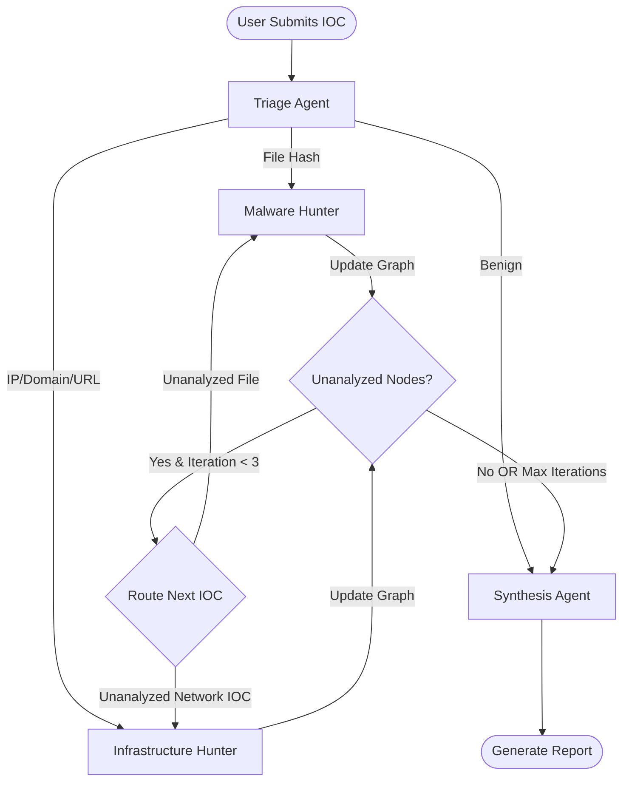

# Threat Hunter Platform - Product Requirements Document

**Version:** 1.0  
**Date:** January 2025  
**Status:** Phase 1 Complete / Phase 2 Planning  
**Target Users:** Single developer + 1-2 testers  
**Timeline:** 3-6 months  
**Implementation Details:** See [IMPLEMENTATION_GUIDE.md](./IMPLEMENTATION_GUIDE.md)

---

## 1. Executive Summary

### What
An AI-powered threat investigation platform that automates Security Operations Center (SOC) analyst workflows using specialized AI agents orchestrated by LangGraph.

### Why
Manual threat investigation is time-consuming (60-90 minutes per IOC) and error-prone. This tool reduces investigation time to under 5 minutes while discovering 5-10x more related indicators through automated multi-agent analysis.

### Scope
Single-user development tool for experimentation and validation. **NOT a production system.** Focus is on validating the multi-agent approach and iterating on agent prompts.

### Goal
Build a working threat investigation system that demonstrates:
- AI agents can perform SOC analyst tasks
- LangGraph can orchestrate complex investigation workflows
- Graph-based state management enables comprehensive IOC discovery
- Comprehensive logging enables debugging and prompt iteration

---

## 2. Product Vision

### The Problem

**Current Manual Process:**
1. Analyst looks up IOC in VirusTotal
2. Checks if file is malicious
3. Manually extracts dropped files
4. Looks up each dropped file individually
5. Extracts network IOCs (C2 servers)
6. Looks up each IP/domain individually
7. Manually correlates findings
8. Writes investigation report

**Time:** 60-90 minutes per investigation  
**Depth:** Often misses related IOCs due to analyst fatigue  
**Scalability:** Cannot investigate at scale

### The Solution

**Automated AI Agent Process:**
1. User submits IOC
2. Triage agent classifies and assesses threat level
3. Specialist agents (Malware/Infrastructure) analyze automatically
4. Agents extract and investigate related IOCs iteratively
5. Synthesis agent generates comprehensive report with graph visualization

**Time:** 2-5 minutes per investigation  
**Depth:** Discovers all related IOCs up to 3 degrees of separation  
**Scalability:** Can run multiple investigations concurrently (Phase 3+)

### Success Criteria

**Phase 1 (MVP):**
- ✅ Can investigate any IOC type (file, IP, domain, URL) end-to-end
- ✅ Graph correctly represents relationships between IOCs
- ✅ Agent decisions are traceable through logs
- ✅ Cost per investigation < $0.50
- ✅ Investigation completes in < 5 minutes

**Phase 2 (HTTP API):**
- ✅ All Phase 1 functionality accessible via REST API
- ✅ Real-time status updates via Server-Sent Events
- ✅ Multiple concurrent investigations supported

**Phase 3 (Production):**
- ✅ Web UI with real-time graph visualization
- ✅ Deployed to GCP Cloud Run
- ✅ Sub-$20/month operating cost
- ✅ < 5% false positive rate on malicious verdicts

---

## 3. Core Architecture

### 3.1 High-Level System Design
```
┌─────────────────────────────────────────────────────────────┐
│                   User Interface                             │
│  Phase 1: CLI (python cli.py investigate malicious.exe)     │
│  Phase 3: Web UI (Next.js + React Flow)                     │
└────────────────┬────────────────────────────────────────────┘
                 │
┌────────────────▼────────────────────────────────────────────┐
│              Investigation Orchestrator                      │
│              (LangGraph State Machine)                       │
│                                                              │
│  ┌─────────┐   ┌─────────┐   ┌─────────┐   ┌─────────┐   │
│  │ Triage  │→→→│Malware  │→→→│  Infra  │→→→│Synthesis│   │
│  │ Agent   │   │ Hunter  │   │ Hunter  │   │ Agent   │   │
│  └─────────┘   └─────────┘   └─────────┘   └─────────┘   │
│                                                              │
│  State: {graph_nodes, graph_edges, iteration, budget}      │
└────────────────┬────────────────────────────────────────────┘
                 │
┌────────────────▼────────────────────────────────────────────┐
│                  MCP Tool Registry                           │
│  Routes tool calls to appropriate MCP server                 │
└────┬───────────┬───────────┬──────────────┬────────────────┘
     │           │           │              │
┌────▼─────┐ ┌──▼──────┐ ┌──▼─────────┐ ┌──▼────────┐
│   GTI    │ │ Shodan  │ │  URLScan   │ │   YARA    │
│   MCP    │ │   MCP   │ │    MCP     │ │    MCP    │
└──────────┘ └─────────┘ └────────────┘ └───────────┘
```

### 3.2 Component Responsibilities

| Component | Responsibility | Reference |
|-----------|----------------|-----------|
| **Triage Agent** | IOC classification, initial threat assessment, routing decision | [IMPLEMENTATION_GUIDE.md §2.3.1](./IMPLEMENTATION_GUIDE.md) |
| **Malware Hunter** | Behavioral analysis, dropped file extraction, network IOC discovery | [IMPLEMENTATION_GUIDE.md §2.3.2](./IMPLEMENTATION_GUIDE.md) |
| **Infrastructure Hunter** | DNS pivoting, ASN correlation, infrastructure mapping | [IMPLEMENTATION_GUIDE.md §2.3.3](./IMPLEMENTATION_GUIDE.md) |
| **Synthesis Agent** | Report generation, graph visualization, final verdict | [IMPLEMENTATION_GUIDE.md §2.3.4](./IMPLEMENTATION_GUIDE.md) |
| **LangGraph Orchestrator** | State management, iteration control, conditional routing | [IMPLEMENTATION_GUIDE.md §2.2](./IMPLEMENTATION_GUIDE.md) |
| **MCP Registry** | Tool discovery, connection management, API call routing | [IMPLEMENTATION_GUIDE.md §2.4.2](./IMPLEMENTATION_GUIDE.md) |
| **Investigation Graph** | In-memory NetworkX graph, relationship tracking, state serialization | [IMPLEMENTATION_GUIDE.md §3.1](./IMPLEMENTATION_GUIDE.md) |

### 3.3 Investigation Flow


**Key Points:**
- **Iterative:** System loops up to 3 times to analyze newly discovered IOCs
- **Conditional:** Routing logic based on IOC type and graph state
- **Bounded:** Circuit breakers prevent infinite loops and cost explosions

---

## 4. Technical Specifications

### 4.1 Technology Stack
```yaml
Backend:
  Language: Python 3.12+
  Orchestration: LangGraph 0.2+ (state machine)
  API Framework: FastAPI 0.115+ (Phase 2)
  LLM: 
    - Gemini 3.0 Pro (Vertex AI via API Key) - Primary Model
  Graph: NetworkX 3.0+ (in-memory, Phase 1) -> KuzuDB (Phase 2)
  Tools: MCP protocol (HTTP-based)
  Validation: Pydantic 2.0+

Frontend (Phase 3):
  Framework: Next.js 14 (App Router)
  Graph Visualization: React Flow
  UI Components: shadcn/ui
  Real-time Updates: Server-Sent Events (SSE)

Infrastructure:
  Development: Local (Python + Node.js)
  Production (Phase 3): 
    - GCP Cloud Run (backend + frontend)
    - Cloud Logging (centralized logs)
    - Cloud Storage (reports)

Version Control:
  Git: All code, configs, and prompts tracked
  GitHub: Repository with CI/CD pipeline
```

### 4.2 Data Models

**Note:** Full implementation details in [IMPLEMENTATION_GUIDE.md §2.4.1](./IMPLEMENTATION_GUIDE.md)

#### Investigation State
```python
class InvestigationState(TypedDict):
    # Input
    ioc: str                          # Original IOC submitted
    ioc_type: str                     # "file" | "ip" | "domain" | "url"
    
    # Graph (serialized as lists for JSON compatibility)
    graph_nodes: list[dict]           # [{"id": "hash1", "type": "file", ...}]
    graph_edges: list[dict]           # [{"source": "hash1", "target": "ip1", ...}]
    
    # Control flow
    iteration: int                    # Current iteration (0-3)
    max_iterations: int               # Hard limit (default: 3)
    agents_run: list[str]             # ["triage", "malware", ...]
    status: str                       # "running" | "complete" | "failed"
    
    # Budget tracking
    budget: InvestigationBudget       # Cost/resource limits
    
    # Output
    findings: list[dict]              # Agent discoveries
    report: str                       # Final Markdown report
```

#### Investigation Budget
```python
class InvestigationBudget:
    max_api_calls: int = 200          # Hard limit on API calls
    max_graph_nodes: int = 50         # Hard limit on IOCs discovered
    max_wall_time: int = 600          # 10 minutes timeout
    
    api_calls_made: int = 0           # Counter
    nodes_created: int = 0            # Counter
    time_elapsed: int = 0             # Seconds
    
    def can_continue(self) -> bool:
        """Check if investigation can continue"""
```

#### Graph Node
```python
{
  "id": "abc123...",              # IOC value
  "type": "file|ip|domain|url",   # IOC type
  "verdict": "MALICIOUS|...",     # Threat verdict
  "score": 85,                    # Threat score (0-100)
  "analyzed": true,               # Has specialist analyzed this?
  "data": {...}                   # Full analysis result
}
```

#### Graph Edge
```python
{
  "source": "abc123...",          # Source IOC
  "target": "evil.com",           # Target IOC
  "relationship": "COMMUNICATES_WITH|DROPPED|RESOLVES_TO",
  "description": "File abc123 contacted evil.com:443 during execution"
}
```

---

## 5. Core Features

### 5.1 Investigation Workflow

**User Action:** Submit IOC → System executes multi-stage investigation

#### Stage 1: Triage (Always Runs)
- Classify IOC type (file/IP/domain/URL)
- Query GTI for verdict
- Determine threat level (MALICIOUS/SUSPICIOUS/BENIGN)
- Route to specialist agent

#### Stage 2: Specialist Analysis (Iteration 1)
**If File:** Malware Hunter analyzes behavior
- Extract behavioral data from GTI sandbox
- Identify dropped files
- Extract network communications (IPs, domains, URLs)
- Add all findings to investigation graph

**If Network IOC:** Infrastructure Hunter pivots
- DNS resolution history
- Hosting infrastructure (ASN, geolocation)
- Related domains/IPs
- Add all findings to investigation graph

#### Stage 3: Iterative Deepening (Iterations 2-3)
- Check graph for unanalyzed nodes
- Route unanalyzed files → Malware Hunter
- Route unanalyzed network IOCs → Infrastructure Hunter
- Continue until:
  - No unanalyzed nodes remain, OR
  - Max iterations (3) reached, OR
  - Budget exhausted

#### Stage 4: Synthesis (Always Runs)
- Generate executive summary
- Create graph visualization (Mermaid format)
- Write detailed technical report
- Identify gaps (if investigation incomplete)

**Reference:** See [IMPLEMENTATION_GUIDE.md §2](./IMPLEMENTATION_GUIDE.md) for implementation details.

### 5.2 Agent Capabilities

#### Triage Agent
**Purpose:** Initial IOC assessment and routing

**Inputs:** 
- IOC value (hash/IP/domain/URL)

**Tools:** 
- GTI MCP (lookup_ioc)

**Outputs:**
- IOC classification (file/ip/domain/url)
- Threat verdict (MALICIOUS/SUSPICIOUS/BENIGN)
- Threat score (0-100)
- Routing decision (malware/infrastructure/synthesis)

**Logic:**
1. Pattern match to determine IOC type
2. Query GTI for threat intelligence
3. If MALICIOUS file → route to Malware Hunter
4. If MALICIOUS network → route to Infrastructure Hunter
5. If BENIGN → skip to Synthesis

**Reference:** [IMPLEMENTATION_GUIDE.md §2.3.1](./IMPLEMENTATION_GUIDE.md)

---

#### Malware Hunter Agent
**Purpose:** Deep behavioral analysis of files

**Inputs:**
- File hash (from triage or graph)

**Tools:**
- GTI MCP (get_behavior_summary)

**Outputs:**
- Behavioral analysis report
- Dropped files (list of hashes)
- Network communications (IPs, domains, URLs)
- Attack chain narrative

**Logic:**
1. Query GTI behavioral sandbox data
2. Extract process execution chains
3. Identify persistence mechanisms
4. Extract all network IOCs
5. Add nodes/edges to graph

**Reference:** [IMPLEMENTATION_GUIDE.md §2.3.2](./IMPLEMENTATION_GUIDE.md)

---

#### Infrastructure Hunter Agent
**Purpose:** Network IOC correlation and infrastructure mapping

**Inputs:**
- IP address, domain, or URL (from triage or graph)

**Tools:**
- GTI MCP (get_domain_report, get_ip_report)
- Shodan MCP (optional)

**Outputs:**
- DNS resolution history
- Hosting infrastructure (ASN, geo, registrar)
- Related domains/IPs
- Campaign indicators

**Logic:**
1. Passive DNS lookups
2. ASN clustering analysis
3. SSL certificate correlation
4. Temporal pattern analysis
5. Add nodes/edges to graph

**Reference:** [IMPLEMENTATION_GUIDE.md §2.3.3](./IMPLEMENTATION_GUIDE.md)

---

#### Synthesis Agent
**Purpose:** Final report generation

**Inputs:**
- Complete investigation graph

**Tools:**
- Graph Inspection Tool

**Outputs:**
- Executive summary
- Technical findings report
- Graph visualization (Mermaid)
- Recommendations

**Logic:**
1. Read all nodes/edges from graph
2. Identify attack chain (file → dropped files → C2)
3. Generate narrative
4. Create Mermaid diagram
5. Flag unanalyzed nodes (if budget exhausted)

**Reference:** [IMPLEMENTATION_GUIDE.md §2.3.4](./IMPLEMENTATION_GUIDE.md)

---

### 5.3 Graph Construction

**Purpose:** Track all discovered IOCs and their relationships

**Example Investigation:**
```
malicious.exe (MALICIOUS, score: 95)
    ├─[DROPPED]──> payload.dll (MALICIOUS, score: 87)
    │                  └─[COMMUNICATES]──> 5.6.7.8 (SUSPICIOUS, score: 45)
    ├─[COMMUNICATES]──> evil.com (MALICIOUS, score: 92)
    │                      └─[RESOLVES_TO]──> 1.2.3.4 (MALICIOUS, score: 88)
    └─[COMMUNICATES]──> backup-c2.net (MALICIOUS, score: 85)
```

**Graph Visualization:** Automatically converted to Mermaid syntax and embedded in final report

**Reference:** [IMPLEMENTATION_GUIDE.md §3.1](./IMPLEMENTATION_GUIDE.md) for graph utilities

---

### 5.4 Cost Controls & Circuit Breakers

**Purpose:** Prevent runaway investigations and API cost explosions

#### Hard Limits
```python
INVESTIGATION_BUDGET = {
    "max_iterations": 3,              # Prevent infinite loops
    "max_graph_nodes": 50,            # Prevent graph explosions
    "max_api_calls": 200,             # Prevent API cost explosions
    "max_wall_time": 600              # 10 minutes timeout
}
```

#### Behavior
- **When limit reached:** Investigation stops gracefully
- **Incomplete analysis:** Synthesis agent reports unanalyzed nodes
- **Recommendation:** User can re-run with higher limits if needed

**Example:**
```
Investigation Status: INCOMPLETE
Reason: Max graph nodes reached (50/50)

Unanalyzed IOCs:
- hash_xyz789 (file) - Found via infrastructure pivot
- domain_abc.com (domain) - Found via malware behavior

Recommendation: Re-run with --max-nodes=100 to complete analysis
```

**Reference:** [IMPLEMENTATION_GUIDE.md §2.4.1](./IMPLEMENTATION_GUIDE.md) for budget implementation

---

## 6. Logging & Observability

### 6.1 Two-Tier Logging Strategy

**Purpose:** Enable debugging without overwhelming normal operation

#### Tier 1: Normal Logs (Always On)

**Captures:**
- Agent decisions and reasoning
- Investigation flow milestones
- Tool call summaries (not full payloads)
- Errors and warnings
- Performance metrics

**Format:**
```
[2025-01-15 10:32:15] [inv-123] [triage] INFO: Starting IOC classification
[2025-01-15 10:32:17] [inv-123] [triage] INFO: GTI verdict: MALICIOUS (15/70)
[2025-01-15 10:32:17] [inv-123] [triage] DECISION: Route to Malware Agent
[2025-01-15 10:32:23] [inv-123] [malware] INFO: Found 3 network IOCs
```

**Location:** `logs/normal/investigation_{id}.log`

---

#### Tier 2: Debug Logs (Opt-In via --debug Flag)

**Additional Captures:**
- Full LLM prompts and responses
- Complete API request/response payloads
- LangGraph state snapshots after each agent
- MCP protocol debugging details
- Performance profiling data

**File Structure:**
```
logs/debug/
├── investigation_{id}.log                    # Structured JSON logs
├── {id}_llm_prompts/
│   ├── 001_triage_prompt.txt
│   ├── 001_triage_response.txt
│   ├── 002_malware_prompt.txt
│   └── 002_malware_response.txt
├── {id}_api_calls/
│   ├── 001_gti_request.json
│   ├── 001_gti_response.json
│   ├── 002_gti_request.json
│   └── 002_gti_response.json
└── {id}_state_snapshots/
    ├── after_triage.json
    ├── after_malware.json
    └── after_infrastructure.json
```

**Enable:** 
```bash
python cli.py investigate malicious.exe --debug
```

**Reference:** [IMPLEMENTATION_GUIDE.md §2.4.3](./IMPLEMENTATION_GUIDE.md) for logging implementation

---

### 6.2 Debugging Capabilities

**Example Scenario:** "Why did Malware Agent skip this dropped file?"

**Debugging Steps:**
1. Open `logs/debug/investigation_{id}.log`
2. Search for `DECISION` entries from `malware` agent
3. Read reasoning: "Skipped due to MAX_NODES limit (48/50)"
4. Verify in state snapshot: `{id}_state_snapshots/after_malware.json`
5. See complete LLM reasoning: `{id}_llm_prompts/002_malware_response.txt`

**Benefit:** Every agent decision is traceable to source data and reasoning

---

## 7. Deployment Phases

### Phase 1: Backend CLI (Weeks 1-3) ← **CURRENT FOCUS**

**Objective:** Get investigation logic working without frontend

**Deliverables:**
- ✅ CLI tool: `python cli.py investigate <ioc>`
- ✅ LangGraph workflow with 4 agents
- ✅ MCP integration with existing GTI server
- ✅ In-memory graph construction
- ✅ Two-tier logging system
- ✅ Markdown report generation
- ✅ Performance benchmarking suite

**Testing Method:**
```bash
# Test with known IOCs
python cli.py investigate malicious.exe --debug
python cli.py investigate evil.com

# Verify outputs
cat reports/inv-{id}_report.md
cat reports/inv-{id}_graph.json
cat logs/debug/investigation_inv-{id}.log
```

**Success Criteria:**
- ✅ Can investigate all IOC types (file, IP, domain, URL)
- ✅ Graph builds correctly (verified in JSON output)
- ✅ Agents make sensible decisions (verified in logs)
- ✅ Debug logs capture 100% of data
- ✅ Cost per investigation < $0.50
- ✅ Investigation completes in < 5 minutes

**Timeline:**

| Week | Focus | Deliverables |
|------|-------|--------------|
| **Week 1** | Foundation | Project setup, logging, triage agent, investigation graph |
| **Week 2** | Core Agents | Malware hunter, infrastructure hunter, integration tests |
| **Week 3** | Synthesis & Benchmarking | Synthesis agent, performance benchmarks, documentation |

**Detailed Timeline:** See [IMPLEMENTATION_GUIDE.md §1](./IMPLEMENTATION_GUIDE.md)  
**Benchmarking Guide:** See [BENCHMARKING_GUIDE.md](./BENCHMARKING_GUIDE.md)

---

### Phase 2: HTTP API (Week 4)

**Objective:** Add FastAPI wrapper for HTTP access

**Deliverables:**
- REST API endpoints
- Investigation status tracking
- SSE endpoint for real-time updates
- OpenAPI documentation

**API Endpoints:**
```python
POST   /investigate?ioc=malicious.exe&debug=true
  → {"investigation_id": "inv-123", "status": "started"}

GET    /investigations/{id}/status
  → {"status": "running", "iteration": 2, "current_agent": "infra"}

GET    /investigations/{id}/stream   # SSE
  → Stream of updates as investigation progresses

GET    /investigations/{id}/report
  → {"report": "...", "graph": {...}}
```

**Testing Method:**
```bash
# Start server
python backend/main.py

# Test with curl
curl -X POST http://localhost:8000/investigate?ioc=test.exe
curl http://localhost:8000/investigations/inv-123/status
```

**Success Criteria:**
- ✅ All Phase 1 functionality accessible via HTTP
- ✅ Multiple concurrent investigations supported
- ✅ SSE streams updates in real-time
- ✅ Logs still capture all data

---

### Phase 3: GCP Cloud + Frontend (Weeks 5-8)

**Objective:** Production deployment with web UI

**Deliverables:**
- Next.js frontend with React Flow graph
- Cloud Run deployment (backend + frontend)
- Cloud Logging integration
- Cloud Storage for reports

**GCP Architecture:**
```
┌─────────────────────┐
│  Cloud Run          │
│  - Next.js Frontend │
└──────────┬──────────┘
           │
┌──────────▼──────────┐
│  Cloud Run          │
│  - FastAPI Backend  │
└──────────┬──────────┘
           │
┌──────────▼──────────┐
│  Cloud Run          │
│  - MCP Servers      │
│    (GTI, Shodan)    │
└──────────┬──────────┘
           │
┌──────────▼──────────┐
│  Cloud Logging      │
│  + Cloud Storage    │
└─────────────────────┘
```

**Frontend Components:**
1. **Agent Timeline** (Left Panel) - Shows agent execution status
2. **Investigation Graph** (Top Right) - React Flow force-directed visualization
3. **Investigation Log** (Bottom Right) - Scrollable event stream

**Real-Time Updates:** SSE connection polls LangGraph checkpoints, streams graph/log updates

**Testing Method:**
- Deploy to GCP
- Access via public URL
- Submit IOC via web UI
- Watch graph build in real-time

**Success Criteria:**
- ✅ Accessible from any browser
- ✅ Real-time visualization works
- ✅ Logs queryable in Cloud Logging
- ✅ Sub-$20/month operating cost

---

## 8. Success Metrics

### Development Phase (Months 1-3)

**Functionality:**
- ✅ Can investigate all IOC types (file, IP, domain, URL)
- ✅ Graph builds correctly (verified manually)
- ✅ Agents make reasonable decisions (< 10% false positives)
- ✅ Debug logs capture 100% of investigation data

**Performance:**
- ✅ Investigation completes in < 5 minutes
- ✅ Cost per investigation < $0.50
- ✅ < 5% API call failures (with retry)

**Developer Experience:**
- ✅ Can trace any decision back to source data (via logs)
- ✅ Can modify agent prompts and re-test in < 5 minutes
- ✅ CLI is usable without documentation

---

### Production Readiness (Month 6+)

**Scale:**
- 100+ investigations/day without degradation
- < 2% error rate
- Sub-$20/month operating cost

**Quality:**
- < 5% false positives on malicious verdicts
- > 90% of related IOCs discovered (vs manual analysis)
- Zero hallucinations (all findings traceable to API data)

---

## 9. Non-Requirements

The following features are **intentionally excluded** from the development roadmap:

### Security Features (Handled Elsewhere)
❌ **IOC Input Validation** - Developer controls all inputs manually  
❌ **Private/Internal IOC Detection** - Developer ensures only public IOCs are used  
❌ **Secret Redaction in Logs** - Future WAF/AI protection layer will handle  
❌ **SQL Injection Protection** - No database in use  
❌ **XSS Protection** - No web interface in Phase 1  

**Rationale:** Single-user development tool. Security hardening deferred to production deployment with WAF and AI protection capabilities.

### Scale Features (Single Investigation Focus)
❌ **Batch Investigation** - Tool designed for deep single-IOC analysis, not volume  
❌ **Investigation Queuing** - No concurrent users  
❌ **Rate Limiting Per-User** - Developer controls usage manually  
❌ **Load Balancing** - Single instance is sufficient  

**Rationale:** Purpose is focused threat hunting on individual indicators, not mass scanning.

### Persistence Features (Ephemeral by Design)
❌ **Investigation History** - No database, each investigation is standalone  
❌ **Investigation Comparison** - No persistent storage to compare against  
❌ **Historical Trending** - Not tracking over time  
❌ **Cross-Investigation Correlation** - Each investigation is independent  

**Rationale:** GraphRAG/persistent storage is deferred to Phase 4+. Current focus is validating agent logic.

### Versioning Features (Git Handles)
❌ **Prompt Version Tracking** - Git commits track all changes  
❌ **Config Versioning** - Git handles configuration history  
❌ **Report Version Numbers** - Reports are timestamped, git tracks code version  

**Rationale:** Standard version control is sufficient for single-developer workflow.

### Export Features (Markdown Sufficient)
❌ **PDF Export** - Can convert Markdown → PDF manually if needed  
❌ **STIX Export** - Not integrating with threat intel platforms yet  
❌ **JSON API Export** - No API consumers in Phase 1  
❌ **CSV Export** - Markdown reports are human-readable  

**Rationale:** Markdown is sufficient for reading/sharing. Advanced formats deferred until proven need.

### UX Features (MVP Focus)
❌ **Investigation Profiles** (quick/standard/deep) - Can run with different flags if needed  
❌ **IOC Whitelist/Blacklist** - Developer knows which IOCs to investigate  
❌ **Investigation Templates** - All investigations follow same workflow  
❌ **Custom Report Formatting** - Synthesis agent output is sufficient  

**Rationale:** Premature optimization. Keep it simple for experimentation.

### Advanced Features (Deferred to Phase 4+)
❌ **Agent Performance Metrics Dashboard** - Can analyze benchmark results manually  
❌ **Agent Timeout Configuration UI** - Hardcoded values from benchmarks are sufficient  
❌ **Graph Cycle Detection** - Likely covered by node deduplication  
❌ **Resume Failed Investigations** - Rare with 5-minute investigations  
❌ **Multi-Format Report Export** - Markdown only for now  

**Rationale:** Focus on core functionality first. Add these only if proven necessary.

---

## 10. Cost Estimates

### Per Investigation (Estimated)
```
Gemini 2.0 Flash (Default):
- 4 agent calls × 500 tokens input = 2,000 tokens input
- 4 agent calls × 200 tokens output = 800 tokens output
- Input:  2,000 tokens × $0.000001 = $0.002
- Output:   800 tokens × $0.000002 = $0.0016
- Total: ~$0.0036 per investigation

Gemini 2.5 Pro (Optional):
- 4 agent calls × 500 tokens input = 2,000 tokens input
- 4 agent calls × 200 tokens output = 800 tokens output
- Input:  2,000 tokens × $0.000005 = $0.01
- Output:   800 tokens × $0.000015 = $0.012
- Total: ~$0.022 per investigation

GTI API:
- All queries: $0 (included in Enterprise license)

Total per investigation:
- With Gemini 2.0 Flash: ~$0.004
- With Gemini 2.5 Pro: ~$0.022
```

### Monthly (100 investigations/day)
```
LLM Costs (Gemini 2.0 Flash):
- 100 investigations/day × 30 days = 3,000 investigations
- 3,000 × $0.004 = $12/month

GCP Costs (Phase 3):
- Cloud Run (Backend + Frontend): ~$10/month (scales to zero)
- Cloud Logging: ~$5/month
- Cloud Storage: ~$1/month

Total (Phase 3): ~$28/month
```

**Note:** Actual costs may vary based on:
- Investigation complexity (more iterations = more LLM calls)
- Choice of LLM model
- Number of API calls per investigation

---

## 11. Future Enhancements (Post-MVP)

These features are planned for future phases but not required for initial validation:

### Phase 4: Advanced Agents (Month 7+)
- **Campaign Correlation Agent** - Links investigations across time
- **Attribution Agent** - Threat actor identification
- **Hunt Hypothesis Generator** - Proactive hunting recommendations

### Phase 5: Graph Database (Month 9+)
- **Neo4j Integration** - Persistent investigation storage
- **Cross-Investigation Correlation** - "Have we seen this infrastructure before?"
- **Temporal Analysis** - Trending and historical patterns
- **GraphRAG** - LLM-powered graph queries

### Phase 6: Production Features (Month 12+)
- **Multi-User Support** - Authentication and user management
- **Investigation History** - Search and compare past investigations
- **Advanced Caching** - Reduce API costs with intelligent caching
- **Webhook Notifications** - Slack/email alerts
- **STIX Export** - Threat intel platform integration
- **PDF Reports** - Executive-friendly report format

---

## Appendix A: References

### Implementation Documentation
- **[IMPLEMENTATION_GUIDE.md](./IMPLEMENTATION_GUIDE.md)** - Complete pseudocode for all components
- **[BENCHMARKING_GUIDE.md](./BENCHMARKING_GUIDE.md)** - Performance testing methodology
- **[CLAUDE.md](./CLAUDE.md)** - AI assistant system instructions

### External Documentation
- **LangGraph Documentation:** https://langchain-ai.github.io/langgraph/
- **MCP Protocol Specification:** https://modelcontextprotocol.io/
- **GTI API Documentation:** https://developers.virustotal.com/reference/overview
- **Gemini API Documentation:** https://ai.google.dev/gemini-api/docs

---

## Appendix B: Project Structure
```
threat-hunter/
├── backend/
│   ├── cli.py                      # CLI entry point
│   ├── main.py                     # FastAPI app (Phase 2)
│   │
│   ├── agents/
│   │   ├── __init__.py
│   │   ├── triage.py               # IOC classification
│   │   ├── malware.py              # Behavioral analysis
│   │   ├── infrastructure.py       # Network pivoting
│   │   └── synthesis.py            # Report generation
│   │
│   ├── tools/
│   │   ├── __init__.py
│   │   └── mcp_registry.py         # MCP server connector
│   │
│   ├── models.py                   # Pydantic data models
│   ├── graph_workflow.py           # LangGraph state machine
│   ├── logging_config.py           # Two-tier logging
│   └── config.py                   # Settings
│
├── mcp-servers/                    # User's existing MCP servers
│   ├── gti-server/
│   └── shodan-server/
│
├── tests/
│   ├── benchmark.py                # Performance benchmarks
│   ├── test_agents.py              # Unit tests
│   └── fixtures/                   # Test IOC samples
│
├── logs/
│   ├── normal/                     # Always-on logs
│   └── debug/                      # Debug mode logs
│
├── reports/                        # Investigation outputs
│
├── docs/
│   ├── PRD.md                      # This document
│   ├── IMPLEMENTATION_GUIDE.md     # Pseudocode reference
│   ├── BENCHMARKING_GUIDE.md       # Testing guide
│   └── CLAUDE.md                   # AI assistant instructions
│
├── .env                            # API keys (not committed)
├── .gitignore
├── requirements.txt
└── README.md
```

---

## Appendix C: Risk Mitigation

| Risk | Likelihood | Impact | Mitigation |
|------|-----------|--------|------------|
| **API cost explosion** | Medium | High | Hard limits (200 calls/investigation, budget tracking) |
| **Agent hallucination** | Low | High | Enforce evidence-based reasoning, log all sources |
| **Infinite loops** | Medium | Medium | Max 3 iterations, 10 minute timeout, cycle detection |
| **MCP server failure** | Low | Medium | Graceful degradation, retry logic, error logging |
| **Investigation timeout** | Low | Low | Circuit breakers, user can retry with higher limits |
| **False positives** | Medium | Medium | Multi-source validation, confidence scoring |
| **Data leakage** | Low | High | No private IOC detection needed (developer controls inputs) |
| **Prompt injection** | Low | Medium | Future WAF/AI protection layer will handle |

---

**Document Version:** 1.0  
**Last Updated:** January 2025  
**Next Review:** End of Phase 1 (Week 3)  
**Maintained By:** Development Team